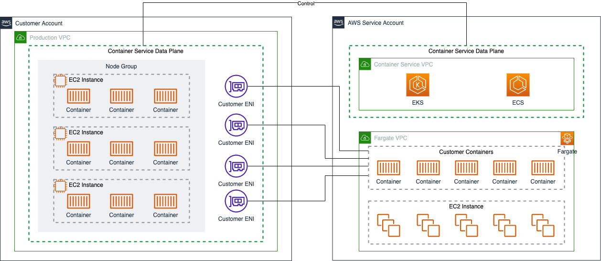
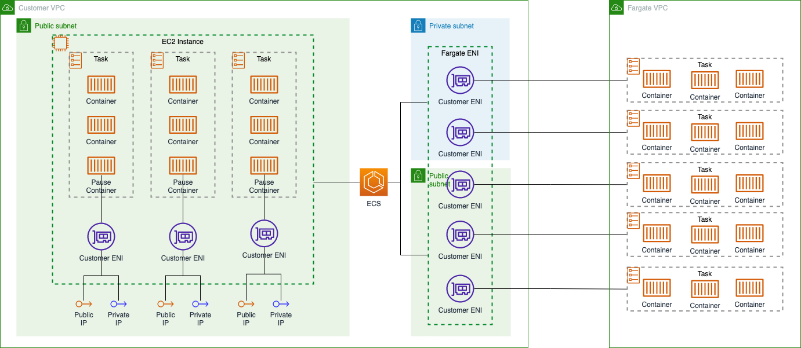

# AWS Lambda Data Transfer Cost

[中文](Container-CN.md) | English

## Summary

AWS offers two types of managed container services: Amazon Elastic Container Serivce (ECS), and Amazon Elastic Kubernetes Service (EKS). This page begins with a brief introduction to the network-related knowledge of these two types of container services, and then summarizes the calculation of the costs incurred for data transfer in several typical application scenarios. The following sections are included:  

- 1. [Networking Concept for EKS & ECS](#1-networking-concept-for-eks--ecs)
- 2. [Service Access Data Transfer](#2-service-access-data-transfer)
- 3. [Pull Image from ECR](#3-pull-image-from-ecr)

The following costing instructions from the official website are referenced in this page:

- EC2 Pricing: [Global Region](https://aws.amazon.com/ec2/pricing/on-demand/), [Ningxia & Beijing Regions](https://www.amazonaws.cn/en/ec2/pricing/);
- AWS Fargate Pricing: [Global Region](https://aws.amazon.com/fargate/pricing/)，[Ningxia & Beijing Regions](https://www.amazonaws.cn/en/fargate/pricing/)；
- Amazon ECR Priding: [Global Region](https://aws.amazon.com/ecr/pricing/)，[Ningxia & Beijing Regions](https://www.amazonaws.cn/en/ecr/pricing/);
- PrivateLink Pricing: [Global Region](https://aws.amazon.com/privatelink/pricing/), [Ningxia & Beijing Regions](https://www.amazonaws.cn/en/privatelink/pricing/);  
- NAT Pricing: [Global Region](https://aws.amazon.com/vpc/pricing/), [Ningxia & Beijing Regions](https://www.amazonaws.cn/en/vpc/pricing/)

## 1. Networking Concept for EKS & ECS

Amazon ECS and Amazon EKS are fully managed container orchestration services from AWS. Both ECS and EKS support two types of approaches to resource provisioning in the compute plane: providing compute resources through EC2 instances and providing compute resources through Fargate.

When providing compute resources using EC2 instances, the container service creates EC2 instances within the customer's own VPC, which are visible and accessible to users.

When providing compute resources using the [AWS Fargate](https://aws.amazon.com/fargate/) method, the required EC2 instances are created within the Fargate VPC and managed by the Fargate service. These EC2 instances are not visible to users, nor can users access them and deploy DaemonSet resources. The Fargate service creates ENI resources in the customer VPC, and the container communicates externally through these ENIs.

The logic is illustrated in the following figure:

For both EKS and ECS services, AWS provides a Container Network Interface (CNI) plug-in. With CNI, containers can communicate directly using the VPC network, obtaining the VPC-assigned IP address instead of the container overlay layer IP address. This approach improves communication efficiency. But for EKS and ECS services, CNI provides communication in a slightly different way.

### 1.1 EKS CNI Concept

For EKS，when using EC2 instances to provide computing resources, [each pod will be assigned a separate private IP address](https://docs.aws.amazon.com/eks/latest/userguide/pod-networking.html)：

>Amazon EKS supports native VPC networking with the Amazon VPC Container Network Interface (CNI) plugin for Kubernetes. This plugin assigns a private IPv4 or IPv6 address from your VPC to each pod. 

When using the Fargate method of providing compute resources，[each pod will be assigned a separate ENI](https://docs.aws.amazon.com/eks/latest/userguide/fargate.html), and can only be located on a private subnet:

>Each pod that runs on Fargate has its own isolation boundary. They don't share the underlying kernel, CPU resources, memory resources, or elastic network interface with another pod.
>
>Pods that run on Fargate are only supported on private subnets (with NAT gateway access to AWS services, but not a direct route to an Internet Gateway), so your cluster's VPC must have private subnets available.

The EKS CNI plug-in works as follows:

### 1.2 ECS CNI Concept

Although the CNI plug-in for ECS also enables the Container to communicate using the VPC network (select awsvpc mode when creating an ECS Task), it does so in a slightly different way than the EKS CNI.

When providing compute resources using EC2 instances, [the ECS CNI assigns a separate ENI to each Task](https://docs.aws.amazon.com/AmazonECS/latest/developerguide/task-networking-awsvpc.html) (as to EKS CNI, a separate private IP to each pod), and manages the network stack within the Task by creating an additional pause container within the Task:

>each task gets its own elastic network interface (ENI).

>When a task is started with the awsvpc network mode, the Amazon ECS container agent creates an additional pause container for each task before starting the containers in the task definition. It then configures the network namespace of the pause container by running the [amazon-ecs-cni-plugins](https://github.com/aws/amazon-ecs-cni-plugins)  CNI plugins. The agent then starts the rest of the containers in the task so that they share the network stack of the pause container.

When providing computing resources using the Fargate model, [the ECS CNI assigns a separate ENI to each Task](https://docs.aws.amazon.com/AmazonECS/latest/developerguide/AWS_Fargate.html), and [could be located on either a public or private subnet](https://docs.aws.amazon.com/AmazonECS/latest/userguide/fargate-task-networking.html):

在使用 Fargate 模式提供计算资源时，ECS CNI [为每个 Task 分配一个独立的 ENI](https://docs.aws.amazon.com/AmazonECS/latest/developerguide/AWS_Fargate.html)，且[可以位于公有子网或私有子网](https://docs.aws.amazon.com/zh_cn/AmazonECS/latest/userguide/fargate-task-networking.html)：

>Amazon ECS task definitions for AWS Fargate require that the network mode is set to awsvpc. The awsvpc network mode provides each task with its own elastic network interface.

>When using a public subnet, you can assign a public IP address to the task ENI. 

>When using a private subnet, the subnet can have a NAT gateway attached.

The ECS CNI plug-in works as follows:

[Back to Top](#summary)

## 2. Service Access Data Transfer

Based on the introduction in Part 1, the billing logic for external data transfer using EKS/ECS is the same as that for external data transfer using EC2 instances. You can access the Internet directly through the Public IP or expose services through the ELB.

Whether EC2 mode or the Fargate mode, the data transfer is essentially through an ENI in the customer VPC. Therefore, in the scenario where the container with other components, refer to [EC2 data transfer costs](../EC2/EC2-EN.md) in this repository.

[Back to Top](#Summary)

## 3. Pull Image from ECR

Another common data transfer scenario when using containers is the pulling of images. When using EKS or ECS, you may use the Amazon Elastic Container Registry (ECR) as the image repository. The following figure shows the data transfer costs incurred by a container running on ECS/EKS when pulling an image from ECR in several typical scenarios.

**NOTES:**

- For simplicity, the following figure identifies the location of the Container based on the subnet of the ENI used by the Container, without distinguishing whether the computating resources come from an EC2 instance or Fargate;
- The figure represents a combination of pulling image scenarios and does not represent the actual network design.

Some major scenarios of pulling images are described as below:

**1. ECR-IAD -> ECR-PDX**

ECR supports immage replication between two regions, [incurring data transfer charges as standard ECR data transfer out charges](https://aws.amazon.com/blogs/containers/cross-region-replication-in-amazon-ecr-has-landed/):

>Data transferred when copying images across regions incur ECR data transfer out charges based on the source repository’s Region.

The source region in the figure is the N.Virginia region (us-east-1), where ECR data transfer out is billed at $0.09/GB.

Furthermore, when the ECR accesses other regions, it will [incur standard Data Transfer Out charges to the Internet](https://aws.amazon.com/ecr/pricing/), instead of following the inter-regional data transfer rate.

>Data transferred between Amazon ECR and other services in different regions will be charged at Internet Data Transfer rates on both sides of the transfer.

**2.  ECR-IAD -> Container-1**

Containers located in public subnet do not incur data transfer costs when pulling images from ECR image repositories in the same region.

>Data transfer “in” and “out” refers to transfer into and out of Amazon ECR. Data transferred between Amazon ECR and other services within the same region e.g., Amazon EC2, AWS Lambda, AWS App Runner, or AWS Fargate is free of charge (i.e., $0.00 per GB).

**3.  ECR-PDX -> Container-2**

As described in the ECR-IAD -> ECR-PDX scenario, ECR charges for inter-regional data transfers with reference to the Internet data transfer rate.

Therefore, when Container-2 in us-east-1 pulls an image from ECR-PDX in us-west-2, it needs to charge the Internet data transfer cost at us-west-2's billing rate.

**4.  ECR-IAD -> Container-3**

For containers located in private subnets, there are two ways to get images from ECR: through the NAT Gateway or, through the ECR Interface Endpoint.

Container-3 pulls images through the NAT Gateway. Since Container-3 and ECR-IAD are in the same region, the ECR does not incur data transfer costs. However, since all traffic passes through NAT Gateway, data processing charges are incurred on NAT Gateway. All traffic passing through the NAT Gateway is charged a data processing fee, regardless of the direction of in-bound or out-bound. In the us-east-1 region, for example, NAT Gateway data processing is charged at $0.045/GB. (NAT Gateway also charges an hourly rate of $0.045/h)

**5.  ECR-IAD -> Container-4**

If resources in a subnet cannot access the Internet through a NAT Gateway, they can also access the ECR  repository in the same region through an ECR Endpoint, which is used in Container-4. The ECR Endpoint is an Interface Endpoint, which charges an hourly usage fee and a data processing fee.

So when Container-4 pulls an image from ECR-IAD, the ECR-IAD will not incur data transfer charges, but the ECR Interface Endpoint will incur data processing charges. For us-east-1, for example, the rate is 0.01$/GB.

(Interface endpoint also charges an hourly rate, e.g. 0.01$/h in N.Virginia.)

**6. Container-3 <--> S3-IAD**

Resources located in a private subnet can access S3 resources in the same region through the S3 Endpoint. If the S3 Endpoint created is a Gateway Endpoint, no cost is incurred.

**7. ECR-PDX -> Container-4**

The VPC endpoint does not support inter-regional resource access, so Container-4 cannot access the image in ECR-PDX located in us-west-2 through the ECR Interface Endpoint.

[Back to Top](#Summary)

[Back to README](../../README-EN.md)