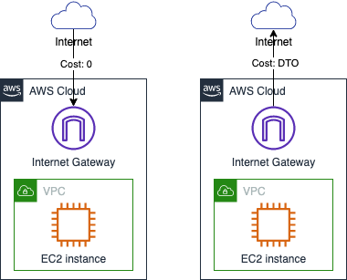
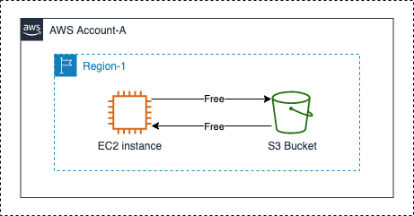
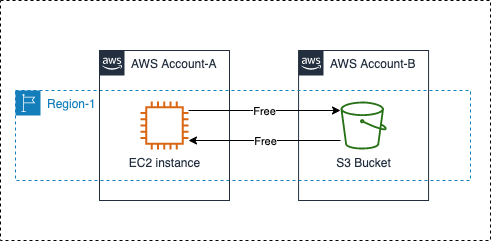
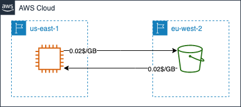
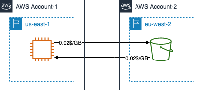

# Amazon EC2 Data Transfer Cost

## Summary

本章汇总了以下与 EC2 相关的流量费用说明：

* [EC2 <----> 互联网](#1-ec2----internet)： 
	
数据流向 | 互联网 --> EC2 | EC2 --> 互联网
----|------|----
EC2 流量费 | 无流量费 | 数据流出费用

*  [EC2 <----> Amazon S3（通过公共 IP 访问）](#2-ec2----s3通过公共-ip-访问)：

相同区域 | S3 --> EC2 | EC2 --> S3
----|------|----
EC2 流量费 | 无流量费 | 无流量费
S3 流量费 | 无流量费  | 无流量费

跨区域 | S3 --> EC2 | EC2 --> S3
----|------|----
EC2 流量费 | 无流量费 | 跨区域流量费
S3 流量费 | 跨区域流量费  | 无流量费

* [EC2 <----> EC2]

## 1. EC2 <--> Internet

本节中所提到的“互联网”不包括 AWS 环境下的公共 IP。

从互联网流入 EC2 实例的所有流量均不产生费用，全球所有区域均遵从此标准。

从 EC2 实例传出至互联网的流量根据每 GB 收取流量费。
  

- 北京区域、宁夏区域，统一收费标准：0.933元/GB，[官网说明](https://www.amazonaws.cn/ec2/pricing/)；  
- 全球其它区域：以 10TB、40TB、100TB、150TB 提供阶梯计费方式，[官网说明](https://aws.amazon.com/cn/ec2/pricing/on-demand/)

[返回目录](#summary)
## 2. EC2 <--> S3（通过公共 IP 访问）

本小节内容仅针对 EC2 和 S3 之间的数据访问，不涉及到 NAT Gateway、VPC Endpoint 等其它服务。

### 2.1 EC2 和 S3 属于相同区域
当 EC2 实例和 S3 存储桶处于相同区域时，无论 EC2 实例和 S3 存储桶是否在同一个账号下，都不会产生数据传输的流量费用。全球所有区域（含北京、宁夏）均遵循此规则。  

**1. 费用说明**
- 相同账号下，相同区域内，EC2 与 S3 之间无数据流量费
  

- 不同账号下，相同区域内，EC2 与 S3 之间无数据流量费*
  

**2. 文档参考**
对于 EC2 到 S3 的流量费用，[官方文档](https://aws.amazon.com/cn/ec2/pricing/on-demand/) （参见“数据传输”部分）说明如下：

>在同一 AWS 区域中的 Amazon S3、Amazon Glacier、Amazon DynamoDB、Amazon SES、Amazon SQS、Amazon Kinesis、Amazon ECR、Amazon SNS、Amazon SimpleDB 和 Amazon EC2 实例之间传输数据是免费的

文档中未明确说明跨账号时的情况。基于个人 2021 年 3 月 23 日测试结果，当处于不同账号时，相同区域内的 EC2 实例向 S3 存储桶传输数据时不产生流量费用。

对于 S3 到 EC2 的流量费用，[官方文档](https://aws.amazon.com/cn/s3/pricing/)（参见“数据传输”部分）说明如下：

>传出到 Amazon Elastic Compute Cloud (Amazon EC2) 实例的数据，当实例与 S3 存储桶位于同一 AWS 区域时（包括传输到位于相同 AWS 区域的不同账户时）。

### 2.2 EC2 和 S3 属于不同区域
跨区域的数据传输会产生跨区域流量费用，各区域针对跨区域流量传输费用的计费标准不一定相同。以下内容以北弗吉尼亚区域（us-east-1）和伦敦区域（eu-west-2）的传输为例进行说明，传输数据为 1 GB。

**1. EC2 和 S3 属于相同账号**

*相同账号下，EC2 与 S3 在跨区域传输时的流量费用*  
  

当 EC2 向 S3 中上传 1 GB 数据时，会收取从 us-east-1 向 eu-west-2 的流量费 0.02 USD。  
当 EC2 从 S3 中下载 1 GB 数据时，会收取从 eu-west-2 向 us-east-1 的流量费 0.02 USD。

**2. EC2 和 S3 属于不同账号（S3 未开启对方付费功能）**  

  

账户 | 场景 | 产生费用的服务 |  流量方向 | 费用
----|----|----|----|----
Account-1 | 向 S3 上传文件 | EC2 | 从 us-east-1 向 eu-west-2 | 0.02 USD
Account-2 | 从 S3 下载文件 | S3 | 从 eu-west-2 向 us-east-1 | 0.02 USD

**3. EC2 和 S3 属于不同账号（S3 开启对方付费功能）**    

[返回目录](#Summary)

[【返回 README】](../../README.md)