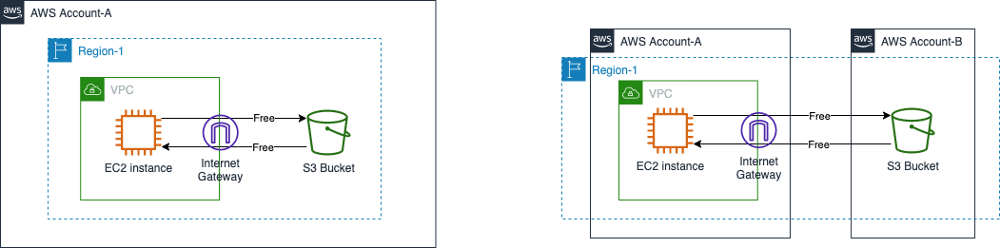
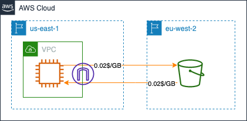
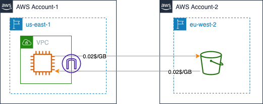
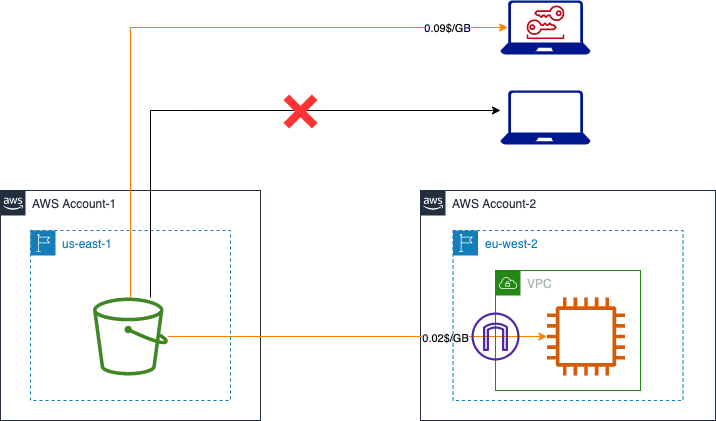
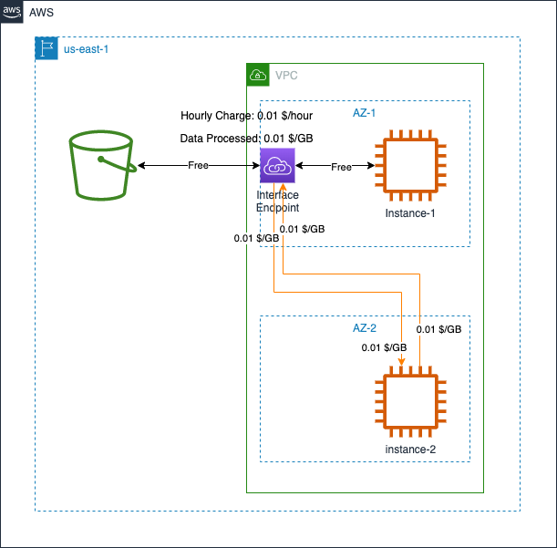
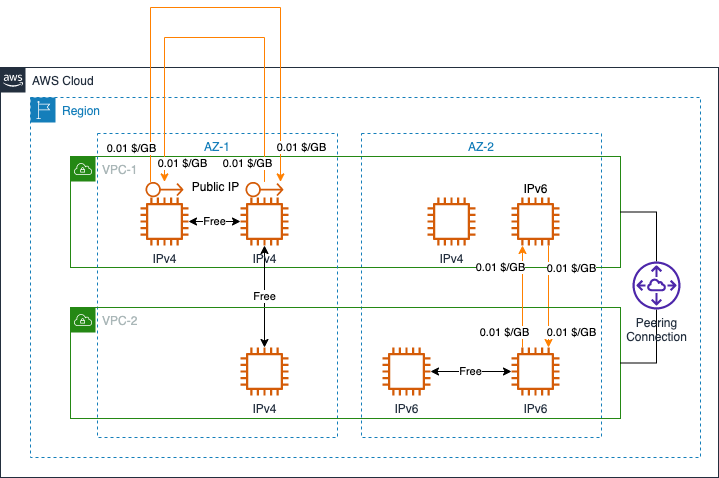
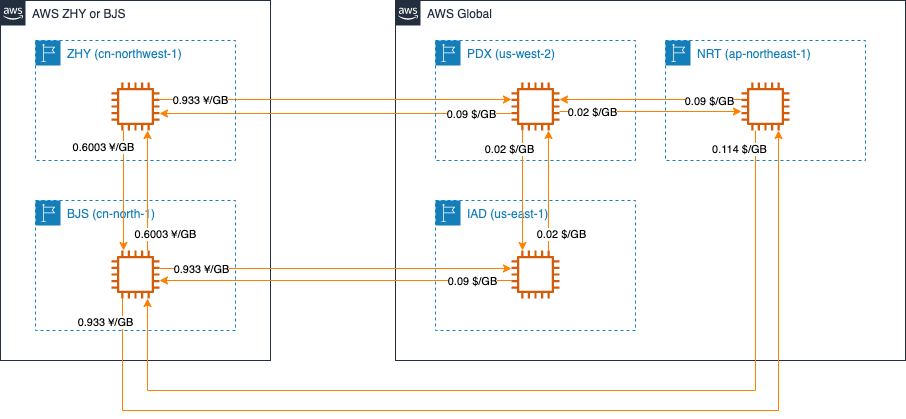
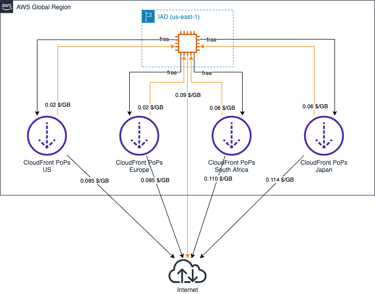
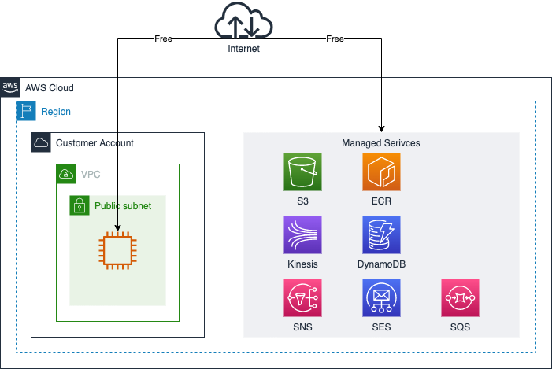

# Amazon EC2 Data Transfer Cost

中文 ｜ [English](EC2-EN.md)
## Summary

本章内容总结了 EC2 几种典型应用场景下，数据传输所产生的费用计算方式。包含如下场景：

- 1. [EC2 <--> Internet](#1-ec2----internet)
- 2. [EC2 <--> S3（不使用 S3 终端节点）](#2-ec2----s3不使用-s3-终端节点)
  - 2.1 [EC2 和 S3 属于相同区域](#21-ec2-和-s3-属于相同区域)
  - 2.2 [EC2 和 S3 属于不同区域](#22-ec2-和-s3-属于不同区域)
- 3. [EC2 <--> S3（使用 S3 终端节点）](#3-ec2----s3使用-s3-终端节点)
  - 3.1 [网关类终端节点费用](#31-网关类终端节点费用)
  - 3.2 [接口类终端节点费用](#32-接口类终端节点费用)
- 4. [EC2 <--> EC2](#3-ec2----ec2)
  - 4.1 [当 EC2 实例处于相同可用区](#41-当-ec2-实例处于相同可用区)
  - 4.2 [当 EC2 实例处于相同区域的不同可用区](#42-当-ec2-实例处于相同区域的不同可用区)
  - 4.3 [当 EC2 实例处于不同区域时](#43-当-ec2-实例处于不同区域时)
- 5. [EC2 <--> CloudFront](#5-ec2----cloudfront)
- 6. [EC2 <--> Other Services](#6-ec2----other-services)

本章参考了官网中以下费用计算说明：

- EC2 计费说明：[全球区域](https://aws.amazon.com/cn/ec2/pricing/on-demand/)，[宁夏、北京区域](https://www.amazonaws.cn/ec2/pricing/)；
- S3 计费说明：[全球区域](https://aws.amazon.com/cn/s3/pricing/)，[宁夏、北京区域](https://www.amazonaws.cn/s3/pricing/)；
- PrivateLink 计费说明：[全球区域](https://aws.amazon.com/cn/privatelink/pricing/)，[宁夏、北京区域](https://www.amazonaws.cn/privatelink/pricing/)；
- CloudFront 计费说明：[全球区域](https://aws.amazon.com/cn/cloudfront/pricing/)，[宁夏、北京区域](https://www.amazonaws.cn/cloudfront/pricing/)

## 1. EC2 <--> Internet

本节中所指的 **互联网** 是指由不属于 AWS 的公共 IP 所组成的网络。 EC2 与 互联网发生通信时，费用如下图所示：

从互联网流入 EC2 实例的所有流量均不产生费用，从 EC2 实例传出至互联网的流量根据每 GB 收取流量费。

- 北京区域、宁夏区域，统一收费标准：0.933元/GB，[官网说明](https://www.amazonaws.cn/ec2/pricing/)；  
- 全球其它区域：以 10TB、40TB、100TB、150TB 提供阶梯计费方式，[官网说明](https://aws.amazon.com/cn/ec2/pricing/on-demand/)

[返回顶部](#summary)
## 2. EC2 <--> S3（不使用 S3 终端节点）

本小节内容仅针对 EC2 和 S3 之间的数据访问，不涉及到 NAT Gateway、VPC Endpoint 等其它服务。

### 2.1 EC2 和 S3 属于相同区域

当 EC2 实例和 S3 存储桶处于相同区域时，无论 EC2 实例和 S3 存储桶是否在同一个账号下，都不会产生数据传输的流量费用。全球所有区域（含北京、宁夏）均遵循此规则。  

EC2 到 S3 的 [数据传输](https://aws.amazon.com/cn/ec2/pricing/on-demand/) 费用说明：  
>在同一 AWS 区域中的 Amazon S3、Amazon Glacier、Amazon DynamoDB、Amazon SES、Amazon SQS、Amazon Kinesis、Amazon ECR、Amazon SNS、Amazon SimpleDB 和 Amazon EC2 实例之间传输数据是免费的

S3 到 EC2 的 [数据传输](https://aws.amazon.com/cn/s3/pricing/) 费用说明指出，以下情况无需支付费用：  
>传从 Amazon S3 存储桶传输到与 S3 存储桶相同的 AWS 区域内的任何 AWS 服务的数据（包括至同一 AWS 区域中不同的账户）。

  

只要 EC2 实例与 S3 存储桶在相同区域，无论它们是否在相同账号内，都不会产生数据传输费用。

### 2.2 EC2 和 S3 属于不同区域
跨区域的数据传输会产生跨区域流量费用。数据传入区域时不收费，传出区域时产生跨区域费用：

 - 全球各区域间（除北京、宁夏区域）流量费用：根据源和目标区域决定，详细说明参见 [EC2 全球定价页面](https://aws.amazon.com/cn/ec2/pricing/on-demand/)  
 - 北京与宁夏区域间流量费用：0.6003 RMB/GB，详细说明参见 [EC2 中国大陆地区定价页面](https://www.amazonaws.cn/ec2/pricing/)  

以下内容以北弗吉尼亚区域（us-east-1）和伦敦区域（eu-west-2）的传输为例进行说明。

i. *当 EC2 实例和 S3 存储桶来自 <mark>相同账号</mark> 时*：

  

当 EC2 向 S3 中上传 1 GB 数据时，会收取从 us-east-1 向 eu-west-2 的流量费 0.02 USD。  
当 EC2 从 S3 中下载 1 GB 数据时，会收取从 eu-west-2 向 us-east-1 的流量费 0.02 USD。

ii. *当 EC2 实例和 S3 存储桶来自 <mark>不同账号</mark> 时*：

  

账户 | 场景 | 产生费用的服务 |  流量方向 | 费用
----|----|----|----|----
Account-1 | 向 S3 上传文件 | EC2 | 从 us-east-1 向 eu-west-2 | 0.02 USD
Account-2 | 从 S3 下载文件 | S3 | 从 eu-west-2 向 us-east-1 | 0.02 USD

iii. *当 EC2 实例和 S3 存储桶来自 <mark>不同账号</mark>，且 S3 所在账户开启 [请求者付款](https://docs.aws.amazon.com/zh_cn/AmazonS3/latest/userguide/RequesterPaysBuckets.html) 功能后*：

  

Account-1 的 S3 存储桶位于北弗吉尼亚区域（us-east-1），Account-2 的 EC2 实例位于伦敦区域（eu-west-2）。此外，账号 2 还有一台笔记本配置了 IAM User 的 AKSK，该 User 拥有访问 S3 存储桶所需权限。Account-1 开启了“请求者付款”功能。 

从 S3 存储桶中下载对象所产生的流量费用全部由 Account-2 承担，包括：

  - 使用 EC2 实例下载时，产生 0.02 USD/GB 跨区域流量费；
  - 使用配置了 AKSK 的笔记本下载时，产生 0.09 USD/GB 的 S3 向互联网传输数据流量费；
  - 使用未配置 AKSK 的笔记本下载时，任务失败。

[返回顶部](#Summary)

## 3. EC2 <--> S3（使用 S3 终端节点）

您可以使用两种类型的 VPC 终端节点访问 Amazon S3：*网关终端节点* 和 *接口终端节点*。*网关终端节点* 是您在路由表中指定的网关，用于通过 AWS 网络从 VPC 访问 Amazon S3。*接口终端节点* 通过私有 IP 地址将请求从您的 VPC 内部、本地或其他 AWS 区域 中的 VPC 使用 VPC 对等连接或 AWS Transit Gateway 路由到 Amazon S3，从而扩展 *网关终端节点* 的功能。

### 3.1 网关类终端节点费用

网关类终端节点不产生使用费用，[AWS PrivateLink 用户手册](https://docs.aws.amazon.com/zh_cn/vpc/latest/privatelink/vpc-endpoints.html) 中明确指出：

>使用网关端点不会产生任何费用。 

如下图示意：

  

### 3.2 接口类终端节点费用

使用接口类终端节点时，将会因为 **每个可用区每个 VPC 终端节点使用时间**、**AWS 区域每月处理的数据**、**跨可用区数据流量** 而产生费用。

**每个可用区每个 VPC 终端节点使用时间** 和 **AWS 区域每月处理的数据** 为接口类终端节点的标准计费维度，可以从 [AWS PrivateLink定价](https://aws.amazon.com/cn/privatelink/pricing/) 页面中看到全球各区域的详细定价说明（北京区域和宁夏区域参见 [这里](https://www.amazonaws.cn/privatelink/pricing/)）。由于接口类网关节点基于可用区创建，如果在使用过程中出现跨可用区访问，还会产生 **跨可用区数据流量** 费用。  

下图示例中包含两个 EC2 实例，一个 Interface Endpoint。其中一个 EC2 实例与 Interface Endpoint 不在同一可用区内。两个实例分别上传 1 GB 数据，并下载 2 GB 数据。  

  

上述例子中，假设数据的上传、下载在 1 小时内可以完成，那么 1 小时内流量相关的成本计算如下。

Instance-1 产生的费用：  

  * 接口终端节点流量处理费 = 0.01 x 3GB（上传、下载均计费） = 0.03 USD；  
  * 接口终端节点时长费用 = 0.01 x 1 = 0.01 USD；  

合计：0.03 + 0.01 = 0.04 USD

Instance-2 产生的费用：  

  * 接口终端节点流量处理费 = 0.01 x 3GB（上传、下载均计费） = 0.03 USD；  
  * 接口终端节点时长费用 = 0.01 x 1 = 0.01 USD；（如果 Instance-1 和 Instance-2 在同一小时内下载对象，则时长费用不用重复计算）  
  * 跨可用区间流量处理费用 = 0.01 x 2 x 2GB（Interface Endpoint ENI  -> Instance-2）+ 0.01 x 2 x 2GB（Instance-2 -> Interface Endpoint ENI） = 0.06 USD；  

合计：0.03 + 0.01 + 0.06 = 0.10 USD  

[返回顶部](#Summary)
## 4. EC2 <--> EC2
### 4.1 当 EC2 实例处于相同可用区

在使用私有 IP 进行通信时，处于相同 AZ 的两个 EC2 实例之间，不产生流量费用。

[在同一 AWS 区域内传输数据](https://aws.amazon.com/cn/ec2/pricing/on-demand/) 时：

>IPv4：对于从公有或弹性 IPv4 地址“传入”和“传出”的数据，每个方向均按 0.01 USD/GB 的标准收费。  
>IPv6：对于从其他 VPC 中的 IPv6 地址“传入”和“传出”的数据，每个方向均按 0.01 USD/GB 的标准收费。

如果相同区域内的两个 VPC 建立了 VPC 对等连接，[对等连接本身免费](https://docs.aws.amazon.com/vpc/latest/peering/what-is-vpc-peering.html#vpc-peering-pricing)，根据 AWS 在 2021 年 5 月的 [声明](https://aws.amazon.com/cn/about-aws/whats-new/2021/05/amazon-vpc-announces-pricing-change-for-vpc-peering/):

>通过可用区 (AZ) 内的 VPC Peering 连接进行的所有数据传输都将免费。通过 VPC Peering 连接进行的所有跨可用区的数据传输，将继续按照标准的区域内数据传输费率收费。

  

### 4.2 当 EC2 实例处于相同区域的不同可用区

[在同一 AWS 区域内传输数据](https://aws.amazon.com/cn/ec2/pricing/on-demand/) 时：

>对于从 Amazon EC2、Amazon RDS、Amazon Redshift、Amazon DynamoDB Accelerator (DAX) 和 Amazon ElastiCache 实例、弹性网络接口或同一 AWS 区域内各可用区或的 VPC 对等连接“传入”和“传出”的数据，每个方向均按 0.01 USD/GB 的标准收费。

  

### 4.3 当 EC2 实例处于不同区域时

需要根据 EC2 实例的数据流出量收取区域间流量费，收费标准因源区域、目标区域而不同。当数据需要在全球区域和中国大陆地区的两个区域内进行传输时，参考互联网数据传输收费标准。

  

[返回顶部](#Summary)

## 5. EC2 <--> CloudFront

根据 CloudFront [价格说明](https://aws.amazon.com/cn/cloudfront/pricing/)：

>CloudFront 对从边缘站点传出的数据流量以及 HTTP 或 HTTPS 请求收费。  
>与 AWS 集成后，从任何 AWS 源（例如 Amazon Simple Storage Service (S3)、Amazon Elastic Compute Cloud (EC2) 或 Elastic Load Balancer）执行来源获取都无需支付传输费用。

但是，从 CloudFront 边缘站点向源站传输数据时，即使源站为 AWS 服务，仍然需要支付流量传输费用。

在 AWS 全球区域，数据从边缘站点传出时，传输到互联网和传输到源服务器的费用不同。

在 AWS 中国大陆地区，数据从边缘站点传出时，传输到互联网和传输到源服务器的费用均为 0.30866 ¥/GB。

[返回顶部](#Summary)

## 6. EC2 <--> Other Services

在不考虑使用了 NAT Gateway、Interface Gateway、Transit Gateway 等网络服务的情况下，EC2 和相同区域内的以下 AWS 服务之间无流量传输费用：

>在同一 AWS 区域中的 Amazon S3、Amazon EBS 直接 API、Amazon Glacier、Amazon DynamoDB、Amazon SES、Amazon SQS、Amazon Kinesis、Amazon ECR、Amazon SNS、Amazon SimpleDB 和 Amazon EC2 实例之间直接传输数据是免费的。

  

如希望 EC2 通过 AWS 内部网络访问上述服务，需要在 VPC 内创建终端节点。详细内容参见 [VCP 部分](../../Networking/VPC/VPC-CN.md)说明。

[返回顶部](#Summary)

[【返回 README】](../../README.md)