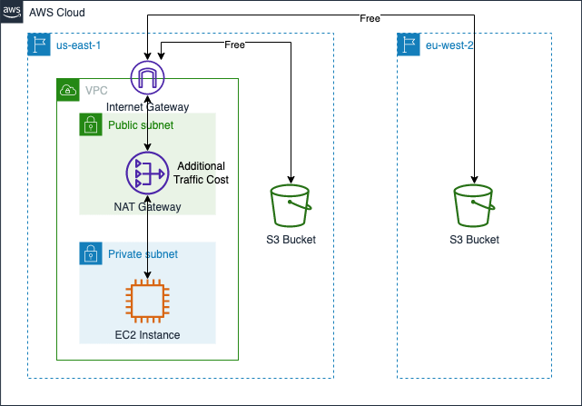
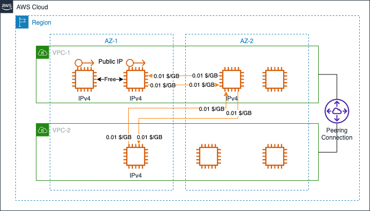

# Amazon EC2 Data Transfer Cost

[中文](EC2-CN.md) | English  

## Summary

This page summarizes the cost calculation of EC2 data transfer in several typical scenarios. The following scenarios are included:

- 1. [EC2 <--> Internet](#1-ec2----internet)
- 2. [EC2 <--> S3 (without S3 endpoint)](#2-ec2----s3-without-s3-endpoint)
  - 2.1 [EC2 and S3 within the same Region](#21-ec2-and-s3-within-the-same-region)
  - 2.2 [EC2 and S3 across different Regions](#22-ec2-and-s3-across-different-regions)
  - 2.3 [EC2 access S3 via NAT Gateway](#23-ec2-access-s3-via-nat-gateway)
- 3. [EC2 <--> S3 (with S3 endpoint)](#3-ec2----s3-with-s3-endpoint)
  - 3.1 [Gateway Endpoint Pricing](#31-gateway-endpoint-pricing)
  - 3.2 [Interface Endpoint Pricing](#32-interface-endpoint-pricing)
- 4. [EC2 <--> EC2](#4-ec2----ec2)
  - 4.1 [EC2 instnaces within the same AZ](#41-ec2-instnaces-within-the-same-az)
  - 4.2 [EC2 instances across different AZ](#42-ec2-instances-across-different-az)
  - 4.3 [EC2 instances across different Regions](#43-ec2-instances-across-different-regions)
- 5. [EC2 <--> CloudFront](#5-ec2----cloudfront)
- 6. [EC2 <--> Other Services](#6-ec2----other-services)

The following costing instructions from the official website are referenced in this page:

- EC2 Pricing: [Global Region](https://aws.amazon.com/ec2/pricing/on-demand/), [Ningxia & Beijing Regions](https://www.amazonaws.cn/en/ec2/pricing/);
- S3 Pricing: [Global Region](https://aws.amazon.com/s3/pricing/), [Ningxia & Beijing Regions](https://www.amazonaws.cn/en/s3/pricing/);  
- PrivateLink Pricing: [Global Region](https://aws.amazon.com/privatelink/pricing/), [Ningxia & Beijing Regions](https://www.amazonaws.cn/en/privatelink/pricing/);  
- CloudFront Pricing: [Global Region](https://aws.amazon.com/cloudfront/pricing/), [Ningxia & Beijing Regions](https://www.amazonaws.cn/en/cloudfront/pricing/)

## 1. EC2 <--> Internet

The **Internet** refferred to in this page means a network consisting of public IPs that are not part of AWS. When EC2 communicates with the Internet, the costs are as shown in the following figure.

All data traffic flowing IN To the EC2 instance from the Internet is free, but data traffic flowing OUT From Amazon EC2 to Internet is charged on a per GB basis.

- Beijing and Ningxia Regions have the same rate: 0.933 RMB/GB，[EC2 Pricing](https://www.amazonaws.cn/en/ec2/pricing/)；  
- Global Regions have stepped billing rate with 10TB, 40TB, 100TB, and 150TB, [EC2 Pricing](https://aws.amazon.com/ec2/pricing/on-demand/)

[Back to Top](#summary)

## 2. EC2 <--> S3 (without S3 endpoint)

This section is only for data transfer between EC2 and S3, and no other services included, such as NAT Gateway, VPC Endpoint, etc.

### 2.1 EC2 and S3 within the same Region

Data transferred directly between Amazon EC2 and Amazon S3 in the same AWS Region is free, regardless of whether the EC2 instances and S3 storage buckets are under the same AWS account. All regions (including Beijing, Ningxia) follow this rule. 

[Data transfer cost](https://aws.amazon.com/ec2/pricing/on-demand/) from EC2 to S3 is described as follows: 

>Data transferred directly between Amazon S3, Amazon EBS direct APIs*, Amazon Glacier, Amazon DynamoDB, Amazon SES, Amazon SQS, Amazon Kinesis, Amazon ECR, Amazon SNS or Amazon SimpleDB and Amazon EC2 instances in the same AWS Region is free.

According to [S3 Pricing](https://aws.amazon.com/s3/pricing/) description, no costs for the following cases:  

>Data transferred from an Amazon S3 bucket to any AWS service(s) within the same AWS Region as the S3 bucket (including to a different account in the same AWS Region).

  

No data transfer costs are incurred as long as EC2 instnaces are in the same region as S3 buckets, regardless of whether they are in the same AWS account. 

### 2.2 EC2 and S3 across different Regions

Costs are incurred for data transfer across regions. Data transfer IN to one region is free, but will incure cross region cost when OUT From one region. 

 - Global Region (exclude Beijing and Ningxia Regions): depending on the source and destination regions，for detailed instructions, [EC2 Pricing for Global Regions](https://aws.amazon.com/ec2/pricing/on-demand/)  
 - Data Transfer Cost between Beijing and Ningxia: 0.6003 RMB/GB, or detailed instructions, [EC2 Pricing for China Mainland Regions](https://www.amazonaws.cn/en/ec2/pricing/)  

The following is an example of the data transfer cost between N.Virginia region (us-east-1) and London region (eu-west-2).

i. *EC2 instances and S3 buckets come from the <mark>SAME</mark> AWS account*:

  

When data flow is from EC2 to S3, 1GB data will cost 0.02 USD (from us-east-1 to eu-west-2).    
When data flow is from S3 to EC2, 1GB data will cost 0.02 USD (from eu-west-2 to us-east-1). 

ii. *EC2 instnaces and S3 buckets come from the <mark>DIFFERENT</mark> AWS account*：

  

Account | Scenario | Services that incur costs |  Flow Direction | Cost
----|----|----|----|----
Account-1 | Upload objects to S3 | EC2 | From us-east-1 to eu-west-2 | 0.02 USD
Account-2 | Download objects from S3 | S3 | From eu-west-2 to us-east-1 | 0.02 USD

iii. *EC2 instances and S3 bucket come from <mark>DIFFERENT</mark> AWS account, and S3 Account enbaled [Requester Pays](https://docs.aws.amazon.com/AmazonS3/latest/userguide/RequesterPaysBuckets.html)*：

  

S3 bucket from Account-1 is located in Northern Virginia region (us-east-1) and EC2 instance from Account-2 is located in London region (eu-west-2). In addition, Account-2 has a laptop configured with the IAM User's AKSK, which has full permissions to access to S3 bucket in Account-1. Account-1 has enalbed "requester payment" feature. 

Data transfer costs incurred by downloading objects from S3 storage buckets are fully covered by Account-2, including:

  - When downloading objects with EC2 instance，cross region data transfer fee, 0.02 USD/GB;
  - When downloading objects with Laptop configured AKSK, data transfer out fee, 0.09 USD/GB;
  - When downloading objects with Laptop without AKSK, mission failed.

### 2.3 EC2 access S3 via NAT Gateway
When an EC2 instance is deployed in a private subnet without S3 endpoint, the EC2 instance must access S3 bucket via NAT Gateway. In addition to the costs described in 2.1 and 2.2, NAT Gateway traffic processing fees are added.

  

For detail information on calculating traffic processing costs for NAT Gateway, please refer to [HERE](../../Networking/VPC/VPC-EN.md#2-nat-gateway).

[Back to Top](#Summary)

## 3. EC2 <--> S3 (with S3 endpoint)

You can use two types of VPC endpoints to access Amazon S3: *gateway endpoints* and *interface endpoints*. A *gateway endpoint* is a gateway that you specify in your route table to access Amazon S3 from your VPC over the AWS network. *Interface endpoints* extend the functionality of *gateway endpoints* by using private IP addresses to route requests to Amazon S3 from within your VPC, on premises, or from a VPC in another AWS Region using VPC peering or AWS Transit Gateway.

### 3.1 Gateway Endpoint Pricing

Gateway endpoint has no cost, see [AWS PrivateLink Guide](https://docs.aws.amazon.com/vpc/latest/privatelink/vpc-endpoints.html): 

>There is no charge for using gateway endpoints. 

Example as below:

  

### 3.2 Interface Endpoint Pricing

When using interface endpoint, you will billed for **Pricing per VPC endpoint per AZ**、**Data Processed per month**、**data transfer cross AZ**.  

**Pricing per VPC endpoint per AZ** and **Data Processed per month** are standard billing dimensions for interface endpoint, you may check the pricing detail for each regoin on [AWS PrivateLink Pricing](https://aws.amazon.com/privatelink/pricing/), Beijing and Ningxia regions are [here](https://www.amazonaws.cn/en/privatelink/pricing/）. Since interface endpoints are based on AZ, you may also billed for **data transfer cross AZ** if cross availability zone access occurs.   

The example below contains two EC2 instances in different two AZs, and a Interface Endpoint is created in the same AZ as one EC2 instance. Both two instances upload 1 GB of data and download 2 GB of data each. 

  

In the above example, assuming that the upload and download of data can be completed within 1 hour, the data transfer cost in 1 hour is calculated as follows.

Instance-1 Cost:   

  * Interface Endpoint Data Processed = 0.01 x 3GB (both upload and download) = 0.03 USD;  
  * Interface Endpoint per VPC endpoint per AZ = 0.01 x 1 = 0.01 USD;    

Total: 0.03 + 0.01 = 0.04 USD

Instance-2 Cost:   

  * Interfacce Endpoint Data Processed = 0.01 x 3GB (both upload and download) = 0.03 USD；  
  * Interface Endpoint per VPC endpoint per AZ = 0.01 x 1 = 0.01 USD；(this cost is not double counted if nstance-1 and Instance-2 download objects within the same hour)  
  * Data Transfer cross AZ = 0.01 x 2 x 2GB (Interface Endpoint ENI -> Instance-2) + 0.01 x 2 x 2GB (Instance-2 -> Interface Endpoint ENI) = 0.06 USD；  

Total: 0.03 + 0.01 + 0.06 = 0.10 USD  

[Back to Top](#Summary)

## 4. EC2 <--> EC2
### 4.1 EC2 instnaces within the same AZ

When communicating with private IP, no data transfer cost between two EC2 instances in the same AZ.

[Data Transfer within the same AWS Region](https://aws.amazon.com/ec2/pricing/on-demand/):

>IPv4: Data transferred “in” to and “out” from public or Elastic IPv4 address is charged at $0.01/GB in each direction.  
>IPv6: Data transferred “in” to and “out” from an IPv6 address in a different VPC is charged at $0.01/GB in each direction.

If two VPCs in the same region have established VPC peering connection, [There is no charge to create a VPC peering connection](https://docs.aws.amazon.com/vpc/latest/peering/what-is-vpc-peering.html#vpc-peering-pricing)，According to the [Statement](https://aws.amazon.com/about-aws/whats-new/2021/05/amazon-vpc-announces-pricing-change-for-vpc-peering/) in May 2021:

> all data transfer over a VPC Peering connection that stays within an Availability Zone (AZ) is now free. All data transfer over a VPC Peering connection that crosses Availability Zones will continue to be charged at the standard in-region data transfer rates.

  

### 4.2 EC2 instances across different AZ

[Data Transfer within the same AWS Region](https://aws.amazon.com/ec2/pricing/on-demand/):

>Data transferred "in" to and "out" from Amazon EC2, Amazon RDS, Amazon Redshift, Amazon DynamoDB Accelerator (DAX), and Amazon ElastiCache instances, Elastic Network Interfaces or VPC Peering connections across Availability Zones in the same AWS Region is charged at $0.01/GB in each direction.

  

### 4.3 EC2 instances across different Regions

Data transfer cost across AWS regions is different from data transfer cost to Internet, the costs vary by source region and destination region. When data needs to be transmitted between global regions and mainland China regions, refer to the Internet data transfer charge rate.

  

[Back to Top](#Summary)

## 5. EC2 <--> CloudFront

According to [CloudFront Pricing](https://aws.amazon.com/cloudfront/pricing/) page：

>CloudFront charges traffic served via data transfers out from edge locations, along with HTTP or HTTPS requests.  
>ntegrated with AWS, there are no transfer fees for origin fetches from any AWS origin such as Amazon Simple Storage Service (S3), Amazon Elastic Compute Cloud (EC2), or Elastic Load Balancers.   

However, when transferring data from a CloudFront edge site to a source site, you still need to pay for the data transfer even if the source site is an AWS service.

In AWS Global Regions, the cost of data transfer from the edge site to the Internet and to the source server is not the same.  

In AWS Mainland China regions, data costs 0.30866 ¥/GB for both outbound direction on the edge site.

[Back to Top](#Summary)

## 6. EC2 <--> Other Services

No data transfer costs between EC2 and the following AWS services in the same region if you do not use NAT Gateway, Interface Gateway, Transit Gateway, etc.

>Data transferred directly between Amazon S3, Amazon EBS direct APIs*, Amazon Glacier, Amazon DynamoDB, Amazon SES, Amazon SQS, Amazon Kinesis, Amazon ECR, Amazon SNS or Amazon SimpleDB and Amazon EC2 instances in the same AWS Region is free.   

  

If you want EC2 to access the above services using private IP, you need to create an endpoint within the VPC. See [VCP section in this repository](../../Networking/VPC/VPC-EN.md) for details.

[Back to Top](#Summary)

[Back to README](../../README-EN.md)