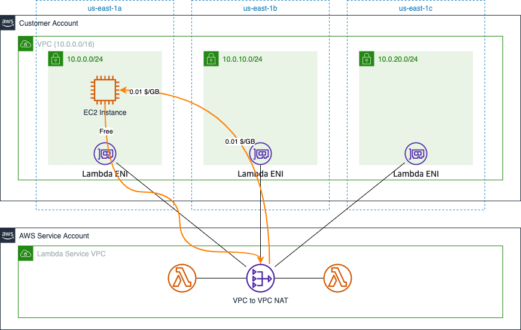
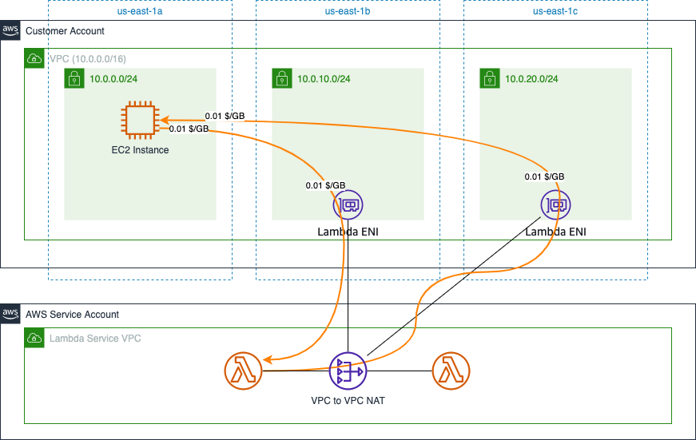
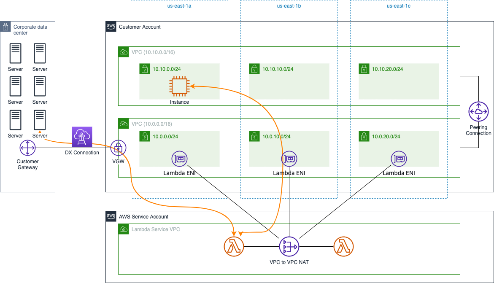

# AWS Lambda Data Transfer Cost

中文 ｜ [English](Lambda-EN.md)

## Summary

本章内容总结了 Lambda 函数在几种典型应用场景下，数据传输所产生的费用计算方式。包含如下场景：

- 1. [Lambda Data Transfer via Public Networking](#1-lambda-data-transfer-via-public-networking)
- 2. [Lambda <--> VPC](#2-lambda----vpc)
- 3. [Lambda <--> Other Resources via VPC](#3-lambda----other-resources-via-vpc)

本章参考了官网中以下费用计算说明：

- EC2 计费说明：[全球区域](https://aws.amazon.com/cn/ec2/pricing/on-demand/)，[宁夏、北京区域](https://www.amazonaws.cn/ec2/pricing/)；
- Lambda 计费说明：[全球区域](https://aws.amazon.com/cn/lambda/pricing/)，[宁夏、北京区域](https://www.amazonaws.cn/lambda/pricing/)

## 1. Lambda Data Transfer via Public Networking

Lambda 函数的数据传输费用计费原则与 Amazon EC2 计费规则相同：

>从函数执行区域外“转入”和“转出”AWS Lambda 函数的数据,将按照 “[数据传输](https://aws.amazon.com/cn/ec2/pricing/on-demand/)” 下列出的 Amazon EC2 数据传输速率收费。

这意味着从 Lambda 函数向互联网传输数据时会产生标准的数据传输费用（Data Transfer Out），访问相同区域内的其他 AWS 服务时不会产生费用。下图以北弗吉尼亚区域为例进行说明：

在使用 Lambda 函数访问其它区域内的资源时，会产生跨区域间的流量成本。图示中展示的是北弗吉尼亚区域（us-east-1）到东京区域（ap-northeast-1）之间的流量成本情况。

[返回顶部](#summary)

## 2. Lambda <--> VPC

如果需要 Lambda 函数可以访问部署在 VPC 中的私有资源，需要对 Lambda 函数的网络进行配置。这个配置本身[不会产生任何费用](https://docs.aws.amazon.com/zh_cn/lambda/latest/dg/foundation-networking.html)：

>如果您的 Lambda 函数需要访问您的账户 VPC 中的资源，[请配置该函数以访问 VPC](https://docs.aws.amazon.com/zh_cn/lambda/latest/dg/configuration-vpc.html)。Lambda 提供名为 Hyperplane ENI 的托管资源，您的 Lambda 函数可使用这些资源从 Lambda VPC 连接到您的账户 VPC 中的 ENI（弹性网络接口）。
>
>使用 VPC 或 Hyperplane ENI 无需额外付费。

但通过个人验证，Lambda 函数在访问 VPC 内资源时，可能产生跨可用区的数据传输费用。

假设在设置 Lambda 函数访问 VPC 时，指定了位于多个可用区内的子网，其数据传输流量存在下图所示的可能：

图示场景下，客户创建的 Lambda 函数通过位于可用区 us-east-1b 中的网络接口进入到客户 VPC 中，并通过这个网络接口访问到位于可用区 us-east-1a 中 EC2 实例上的应用。EC2 实例上的响应流量则通过相同可用区内的网络接口路由回 Lambda 函数。在这一过程中就产生了跨可用区流量。

以图示场景为例，假设 Lambda 函数向 EC2 实例发送了 10GB 数据，EC2 实例向 Lambda 函数发回了 2GB 数据。则产生的网络传输成本均为跨可用区流量成本，计算如下：

- Lambda -> EC2：0.01 x 10（ENI 流出）+ 0.01 x 10（EC2 流入）= 0.2 USD
- EC2 -> Lambda：0（在客户账号内未产生跨可用区流量成本）

但如果在配置 Lambda 函数访问 VPC 时，只选择了部分可用区内的子网，并且要访问的资源恰好位于未选中的子网内，在双方向上必然会产生跨可用区的流量传输费用，如下图：

**补充说明两点**：

1. 实际应用场景中，Lambda 函数很少被用于进行大流量传输的操作，所以即使会产生跨可用区流量传输费，总额也不会过高（相对于 Lambda 函数的其它使用成本而言）；
2. 配置 Lambda 可以访问 VPC 时，通常会选中所有可用区以提高可靠性，因此 VPC 内资源向 Lambda 方向上不会产生跨可用区流量费。

[返回顶部](#Summary)

## 3. Lambda <--> Other Resources via VPC

在配置完访问 VPC 后，Lambda 函数通过 [VPC-to-VPC NAT 访问位于客户账号内 VPC 中的资源](https://aws.amazon.com/cn/blogs/compute/announcing-improved-vpc-networking-for-aws-lambda-functions/)。进入到客户 VPC 后，Lambda IP 已经被 NAT 为客户 VPC 内 IP。因此，与客户 VPC 联通的其它资源，Lambda 函数均可以访问。所产生的流量传输费用与 VPC 内资源访问其它资源时产生的流量传输费用按相同方式计算。

如下图，通过 VPC Peering、DX Connection，Lambda 函数可以访问其它与 VPC 关联的资源。

VPC Peering 场景下的流量传输费用说明，参见 [EC2 间流量传输成本说明](../EC2/EC2-CN.md#4-ec2----ec2)。

DX Connection 场景下的流量传输费用说明，参见 [Direct Connect 流量传输成本说明](../..Networking/../../Networking/Connection/Connection-CN.md#1-aws-direct-connect)。

[返回顶部](#Summary)

[【返回 README】](../../README.md)