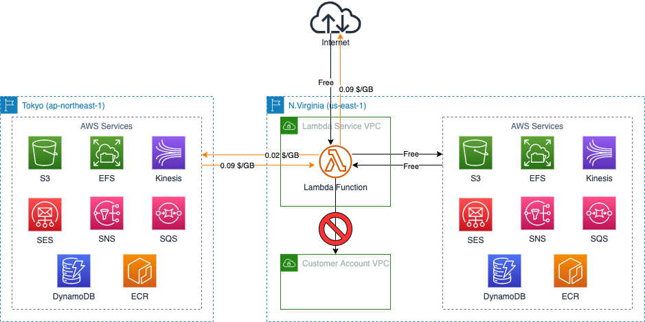
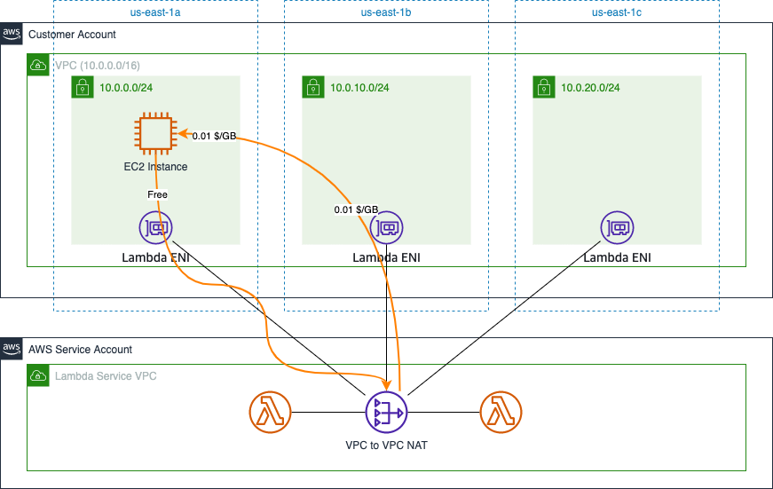
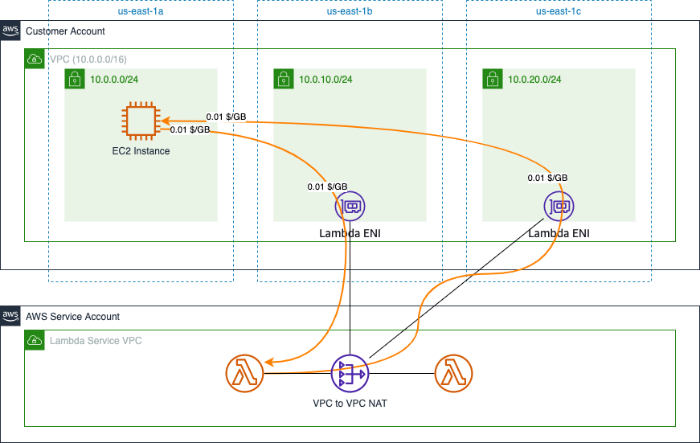
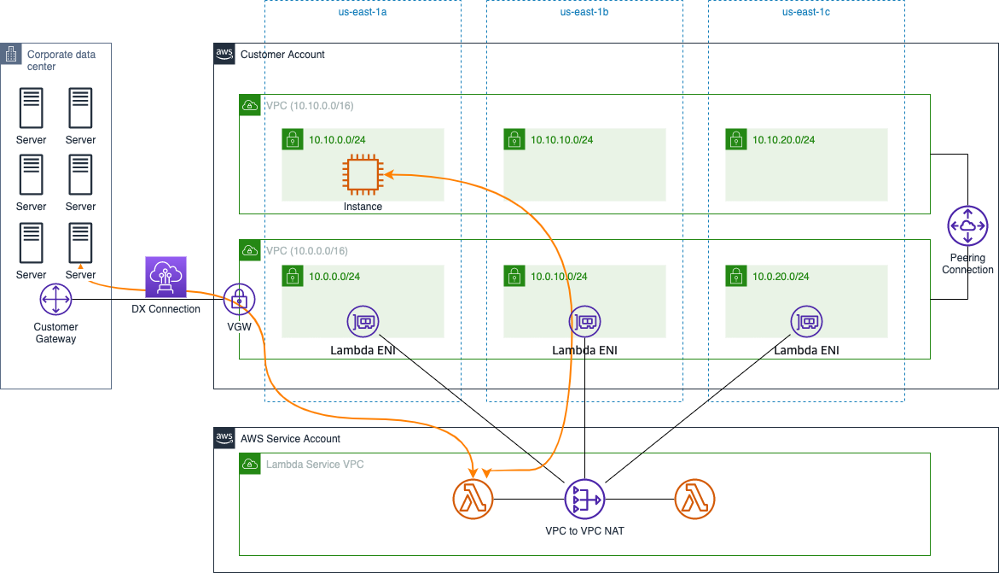

# AWS Lambda Data Transfer Cost

[中文](Lambda-CN.md) | English
## Summary

This page summarizes the cost of data transfers in several typical scenarios when using AWS Lambda. The following scenarios are included:

- 1. [Lambda Data Transfer via Public Networking](#1-lambda-data-transfer-via-public-networking)
- 2. [Lambda <--> VPC](#2-lambda----vpc)
- 3. [Lambda <--> Other Resources via VPC](#3-lambda----other-resources-via-vpc)

The following costing instructions from the official website are referenced in this page:

- EC2 Pricing: [Global Region](https://aws.amazon.com/ec2/pricing/on-demand/), [Ningxia & Beijing Regions](https://www.amazonaws.cn/en/ec2/pricing/);
- Lambda Pricing: [Global Region](https://aws.amazon.com/lambda/pricing/)，[Ningxia & Beijing Regions](https://www.amazonaws.cn/en/lambda/pricing/)

## 1. Lambda Data Transfer via Public Networking

The billing principles for data transfer costs for Lambda functions are the same as Amazon EC2 billing rules:

>Data transferred “in” to and “out” of your AWS Lambda functions, from outside the region the function executed, will be charged at the Amazon EC2 data transfer rates as listed under "[Data transfer](https://aws.amazon.com/ec2/pricing/on-demand/)".

Which means that transferring data from Lambda functions to the Internet will incur standard Data Transfer Out charges, while accessing other AWS services in the same region will not incur charges. The following figure illustrates an example in N.Virginia (us-east-1):

When accessing resources within other regions, inter-region data transfer costs are charged for Lambda functions. The figure shows the data transfer cost between N.Virginia region (us-east-1) and Tokyo region (ap-northeast-1).

[Back to Top](#summary)

## 2. Lambda <--> VPC

If Lambda function needs to access to the private resources deployed in your VPC, you need to configure the network for the Lambda function. This configuration itself [does not incur any cost](https://docs.aws.amazon.com/lambda/latest/dg/foundation-networking.html):   

>If your Lambda function needs to access the resources in your account VPC, [configure the function to access the VPC](https://docs.aws.amazon.com/lambda/latest/dg/configuration-vpc.html). Lambda provides managed resources named Hyperplane ENIs, which your Lambda function uses to connect from the Lambda VPC to an ENI (Elastic network interface) in your account VPC.
>
>There's no additional charge for using a VPC or a Hyperplane ENI.

However, through personal testing, Lambda functions may incur data transfer costs across AZs when accessing resources within the VPC.

Assuming that when configuring the Lambda function to access the VPC, you choose subnets located in multiple AZs, the data transfer traffic as shown in the following figure is possible:

In this scenario, the Lambda function enters the customer VPC through the network interface in us-east-1b and accesses the application on the EC2 instance in us-east-1a through this network interface.Tthe response traffic on the EC2 instance is routed back to the Lambda function through the network interface in the same AZ (us-east-1a). In the process, cross-AZ data transfer traffic is generated.

Still in this scenario, assume that the Lambda function sends 10GB data to the EC2 instance and the EC2 instance sends 2GB data back to the Lambda function. Then the resulting data transfer costs are cross-AZ transfer costs, calculated as follows:  

- Lambda -> EC2：0.01 x 10 (ENI OUT) + 0.01 x 10 (EC2 IN) = 0.2 USD
- EC2 -> Lambda：0 (No cross-AZ transfer costs in customer account)

However, if the Lambda function is configured to access the VPC with subnets within partial AZs , and the resource to be accessed is located within an unselected AZ, it's definitely to incur cross-AZ data transfer costs, as follows:

**Two additional points**:

1. In real cases, Lambda functions are rarely used for heavy data transfer workloads, so even if cross-AZ data transfer fees are incurred, they are not excessive in total (relative to the other costs of using Lambda functions);  
2. When Lambda function is configured to access a VPC, all AZs are usually selected for reliability, so there are no cross-AZ data transfer costs in the direction from resources within VPC to Lambda function.

[Back to Top](#Summary)

## 3. Lambda <--> Other Resources via VPC

After configuring access to the VPC, the Lambda function accesses the resources located in the VPC within the customer account via [VPC-to-VPC NAT](https://aws.amazon.com/cn/blogs/compute/announcing-improved-vpc-networking-for-aws-lambda-functions/). Once data packet from Lambda function enters the customer VPC, the packet IP has been NAT'd to the IP within customer VPC. Therefore, all other resources connected to the customer VPC can be accessed by the Lambda functions. The resulting data transfer costs are calculated in the same way as the data transfer costs for resources within the VPC accessing other resources.

As shown below, the Lambda function can access other resources associated with the VPC through VPC Peering, DX Connection.

For a description of data transfer costs in VPC Peering scenarios, you may reference [data transfer costs among EC2 instances](../EC2/EC2-EN.md#4-ec2----ec2)。

For a description of data transfer costs for DX Connectionscenario, you may reference [Data  transfer costs for Direct Connect](../..Networking/../../Networking/Connection/Connection-EN.md#1-aws-direct-connect)。

[Back to Top](#Summary)

[Back to README](../../README-EN.md)