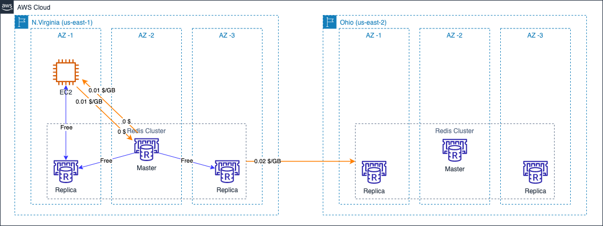

# Amazon NoSQL Data Transfer Cost

中文 ｜ [English](memoryDB-EN.md)

## Summary

AWS 提供丰富的数据库服务，在本系列文章中已经有专门章节对 [NOSQL 数据库](../NOSQL/NOSQL-CN.md) 和 [关系型数据库](../RDBMS/RDBMS-CN.md) 的数据传输成本进行了说明。

本章节会对其它数据库服务的传输成本进行说明。您可以通过以下目录快速跳转到相关部分：

【补充章节目录】

本章参考了官网中以下费用计算说明：

- Amazon ElastiCache：[全球区域](https://aws.amazon.com/cn/elasticache/pricing/)，[宁夏及北京区域](https://www.amazonaws.cn/elasticache/pricing/)；
- Amazon Neptune：[全球区域](https://aws.amazon.com/cn/elasticache/pricing/)，[宁夏及北京区域](https://www.amazonaws.cn/elasticache/pricing/)；
- EC2 计费说明：[全球区域](https://aws.amazon.com/cn/ec2/pricing/on-demand/)，[宁夏、北京区域](https://www.amazonaws.cn/ec2/pricing/)

## 1. Amazon ElastiCache

AWS 提供两种托管的内存缓存服务，分别兼容 [Redis](https://github.com/redis/redis) 和 [Memcached](https://github.com/memcached/memcached)。两种服务在数据传输成本方面遵循相同的价格模型。

总体来说，ElastiCache 在数据传输成本上的计算规则和 EC2 相同，唯一的区别在于，当 ElastiCache 和 EC2 不在相同 AZ 时，仅会收取 EC2 这一端的跨 AZ 流量传输费（流入/流出均计费），ElastiCache 这一侧不收取流量传输费。

如下图所示：
  

图中示例中，EC2 实例、ElastiCache(Redis) primary cluster 部署在北弗吉尼亚区域，在俄亥俄区域部署全球数据存储功能。主要的流量成本说明如下：

- 当 EC2 实例访问本可用区内的 Redis 节点时，不产生任何流量费用；
- 当 EC2 实例访问其它 AZ 内的 Redis 节点时，流入和流出的流量均收取跨可用区流量费（北弗吉尼亚区域的收费标准为 0.01 $/GB），而 Redis 节点不会因此产生流量费用；
- Redis 集群内，各节点之间数据同步时不产生跨可用区流量费用；
- 启用全球数据存储功能时，北弗吉尼亚作为主要区域会在数据流出时收取跨区域流量费（0.02 $/GB）。
  
## 2. Amazon Neptune

[Amazon Neptune](https://aws.amazon.com/cn/neptune/) 是一种快速、可靠且完全托管式图数据库服务。

Neptune 的数据传输费用和 ElastiCache 类似，遵循如下原则：

- 当 EC2 实例访问本可用区内的 Neptune 节点时，不产生任何流量费用；
- 