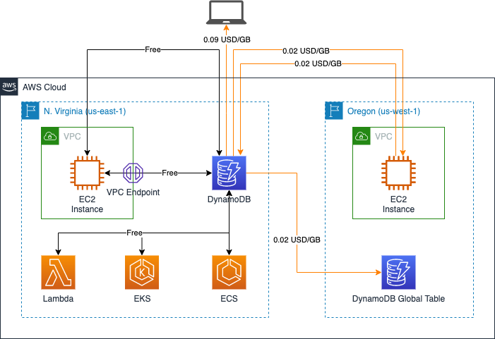
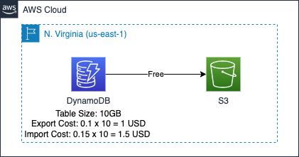
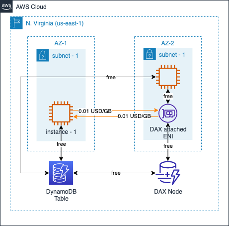
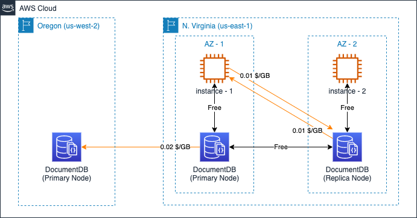
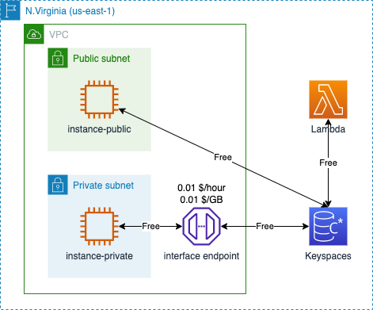

# Amazon NoSQL Data Transfer Cost

[中文](NOSQL-CN.md) ｜ English

## Summary

>[Statement] The classification in this section is not an AWS official classification.

AWS offers several common NOSQL databases, including:

- [Amazon DynamoDB](https://aws.amazon.com/dynamodb/): Amazon DynamoDB is a fully managed, serverless, key-value NoSQL database designed to run high-performance applications at any scale.；
- [Amazon DocumentDB](https://aws.amazon.com/documentdb/): 是Amazon DocumentDB (with MongoDB compatibility) is a fast, scalable, highly available, and fully managed document database service that supports [MongoDB](https://www.mongodb.com) workloads；
- [Amazon Keyspaces](https://aws.amazon.com/keyspaces/): Amazon Keyspaces (for Apache Cassandra) is a scalable, highly available, and managed [Apache Cassandra](https://aws.amazon.com/cn/keyspaces/what-is-cassandra/)–compatible database service.

This page provides a detailed description of the data transfer costs for the three products mentioned above, and you can quickly jump to the relevant sections by the following quick links:

- 1. [Amazon DynamoDB](#1-amazon-dynamodb)
  - 1.1 [Standard Data Transfer](#11-standard-data-transfer)
  - 1.2 [DDB to/from S3](#12-ddb-tofrom-s3)
  - 1.3 [DynamoDB Accelerator](#13-dynamodb-accelerator)
- 2. [Amazon DocumentDB](#2-amazon-documentdb)
- 3. [Amazon Keyspaces](#3-amazon-keyspaces)

The following costing instructions from the official website are referenced in this page:

- DynamoDB Pricing: [Global Region-On Demand](https://aws.amazon.com/dynamodb/pricing/on-demand/)，[Global Region-Provisioned](https://aws.amazon.com/dynamodb/pricing/provisioned/)，[Ningxia & Beijing Regions](https://www.amazonaws.cn/en/dynamodb/pricing/)；
- DocumentDB Pricing: [Global Region](https://aws.amazon.com/documentdb/pricing/)，[Ningxia & Beijing Regions](https://www.amazonaws.cn/en/documentdb/pricing/)；
- Keyspaces Pricing: [Global Region](https://aws.amazon.com/keyspaces/pricing/)；
- EC2 Pricing: [Global Region](https://aws.amazon.com/ec2/pricing/on-demand/), [Ningxia & Beijing Regions](https://www.amazonaws.cn/en/ec2/pricing/);

## 1. Amazon DynamoDB

### 1.1 Standard Data Transfer

When transferring data to/from DynamoDB, major billing dimensions are as follows：

- inbound data transfer: free;
- outbound data transfer (to internet): per GB;
- outbound data transfer (to other services within the same region): free;
- outbound data transfer (to other services in other region): per GB.

The following diagram illustrates DynamoDB data transfer costs in N.Virginia and Oregon regions:

### 1.2 DDB to/from S3

Use this feature to export data from your DynamoDB continuous backups (point-in-time recovery) to Amazon Simple Storage Service (Amazon S3). 

Strictly speaking, there is no data transfer cost between Dynamodb and S3 when they are located in the same region, and there is a standard cross-region transfer cost when they are located in different regions. However, DynamoDB charges a fee for the exported data. This cost is incurred due to data exportion, so it is also summarized here (although it is not a data transfer cost).

The following diagram illustrates this cost as an example in N.Virgian region:

There is **NO cost** for the **data transfer** itself, but the following charges are incurred due to the size of the data (assuming a table size of 10GB when the data is exported to S3):

- continuous backups (PITR): 0.2 x 10 = 2 USD (per month)
- export to S3: 0.1 x 10 = 1 USD

In addition, a S3 PUT Request fee is incurred. This fee is not directly related to the volume of data, but to the number of requests. See [Amazon S3 Pricing](https://aws.amazon.com/s3/pricing/) for more information.

When data needs to be imported from S3, there is also a charge based on the amount of data imported. As shown above, the rate in the N.Virginia region is $0.15/GB.

### 1.3 DynamoDB Accelerator

[Amazon DynamoDB Accelerator (DAX)](https://aws.amazon.com/dynamodb/dax/) is a fully managed, highly available, in-memory cache for Amazon DynamoDB. The DAX nodes are deployed on EC2 instances that are not visible to the customer account and will transfer data via ENI within the customer account.

Standard cross-availability data transfer charges are incurred when the DAX node and EC2 instance are not within the same AZ. If the EC2 instance does not access through the DAX Cluster endpoint, but directly accesses the DynamoDB table, no cross-availability zone data transfer charges are incurred.

No data transfer costs are incurred between the DAX node and the ENI in the customer account.

See below diagram as detail:

[Back to Top](#summary)

## 2. Amazon DocumentDB

DocumentDB cluster is deployed on instance. Amazon DocumentDB [Global Clusters](https://aws.amazon.com/documentdb/global-clusters/) provides disaster recovery from region-wide outages and enables low-latency global reads, with a typical lag of less than one second. 

According to [DocumentDB Pricing](https://aws.amazon.com/cn/documentdb/pricing/), when creating a cross-AZ database cluster, no cross-AZ data transfer cost between the nodes within the database cluster.

>Data transferred between AZs for replication of multi-AZ deployments is free. 

Data transferred between Amazon DocumentDB and Amazon Elastic Compute Cloud (EC2) instances in the same Availability Zone is free. If cross-region data replication is required (such as [Global Clusters](https://aws.amazon.com/documentdb/global-clusters/)), cross-region data transfer fee will be charged. 

The following diagram illustrates this cost as an example in N.Virgian and Oregon regions:

Communication between EC2 instances and DocumentDB is entirely via private IP. Therefore, EC2 instances do not need to have public network access to access DocumentDB.

By August 2022, AWS does NOT provide VPC endopint for DocumentDB as well.

[Back to Top](#summary)

## 3. Amazon Keyspaces

According to [Amazon Keyspaces Pricing](https://aws.amazon.com/keyspaces/pricing/), Traffic billing rules of Keyspaces is similar to S3/DynamoDB: data traffic within the same region has no data transfer charges, and data transfer across regions has standard cross-region data transfer charges.

Note that EC2 instances accessing Keyspaces must have public access or through an interface endpoint. when using an interface endpoint, traffic processing fees and usage duration fees are incurred on the interface endpoint. You may get detail illustration from [Amazon VPC Data Transfer Cost](../../Networking/VPC/VPC-EN.md#3-vpc-endpoint)

Below diagram is a reference:

[Back to Top](#summary)

[Back to README](../../README-EN.md)