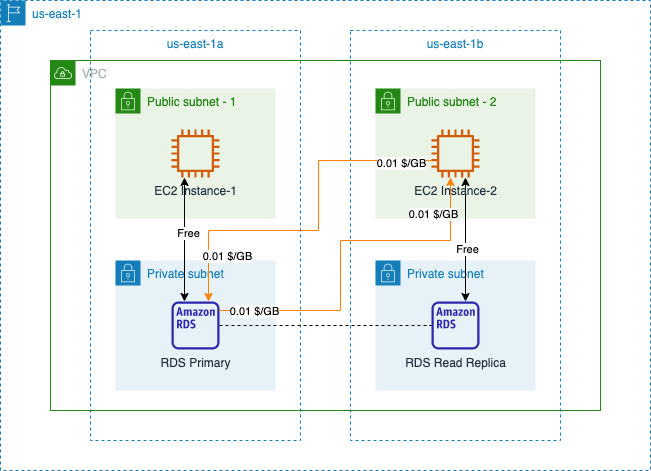
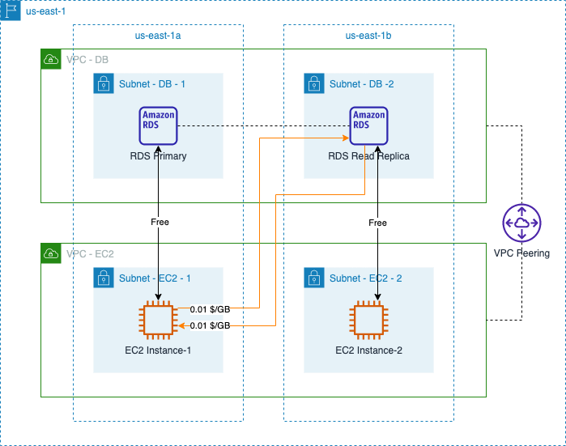
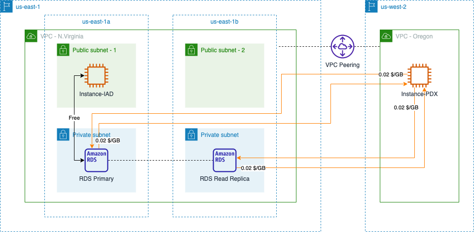
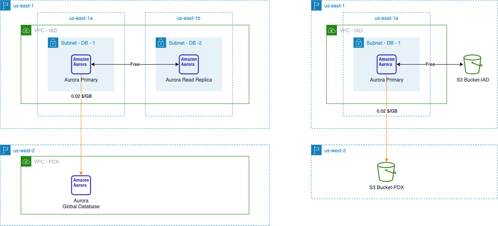

# Amazon RDS/Aurora Data Transfer Cost

[中文](RDBMS-CN.md) | English

## Summary

Amazon Relational Database Service (RDS) is a collection of AWS managed database services, and offers six popular engines: Amazon Aurora, PostgreSQL, MySQL, MariaDB, Oracle, and SQL Server. Amazon Aurora is a MySQL and PostgreSQL-compatible relational database built for the cloud that combines the performance and availability of traditional enterprise databases with the simplicity and cost-effectiveness of open source databases. When using RDS, data transfer costs are incurred in the following two major scenarios:  

- 1. [Database Access Data Transfer](#1-database-access-data-transfer)
- 2. [Database Feature Data Transfer](#2-database-feature-data-transfer)

The following costing instructions from the official website are referenced in this page:

- EC2 Pricing: [Global Region](https://aws.amazon.com/ec2/pricing/on-demand/), [Ningxia & Beijing Regions](https://www.amazonaws.cn/en/ec2/pricing/);
- Amazon RDS Pricing: [Global Region](https://aws.amazon.com/rds/pricing/), [Ningxia & Beijing Regions](https://www.amazonaws.cn/en/rds/pricing/)；
- Amazon Aurora Pricing: [Global Region](https://aws.amazon.com/rds/aurora/pricing/)，[Ningxia & Beijing Regions](https://www.amazonaws.cn/en/rds/aurora/pricing/)

**NOTES:** This page uses <mark>MySQL-compatible</mark> database engines as examples. Different database engines support different features, and the figures used in this page should not be considered as a reference for architecture design in real cases.

## 1. Database Access Data Transfer

When creating an RDS database, you can choose whether to allow public access. If public access is allowed, billing is based on standard data transfer out. See [EC2 billing](https://aws.amazon.com/ec2/pricing/on-demand/) and for Ningxia and Beijing regions is [here](https://www.amazonaws.cn/en/ec2/pricing/).

When public access is not allowed, some major scenarios are as below.

### 1.1 Access database within the same VPC

If the resource accessing the RDS database (e.g. EC2 instance) and the RDS database are located in the same VPC, [data transfer pricing](https://aws.amazon.com/rds/mysql/pricing/) is the same as the data transfer pricing for EC2:

>Data transferred between Amazon RDS and Amazon EC2 Instances in the same Availability Zone is free.

>Amazon RDS DB Instances inside VPC: For data transferred between an Amazon EC2 instance and Amazon RDS DB Instance in different Availability Zones of the same Region, Amazon EC2 Regional Data Transfer charges apply on both sides of transfer.

The following figure illustrates this scenario for the N.Virginia region (us-east-1) as an example:

Assuming that EC2 Instance-2 writes 10GB data to RDS Primary and reads another 5GB data, the total cost of data transfer across AZ includes:

- RDS Primary -> EC2 Instance-2：0.01 x 5 (OUT from database) + 0.01 x 5 (Instance-2 IN) = 0.1 $
- EC2 Instance-2 -> RDS Primary：0.01 x 10 (OUT from Instance-2) + 0.01 x 10 (Database IN) = 0.2 $

Total: 0.1 + 0.2 = 0.3 $

### 1.2 Access database cross VPC

Two VPCs can be connected via VPC Peering, allowing resources within the VPC to communicate via private IP.

But unlike cross-AZ access within the same VPC, cross-AZ access are charged cross-AZ fees only for EC2 instances, [RDS databases do not incur cross-AZ data transfer fees](https://aws.amazon.com/rds/mysql/pricing/):

>Amazon RDS DB Instances outside VPC: For data transferred between an Amazon EC2 instance and Amazon RDS DB Instance in different Availability Zones of the same Region, there is no Data Transfer charge for traffic in or out of the Amazon RDS DB Instance. You are only charged for the Data Transfer in or out of the Amazon EC2 instance and standard Amazon EC2 Regional Data Transfer charges apply ($.01 per GB in/out).

Shown as below:

For the cross-AZ data transfer cost of Aurora databases, the [Aurora Pricing Description for Global Region](https://aws.amazon.com/rds/aurora/pricing/) does not highlight the difference between inside-VPC and outsite-VPC, nor does it highlight whether there are data transfer cost on the side of  database, but only in general terms:

>For data transferred between an Amazon EC2 instance and Amazon Aurora DB instance in different Availability Zones of the same Region, Amazon EC2 Regional Data Transfer charges apply.

However, in [Aurora billing instructions for Ningxia and Beijing regions](https://www.amazonaws.cn/en/rds/aurora/pricing/), the RDS pricing instructions are directly:

>Amazon RDS DB Instances outside VPC: For data transferred between an Amazon EC2 instance and Amazon RDS DB Instance in different Availability Zones of the same Region, there is no Data Transfer charge for traffic in or out of the Amazon RDS DB Instance. You are only charged for the Data Transfer in or out of the Amazon EC2 instance, and standard Amazon EC2 Regional Data Transfer charges apply.

In addition, consider that Amazon Aurora is listed as a type of RDS in [the official introduction to Amazon RDS](https://aws.amazon.com/rds/).

>Amazon Relational Database Service (RDS) is a collection of managed services that makes it simple to set up, operate, and scale databases in the cloud. Choose from seven popular engines — Amazon Aurora with MySQL compatibility, Amazon Aurora with PostgreSQL compatibility, MySQL, MariaDB, PostgreSQL, Oracle, and SQL Server.

So I tend to think that Aurora does not incur cross-AZ data transfer costs on the database side when accessing out of VPCs,.

### 1.3 Access database cross region

VPC Peering can also be established between two VPCs across regions, and when accessing the database across regions, both the source/destination will be billed at the inter-regional data transfer cost.  Detail instructions are listed in this repository, [Amazon EC2 Data Transfer Cost](../../Compute/EC2/EC2-EN.md#43-ec2-instances-across-different-regions).

[Back to Top](#Summary)

## 2. Database Feature Data Transfer

In addition to the data transfer that occurs when providing services, some RDS features also generate data transfer. There are two main features: database replication and database backup.

The billing principle for these two features is the same: data transfer within the same region is free, and data transfer across regions is billed according to EC2's data transfer cost between regions.

>Data transferred between Availability Zones for replication of Multi-AZ deployments is free.

>DB Snapshot Copy is charged for the data transferred to copy the snapshot data across regions. 

>Cross Region Automated Backups is charged for the data transferred to copy the DB snapshot and DB transaction logs across regions. 

Shown as below:

[Back to Top](#Summary)

[Back to README](../../README-EN.md)
