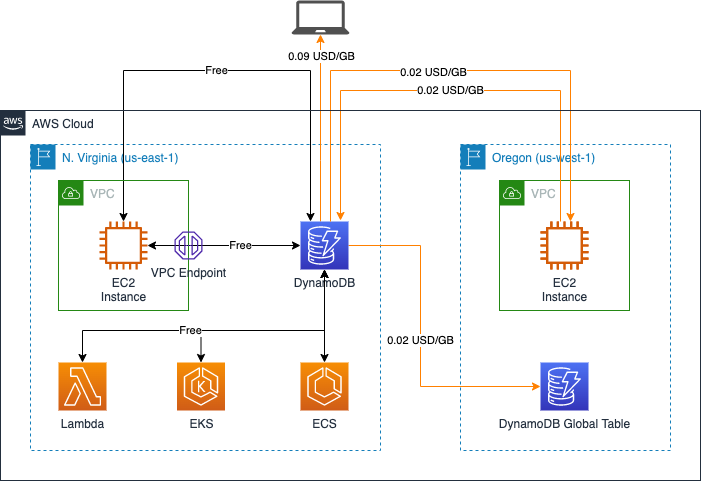
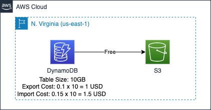
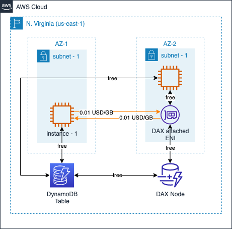
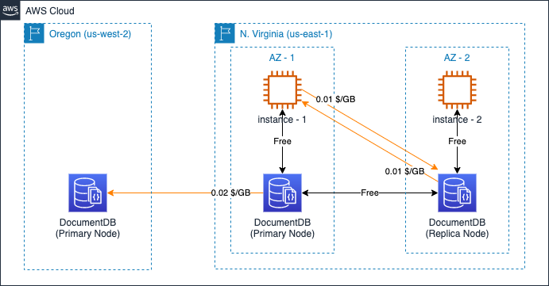
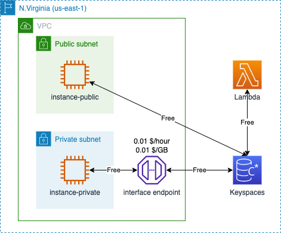

# Amazon NoSQL Data Transfer Cost

中文 ｜ [English](NOSQL-EN.md)

## Summary

>【声明】本章节分类并非 AWS 官方分类方式。

目前，AWS 可提供几种常见的 NOSQL 数据库，包括：

- [Amazon DynamoDB](https://aws.amazon.com/cn/dynamodb/)：AWS 提供的一种完全托管式、无服务器的 NoSQL 键值数据库，旨在运行任何规模的高性能应用程序；
- [Amazon DocumentDB](https://aws.amazon.com/cn/documentdb/)：是一项快速、可扩展、高度可用且完全托管式文档数据库服务，兼容 [MongoDB](https://www.mongodb.com)；
- [Amazon Keyspaces](https://aws.amazon.com/cn/keyspaces/)：一种可扩展、高度可用、托管式 [Apache Cassandra](https://aws.amazon.com/cn/keyspaces/what-is-cassandra/) 兼容数据库服务。

本章将针对上述三款产品的数据传输费用进行详细说明，您可以通过以下目录快速跳转到相关部分：

- 1. [Amazon DynamoDB](#1-amazon-dynamodb)
- 2. [Amazon DocumentDB](#2-amazon-documentdb)
- 3. [Amazon Keyspaces](#3-amazon-keyspaces)

本章参考了官网中以下费用计算说明：

- DynamoDB 计费说明：[全球区域-按需](https://aws.amazon.com/cn/dynamodb/pricing/on-demand/)，[全球区域-预留](https://aws.amazon.com/cn/dynamodb/pricing/provisioned/)，[宁夏及北京区域](https://www.amazonaws.cn/dynamodb/pricing/)；
- DocumentDB 计费说明：[全球区域](https://aws.amazon.com/cn/documentdb/pricing/)，[宁夏及北京区域](https://www.amazonaws.cn/documentdb/pricing/)；
- Keyspaces 计费说明：[全球区域](https://aws.amazon.com/cn/keyspaces/pricing/)；
- EC2 计费说明：[全球区域](https://aws.amazon.com/cn/ec2/pricing/on-demand/)，[宁夏、北京区域](https://www.amazonaws.cn/ec2/pricing/)；

## 1. Amazon DynamoDB

### 1.1 Standard Data Transfer

DynamoDB 在进行标准的数据传输时，几个常见维度的计费方式如下：

- 数据传入：免费；
- 数据传出至互联网：按 GB 收费；
- 数据传出至相同区域内其它 AWS 服务：免费；
- 数据传出至不同区域内 AWS 服务：按 GB 收费。

以 DynamoDB 位于弗吉尼亚北部区域和俄勒冈区域为例，数据传输的成本示例如下图：

### 1.2 DDB to/from S3

使用此功能可将数据从 DynamoDB 连续备份（时间点恢复）导出到 Amazon Simple Storage Service (Amazon S3)。

严格意义上讲，当 S3 与 DynamoDB Table 位于相同区域时，两者之间不会产生数据传输成本；当 S3 与 DynamoDB Table 位于不同区域时，会产生标准的跨区域传输成本。但是 DynamoDB 会对导出的数据收取费用。这个成本是由于数据需要被导出而产生的，因此也总结在这里（尽管它并不是数据传输成本）。

以弗吉尼亚北部区域为例，该成本示意如下：

数据传输本身不收费，但会因为数据量的大小而产生如下费用（假定数据在导出至 S3 时，表的大小为 10GB）：

- 连续备份功能（PITR）：0.2 x 10 = 2 USD（每月费用）
- 导出至 S3 费用：0.1 x 10 = 1 USD

此外，还会产生 S3 PUT Request 费用。该费用与数据量无直接关联，与 Request 次数有关。详情参见 [Amazon S3 定价](https://aws.amazon.com/s3/pricing/)

当需要从 S3 中导出数据到 DynamoDB 时，也会根据导出的数据量进行收费。如上图所示，在弗吉尼亚北部区域的收费标准为 0.15$/GB。

### 1.3 DynamoDB Accelerator

[Amazon DynamoDB Accelerator (DAX)](https://aws.amazon.com/cn/dynamodb/dax/) 是一个由 AWS 托管的、适用于 DynamoDB 的内存缓存。DAX 的节点部署在 EC2 实例上，该 EC2 实例对客户账号不可见，会通过在客户账号内的 ENI 进行数据传输。

当 DAX 节点与客户账号内的 EC2 实例不在相同可用区内时，会产生标准的跨可用区数据传输费用。如果 EC2 实例不通过 DAX Cluster endpoint 进行访问，而是直接访问 DynamoDB 表，则不会产生跨可用区数据传输费。

DAX 节点和客户账号内的 ENI 之间不会产生数据传输费用。

如下图所示：

[返回顶部](#summary)

## 2. Amazon DocumentDB

DocumentDB 采用基于实例的方式部署数据库集群，并可以提供跨区域的 [全局集群](https://aws.amazon.com/cn/documentdb/features/) 功能，跨区域复制延迟不超过 1 秒。

根据 [DocumentDB 价格说明](https://aws.amazon.com/cn/documentdb/pricing/) 在创建跨可用区的数据库集群时，数据库集群内各节点之间不会产生跨可用区的数据传输费：

>出于复制多可用区部署的目的在不同可用区之间传输数据也是免费的。

相同可用区内的访问，也不会产生数据传输费。当需要进行跨区域数据复制时（例如创建 [全局集群](https://aws.amazon.com/cn/documentdb/features/)），则会产生标准的跨区域传输费用。

以弗吉尼亚北部区域和俄勒冈区域为例，DocumentDB 产生的数据传输费用如下图示意：

EC2 实例与 DocumentDB 之间的访问完全通过私有 IP 进行。因此，要访问 DocumentDB 的 EC2 实例不必拥有公网访问能力。

截至 2022 年 8 月， AWS 也不提供针对 DocumentDB 的 VPC endopint。

[返回顶部](#summary)

## 3. Amazon Keyspaces

根据 [Amazon Keyspaces 官网](https://aws.amazon.com/cn/keyspaces/pricing/) 说明，Keyspaces 的流量计费规则与 S3/DynamoDB 相似：相同区域内的其它服务访问 Keyspaces 时不产生数据传输费，跨区域的其它服务访问 Keyspaces 时收取标准的跨区域数据传输费用。

需要注意的是，访问 Keyspaces 的 EC2 实例必须具有公网访问能力，或是通过 interface endpoint 访问 Keyspaces。当使用 interface endpoint 时，会在 interface endpoint 上产生流量处理费、使用时长费。详情可参考本文档中 [Amazon VPC Data Transfer Cost](../../Networking/VPC/VPC-CN.md#3-vpc-endpoint) 部分的说明。

计费示例如下图所示：

[返回顶部](#summary)

[【返回 README】](../../README.md)