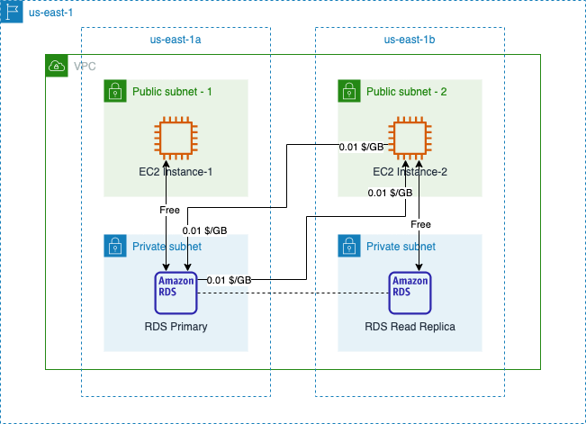
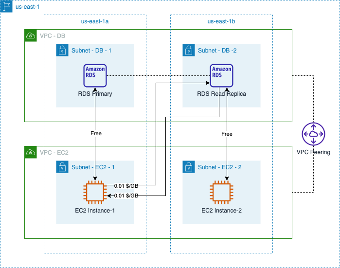
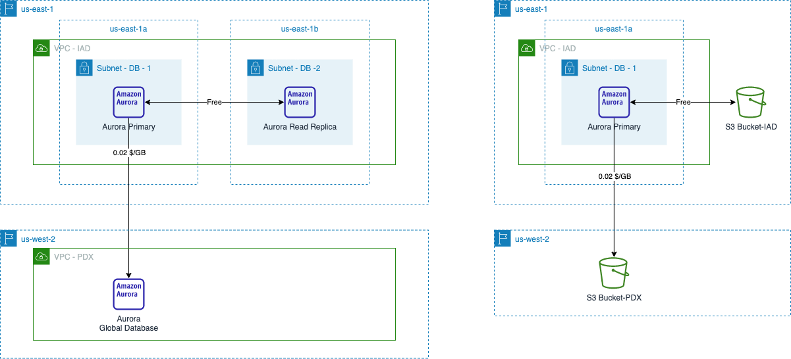

# Amazon RDS/Aurora Data Transfer Cost

中文 ｜ [English](RDBMS-EN.md)

## Summary

在关系型数据库领域内 AWS 所提供的产品是 Amazon Relational Database Serivce（RDS），并提供六种常用的数据库引擎：Amazon Aurora、PostgreSQL、MySQL、MariaDB、Oracle 和 SQL Server。其中 Amazon Aurora 是一种与 MySQL 和 PostgreSQL 兼容的关系数据库，专为云而打造，既具有传统企业数据库的性能和可用性，又具有开源数据库的简单性和成本效益。在使用过程中，在以下两种主要场景中会产生数据传输成本：  

- 1. [Database Access Data Transfer](#1-database-access-data-transfer)
  - 1.1 [Access database within the same VPC](#11-access-database-within-the-same-vpc)
  - 1.2 [Access database cross VPC](#12-access-database-cross-vpc)
  - 1.3 [Access database cross region](#13-access-database-cross-region)
- 2. [Database Feature Data Transfer](#2-database-feature-data-transfer)

本章参考了官网中以下费用计算说明：

- EC2 计费说明：[全球区域](https://aws.amazon.com/cn/ec2/pricing/on-demand/)，[宁夏、北京区域](https://www.amazonaws.cn/ec2/pricing/)；
- Amazon RDS 计费说明：[全球区域](https://aws.amazon.com/cn/rds/pricing/)，[宁夏、北京区域](https://www.amazonaws.cn/rds/pricing/)；
- Amazon Aurora 计费说明：[全球区域](https://aws.amazon.com/cn/rds/aurora/pricing/)，[宁夏、北京区域](https://www.amazonaws.cn/rds/aurora/pricing/)

**注意：**本篇内容一律使用 <mark>MySQL 兼容</mark> 的数据库引擎为例进行说明。不同数据库引擎所支持的功能不同，本篇内容中所用的示意图不能视为实际应用中架构设计的参考。

## 1. Database Access Data Transfer

在创建 RDS 数据库时，可以选择是否允许从公共网络进行访问。如果允许公共访问，则按照标准的数据传出费用进行计费。参见 [EC2 计费说明](https://aws.amazon.com/cn/ec2/pricing/on-demand/)，宁夏和北京区域的计费说明参见 [这里](https://www.amazonaws.cn/ec2/pricing/)。

当不允许公共访问，仅允许 VPC 内资源访问 RDS 数据库时，可具体区分为以下几种情况。

### 1.1 Access database within the same VPC

如果访问 RDS 数据库的资源（例如 EC2 实例）和 RDS 数据库位于相同 VPC 内，[数据传输计费标准](https://aws.amazon.com/cn/rds/mysql/pricing/) 与 EC2 的数据传输计费标准相同：

>在同一可用区域中的 Amazon RDS 实例和 Amazon EC2 实例之间传输数据是免费的。

>VPC 内的 Amazon RDS 数据库实例：如果在位于同一区域、不同可用区的 Amazon EC2 实例和 Amazon RDS 数据库实例之间传输数据，则数据传输的两端都收取 Amazon EC2 区域数据传输费。

下图针对这一场景，以北弗吉尼亚区域（us-east-1）为例进行了说明：

假设 EC2 Instance-2 向 RDS Primary 中写入了 10GB 数据，又读取了 5GB 数据，跨可用区的数据传输成本包括：

- RDS Primary -> EC2 Instance-2：0.01 x 5（从数据库中流出）+ 0.01 x 5（流入 Instance-2）= 0.1 $
- EC2 Instance-2 -> RDS Primary：0.01 x 10（从 Instance-2 流出）+ 0.01 x 10（流入数据库）= 0.2 $

合计：0.1 + 0.2 = 0.3 $

### 1.2 Access database cross VPC

两个 VPC 之间可以通过 VPC Peering 进行连接，使得 VPC 内的资源可以通过私有 IP 进行通信。

但是与相同 VPC 内跨可用区的访问不同，跨 VPC、跨可用区的访问时，仅针对 EC2 实例收取跨可用区费用，[RDS 数据库不产生跨可用区数据传输费用](https://aws.amazon.com/cn/rds/mysql/pricing/)：

>VPC 外的 Amazon RDS 数据库实例：如果在位于同一区域、不同可用区的 Amazon EC2 实例和 Amazon RDS 数据库实例之间传输数据，则不会向 Amazon RDS 数据库实例传入和传出流量收取数据传输费。您只需按标准 Amazon EC2 区域数据传输费（每传入/传出 1GB 收取 0.01 USD），为传入或传出 Amazon EC2 实例的数据付费。

如下图所示：

关于 Aurora 数据库在跨 AZ 时的传输成本问题，[全球区域计费说明](https://aws.amazon.com/cn/rds/aurora/pricing/) 中并未强调跨 VPC 和相同 VPC 的不同，也没有强调数据库这一侧是否会产生流量成本，仅做了笼统说明：

>如果在位于同一区域、不同可用区的 Amazon EC2 实例和 Amazon Aurora 数据库实例之间传输数据，则将收取 Amazon EC2 区域数据传输费。

但在 [宁夏、北京区域 Aurora 计费说明](https://www.amazonaws.cn/rds/aurora/pricing/) 的说明中直接引用了 RDS 计费说明的内容：

>VPC 外的 Amazon RDS 数据库实例：如果在同一区域、不同可用区中的 Amazon EC2 实例和 Amazon RDS 数据库实例之间传输数据，则不收取 Amazon RDS 数据库实例传入和传出流量数据传输费。仅须为 Amazon EC2 实例的数据传入和传出支付数据传输费，价格参照标准的 Amazon EC2 区域数据传输费。

此外，考虑到在 [Amazon RDS 官方介绍](https://aws.amazon.com/cn/rds/) 中将 Amazon Aurora 列为 RDS 的一种：

>Amazon RDS 在多种类型的数据库实例（针对内存、性能或 I/O 进行了优化的实例）上均可用，并提供六种常用的数据库引擎供您选择，包括 **Amazon Aurora**、PostgreSQL、MySQL、MariaDB、Oracle 数据库和 SQL Server。

因此我倾向于认为 Aurora 在跨 VPC、跨可用区访问时，数据库一侧不产生数据传输费用。

### 1.3 Access database cross region

跨区域的两个 VPC 之间也可以建立 VPC Peering。在跨区域访问数据库时，源/目标都将按照区域间的数据传输成本进行计费。详细说明可以参考本系列文章中 [Amazon EC2 Data Transfer Cost](../../Compute/EC2/EC2-CN.md#43-%E5%BD%93-ec2-%E5%AE%9E%E4%BE%8B%E5%A4%84%E4%BA%8E%E4%B8%8D%E5%90%8C%E5%8C%BA%E5%9F%9F%E6%97%B6) 的相关部分内容。

[返回顶部](#Summary)

## 2. Database Feature Data Transfer

除了对外提供服务时会产生数据传输，RDS 自身的一些功能也会产生数据传输。主要体现在两个功能点：数据库复制，数据库备份。

针对这两个功能点的计费原则是一致的：在相同区域内产生的数据传输是免费的，跨区域产生的数据传输按照 EC2 在区域间的数据传输成本进行计费。

>出于复制多可用区部署的目的在不同可用区之间传输数据也是免费的。

>DB Snapshot Copy 按传输的数据量收费，以便跨地区复制快照数据。

>跨区域自动备份按跨区域复制数据库快照和数据库事务日志时传输的数据量收费。

如下图示意：

[返回顶部](#Summary)

[【返回 README】](../../README.md)