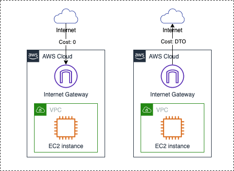

## EC2 <--> Internet ##
English ｜ [中文](01.EC2-Internet-CN.md)

References to the "Internet" in this section do not include public IP from AWS.

All data transfer in is free，all regions (including BJS and ZHY) comply with this rule.

Traffic out from EC2 to the Internet is charged on a per GB basis.  

- BJS and ZHY, same billing rules：0.933RMB/GB，[Official Website](https://www.amazonaws.cn/en/ec2/pricing/)；  
- Other global regions：stepped billing in 10TB, 40TB, 100TB, 150TB，[Official Website](https://aws.amazon.com/ec2/pricing/on-demand/)

[[BACK]](../README-EN.md)