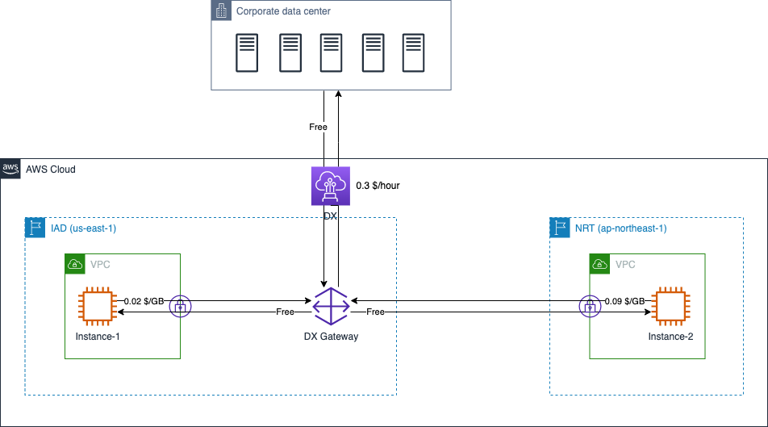
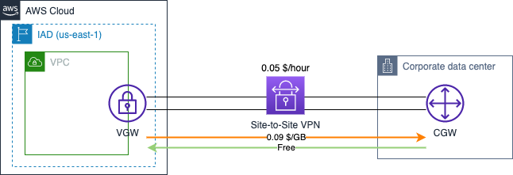

# Connection to AWS Data Transfer Cost

中文 ｜ [English](Connection-EN.md)

## Summary

本章内容总结了连接到 AWS 时，几种典型应用场景下数据传输所产生的费用计算方式。包含如下场景：

- 1. [Direct Connect](#1-aws-direct-connect)
- 2. [DX Gateway](#2-dx-gateway)
- 3. [SiteLink](#3-sitelink)
- 4. [Site to Site VPN](#4-site-to-site-vpn)
  - 4.1 [不启用加速的 VPN](#41-不启用加速的-vpn)
  - 4.2 [启用加速的 VPN](#42-启用加速的-vpn)

本章参考了官网中以下费用计算说明：

- DX 计费说明：[全球区域](https://aws.amazon.com/cn/directconnect/pricing/)，[宁夏、北京区域](https://www.amazonaws.cn/directconnect/pricing/)；
- EC2 计费说明：[全球区域](https://aws.amazon.com/cn/ec2/pricing/on-demand/)，[宁夏、北京区域](https://www.amazonaws.cn/ec2/pricing/)；
- VPN 计费说明：[全球区域](https://aws.amazon.com/cn/vpn/pricing/)；
- Global Accelerator 计费说明：[全球区域](https://aws.amazon.com/cn/global-accelerator/pricing/)；
- Transit Gateway 计费说明：[全球区域](https://aws.amazon.com/cn/transit-gateway/pricing/)，[宁夏、北京区域](https://www.amazonaws.cn/transit-gateway/pricing/)；

## 1. AWS Direct Connect

DX 的价格维度包括：

>连接在任何 AWS 区域运行的资源后（如 Amazon Virtual Private Cloud 或 AWS Transit Gateway），三个因素决定定价：容量、端口小时数和数据传出 (DTO)。  
>
>AWS Direct Connect 数据传入在所有站点按每 GB 0.00 USD 收费。  
>
>数据传出定价取决于源 AWS 区域和 AWS Direct Connect 站点。  

相同 **容量** 时，使用 [专用连接](https://docs.aws.amazon.com/zh_cn/directconnect/latest/UserGuide/WorkingWithConnections.html#dedicated_connection) 和 [托管连接](https://docs.aws.amazon.com/zh_cn/directconnect/latest/UserGuide/WorkingWithConnections.html#hosted_connection) 所产生的的 **端口小时费用** 不同。

图示中，某公司分别通过美国和日本的 DX Location 各建立了 1 条 1Gbps 专用连接。假设 1 小时内，本地数据中心从位于日本的 EC2 实例下载了 2GB 数据，从位于美国的 EC2 实例下载了 4GB 数据，两个 EC2 实例各从本地数据中心内下载了 10GB 数据。所产生的 DX 成本如下：

- 端口费用：0.3 x 1（美国费率）+ 0.285 x 1（日本费率）= 0.585 $
- Instance-1 数据流出费用：0.02 x 4（美国费率）= 0.08 $
- Instance-2 数据流出费用：0.041 x 2（日本费率）= 0.082 $
- 数据流入费用：10 x 0 + 10 x 0 = 0 $（传入数据不产生费用）

合计：0.585 + 0.08 + 0.082 = 0.747 $

[返回顶部](#summary)

## 2. DX Gateway

根据 [官网说明](https://aws.amazon.com/cn/directconnect/faqs/)：

>使用 Direct Connect 网关不会产生任何费用。

但需要遵循 [Direct Connect 计费规则](https://aws.amazon.com/cn/directconnect/pricing/) 付费。由于通过 DX Gateway 允许访问所有区域的资源，注意您将需要根据作为流量来源的 AWS 区域和连接它的 AWS Direct Connect 站点支付适用的 DTO 数据费率。

图示中，某公司利用位于美国的 DX Location 建立了 1 条 1Gbps 专用连接，并通过 DX Gateway 关联到位于北弗吉尼亚区域（IAD）和东京区域（NRT）的 VPC。假设 1 小时内，本地数据中心从位于 NRT 的 EC2 实例下载了 2GB 数据，从位于 IAD 的 EC2 实例下载了 4GB 数据，两个 EC2 实例各从本地数据中心内下载了 10GB 数据。所产生的 DX 成本如下：

- 端口费用：0.3 x 1 = 0.3$
- Instance-1 数据流出费用：0.02 x 4 = 0.08 $
- Instance-2 数据流出费用：0.09 x 2 = 0.18 $
- 数据流入费用：0

合计：0.3 + 0.08 + 0.18 = 0.56 $

[返回顶部](#summary)

## 3. SiteLink

除了 DX 的计费维度外，SiteLink 还有两个因素决定额外成本：

>SiteLink 小时数和 SiteLink 数据传输。

>SiteLink 小时体现 AWS Direct Connect 虚拟接口 (VIF) 启用 SiteLink 功能的小时数。

>SiteLink 数据传输指 AWS Direct Connect 位置之间流动的数据量，按每 GB 支付。SiteLink 数据传输费率根据网络流量的源和目的地而变化。例如，从欧洲发送到加拿大的数据的计费价格与从欧洲发送到印度的数据计费价格不同。

图示中，某公司在美国、英国和日本都有本地数据中心，在 AWS 上启用了 IAD、LHR、NRT 三个区域。每个数据中心通过 1 条 1Gbps 的专用 DX 连接到 AWS。

美国和英国的两条 DX 链路上各创建了 1 个配置 SiteLink 的 VIF，日本的 DX 链路上创建的 VIF 没有启用 SiteLink。

假设 1 小时内，美国数据中心向英国数据中心发送 10GB 数据，英国数据中心向美国数据中心发送 5GB 数据。无论传递数据实际花费了多少时间，则 1 小时内网络链路方面的总体成本计算如下：

- Dedicated DX Connetction 小时成本：0.3 x 1（美国）+ 0.3 x 1（英国）+ 0.285 x 1（日本）= 0.885 $
- DX 流量成本：0（没有从 AWS 通过 DX 连接发送到本地数据中心的数据）
- SiteLink 小时成本：0.5 x 2（美国、英国各有 1 个 VIF 启用了 SiteLink）= 1 $
- SiteLink 流量成本：0.0282 x 10（美国->英国）+ 0.0282 x 5（英国->美国）= 0.423 $

合计：0.885 + 1 + 0.423 = 2.308 $

>如启用了 TGW，还需增加 TGW 的小时费用。图示中在 IAD 增加了一组通过 TGW 关联到 DX Gateway 上的 VPC，仅为了说明 SiteLink 支持 Transit VIF 和 Private VIF，并不能作为实际网络设计的参考。

[返回顶部](#summary)

## 4. Site-to-Site VPN

### 4.1 不启用加速的 VPN

创建 Site-to-Site VPN 后，VPN 服务本身需要按照使用小时数计费：

>如果创建与 Amazon VPC 相连的 AWS 站点到站点 VPN 连接，您需要从 VPN 连接已预置完毕并可用时起按照 VPN 连接小时付费。

VPN 服务所产生的流量费用遵循标准的 EC2 数据传输费用规则：

>AWS 站点到站点 VPN 传出数据会产生 EC2 按需定价页面中所述的数据传出费用。

图示案例中，客户在本地数据中心和 AWS IAD 区域之间建立了 1 条 Site-to-Site VPN 连接，包含两条 VPN 隧道。假设 1 小时内，客户从 AWS 中下载 10GB 数据，并上传 5GB 数据，产生的网络传输成本包括：

- VPN 连接时长成本：0.05 x 1 = 0.05 $（每个 VPN 连接包含两条 VPN 隧道，只需要按照每个 VPN 连接的使用时间计费）
- 数据传输成本：0.09 x 10（EC2 数据传出 AWS 的成本）+ 0 x 5（流入数据免费）= 0.9 $

合计：0.05 + 0.9 = 0.95 $

### 4.2 启用加速的 VPN

[2019 年 12 月](https://aws.amazon.com/cn/about-aws/whats-new/2019/12/announcing-accelerated-site-to-site-vpn-for-improved-vpn-performance/)，AWS 宣布推出 Accelerated Site-to-Site VPN 以提高 VPN 性能。

启用加速功能后，Site-to-Site VPN 的传输成本中还需增加 [AWS Global Accelerator](https://aws.amazon.com/cn/global-accelerator/pricing/) 和 [AWS Transit Gateway](https://aws.amazon.com/cn/transit-gateway/pricing/) 的使用成本。

GA 成本包括：

- 使用时长：按照每个 VPN 隧道收取小时费；
- 数据传输附加费用：以小时为单位，根据数据传输的主方向，按照数据传输量收费，该费用和 [EC2 数据传出费](https://aws.amazon.com/cn/ec2/pricing/on-demand/) 叠加收取

TGW 成本包括：

- 使用时长：按照 TGW 每个关联收取小时费；
- 数据处理成本：所有通过 TGW 的数据，按照数据传输量收费

图示案例假设客户使用 AWS IAD 区域，在 IAD 区域和东京数据中心之间创建 Accelerated Site-to-Site VPN。在 1 小时的计费周期内，从 VPC 内下载 10GB 数据，向 VPC 上传 2GB 数据（下载为数据流向的主方向）。则总体传输成本包括：

- TGW 连接的小时使用成本：0.05 x 2（VPC、VPN 共计 2 个连接）= 0.1 $
- GA 的使用时长成本：0.025 x 2（2 条 VPN 隧道）= 0.05 $
- VPN 的使用时长：0.05 x 1（1 个 VPN 连接）= 0.05 $
- EC2 数据传输费：0.09 x 10（传出 10GB 数据）= 0.9 $
- TGW 数据处理成本：0.02 x 10（VPC -> TGW）+ 0.02 x 2（VPN -> TGW）= 0.24 $
- GA 数据传输附加费：0.035 x 10（该案例中下载为主方向）= 0.35 $

合计：0.1 + 0.05 + 0.05 + 0.9 + 0.24 + 0.35 = 1.69 $

关于 Global Accelerator 的详细费用说明，可参见本文档 [Content Delivery](../../Networking/ContentDelivery/ContentDelivery-CN.md) 部分；    
关于 Transit Gateway 的详细费用说明，可参见本文档 [TGW](../../Networking/TGW/TGW-CN.md) 部分。

[返回顶部](#summary)

[【返回 README】](../../README.md)