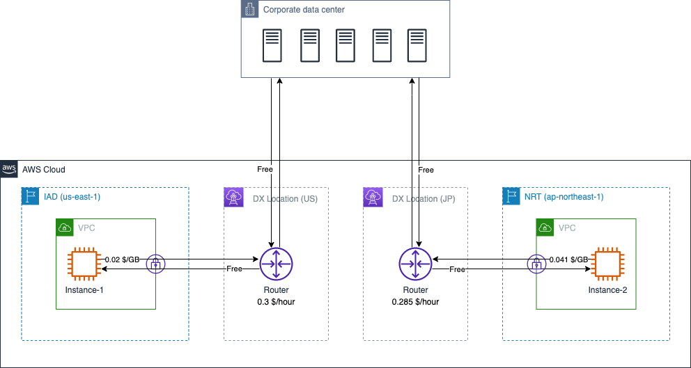
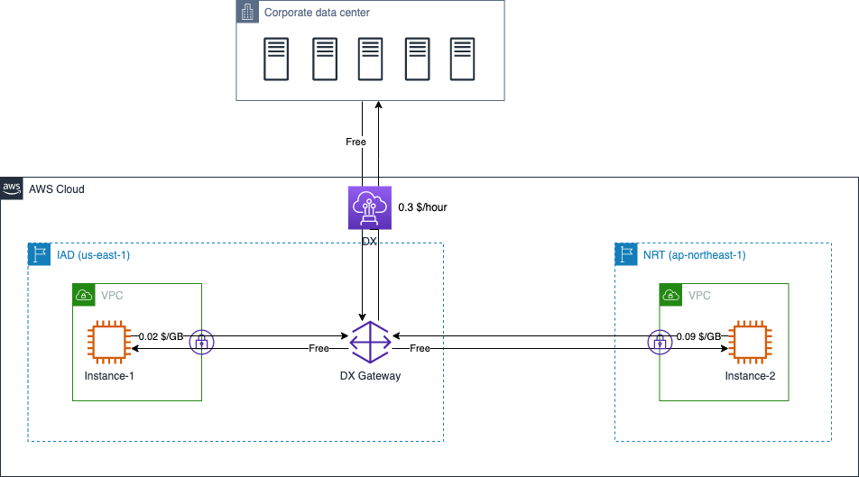
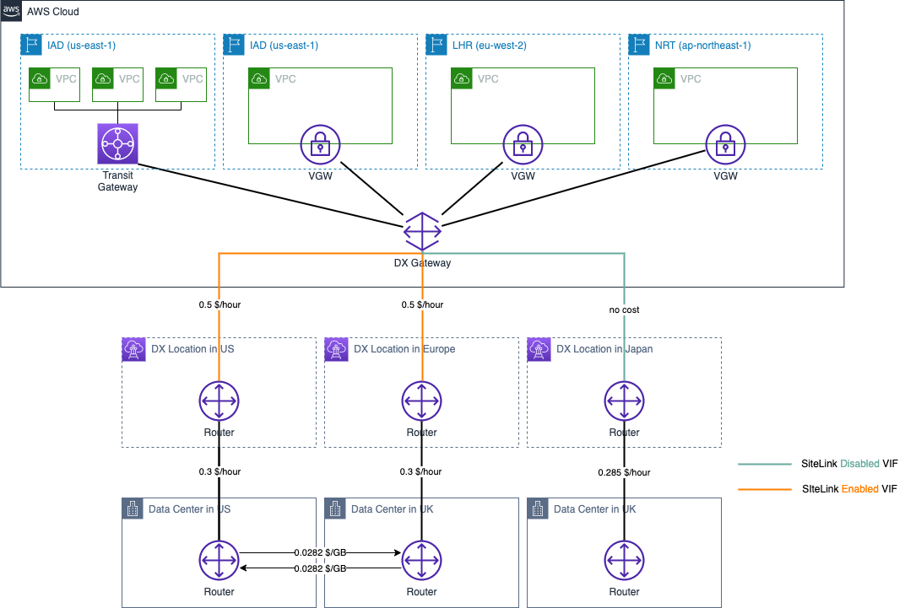
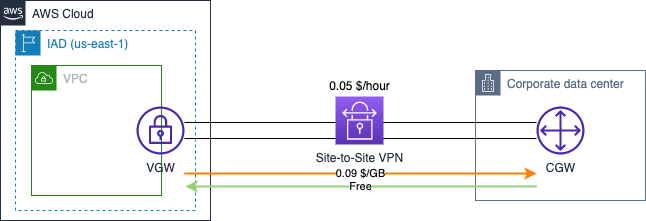
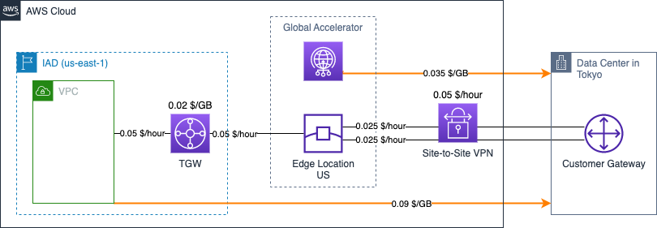

# Connection to AWS Data Transfer Cost

[中文](Connection-CN.md) | English

## Summary

This page summarizes the cost of data transfers in several typical scenarios when connecting to AWS. The following scenarios are included:

- 1. [Direct Connect](#1-aws-direct-connect)
- 2. [DX Gateway](#2-dx-gateway)
- 3. [SiteLink](#3-sitelink)
- 4. [Site to Site VPN](#4-site-to-site-vpn)
  - 4.1 [Standard Site-to-Site VPN Connections](#41-standard-site-to-site-vpn-connections)
  - 4.2 [Accelerated Site-to-Site VPN connections](#42-accelerated-site-to-site-vpn-connections)

The following costing instructions from the official website are referenced in this page:

- DX Pricing: [Global Region](https://aws.amazon.com/directconnect/pricing/), [Ningxia & Beijing Regions](https://www.amazonaws.cn/en/directconnect/pricing/); 
- EC2 Pricing: [Global Region](https://aws.amazon.com/ec2/pricing/on-demand/), [Ningxia & Beijing Regions](https://www.amazonaws.cn/en/ec2/pricing/);  
- VPN Pricing: [Global Region](https://aws.amazon.com/vpn/pricing/);  
- Global Accelerator Pricing: [Global Region](https://aws.amazon.com/global-accelerator/pricing/);  
- Transit Gateway Pricing: [Global Region](https://aws.amazon.com/transit-gateway/pricing/), [Ningxia & Beijing Regions](https://www.amazonaws.cn/transit-gateway/pricing/)

## 1. AWS Direct Connect

DX price dimensions include:

>When connecting to resources running in any AWS Region (such as an Amazon Virtual Private Cloud or AWS Transit Gateway), there are three factors that determine pricing: capacity, port hours, and data transfer out (DTO).
>
>Data transfer in refers to network traffic that is sent into AWS from outside, over AWS Direct Connect. AWS Direct Connect data transfer in is charged at 0.00 USD per GB in all locations.    
>
>When calculating DTO, exact pricing depends on the AWS Region and AWS Direct Connect location you are using.    

When using the same **capacity**, **port hours costs** are different between [Dedicated Connections](https://docs.aws.amazon.com/directconnect/latest/UserGuide/WorkingWithConnections.html#dedicated_connection) and [Hosted Connections](https://docs.aws.amazon.com/directconnect/latest/UserGuide/WorkingWithConnections.html#hosted_connection).

In the figure, a company establishes one 1Gbps dedicated connection to DX Location in the US and one in Japan. Assume that within 1 hour, the local data center downloads 2GB data from the EC2 instance in Japan, 4GB data from the EC2 instance in the US, and ach of the two EC2 instances downloads 10GB data from local data center. The DX costs incurred are as follows:

- Port hours: 0.3 x 1 (US rate) + 0.285 x 1 (Japan rate) = 0.585 $
- Instance-1 Data Transfer OUT Cost: 0.02 x 4 (US rate) = 0.08 $
- Instance-2 Data Transfer OUT Cost: 0.041 x 2 (Japan rate) = 0.082 $
- Data Transfer IN: 10 x 0 + 10 x 0 = 0 $ (Data Transfer IN is free)

Total: 0.585 + 0.08 + 0.082 = 0.747 $

[Back to Top](#summary)

## 2. DX Gateway

From [AWS Direct Connect FAQs](https://aws.amazon.com/directconnect/faqs/)：

>There are no charges for using an AWS Direct Connect gateway.

But You will pay applicable egress data charges based on the source remote AWS Region and port hour charges. See the [AWS Direct Connect pricing page for details](https://aws.amazon.com/directconnect/pricing/). Since access to resources in all regions is allowed through DX Gateway, note that you will need to pay the DTO data cost based on the AWS region that is the source of the traffic and the AWS Direct Connect location that connects to it.

In the figure, a company establishes a dedicated 1Gbps connection using DX Location in the U.S. and connects to the VPCs in N.Virginia region (IAD) and Tokyo region (NRT) via DX Gateway. Assume that in 1 hour, the local data center downloads 2GB data from the EC2 instance in NRT, 4GB data from the EC2 instance in IAD, and each of the two EC2 instances downloads 10GB data from the local data center.  The DX costs incurred are as follows:

- Port hours: 0.3 x 1 = 0.3$
- Instance-1 Data Transfer OUT Cost: 0.02 x 4 = 0.08 $
- Instance-2 Data Transfer OUT Cost: 0.09 x 2 = 0.18 $
- Data Transfer IN: 0

Total: 0.3 + 0.08 + 0.18 = 0.56 $

[Back to Top](#summary)

## 3. SiteLink

In addition to the billing dimension of DX, there are two factors that determine the additional cost: 

>SiteLink hours and SiteLink data transfer.

>SiteLink hours reflect the number of hours an AWS Direct Connect virtual interface (VIF) has the SiteLink feature enabled.

>SiteLink data transfer refers to the amount of data flowing between AWS Direct Connect locations and you pay per gigabyte (GB). SiteLink data transfer rates change depending on the source and destination of the network traffic. For example, data sent from Europe to Canada is charged at a different rate than data sent from Europe to India.

In the figure, a company has local data centers in the US, UK, and Japan, and three regions on AWS - IAD, LHR, and NRT. Each data center is connected to AWS via a dedicated 1Gbps DX.

One VIF with SiteLink enabled was created on each of the two DX links in the US and the UK, and the VIF with SiteLink disabled created on the DX link in Japan.

Assume that in 1 hour, the US data center sends 10GB data to the UK data center and the UK data center sends 5GB data to the US data center. Regardless of the actual time taken to deliver the data, the overall networking cost for this 1 hour period is calculated as follows:

- Dedicated DX Connetction Port hours: 0.3 x 1 (US) + 0.3 x 1 (UK) + 0.285 x 1 (Japan) = 0.885 $  
- DX Data Transfer OUT cost: 0 (No data sent from AWS to local data center via DX connection)
- SiteLink hours cost: 0.5 x 2 (for VIFs in US and UK) = 1 $
- SiteLink Data Transfer cost：0.0282 x 10 (US -> UK)+ 0.0282 x 5 (UK -> US) = 0.423 $

Total: 0.885 + 1 + 0.423 = 2.308 $

>If TGW is enabled, the hourly cost of TGW should be counted. The figure adds a set of VPCs to the DX Gateway via TGW to the IAD for the purpose of illustrating SiteLink's support for Transit VIF and Private VIF, and is not intended to be used as a reference for actual network design.

[Back to Top](#summary)

## 4. Site-to-Site VPN

### 4.1 Standard Site-to-Site VPN Connections

After the Site-to-Site VPN is created, the VPN service itself is billed for the connection hours:

>If you create an AWS Site-to-Site VPN connection to your Amazon VPC, you are charged for each VPN connection-hour that your VPN connection is provisioned and available.

The data transfer costs incurred by the VPN service follow the standard EC2 data transfer cost rules:

>Data transfer out on AWS Site-to-Site VPN incurs data transfer out charges that are explained in the EC2 on-demand pricing page.

In the figure, the customer has established a Site-to-Site VPN connection between the local data center and the AWS IAD region, consisting of two VPN tunnels. Assuming that the customer downloads 10GB data from AWS and uploads 5GB data in 1 hour, the network transfer costs incurred include:

- VPN Connection hours cost: 0.05 x 1 = 0.05 $ (Each VPN connection contains two VPN tunnels and is only billed for the time each VPN connection is used)
- Data Transfer cost: 0.09 x 10 (Data Transfer OUT) + 0 x 5 (Data Transfer IN is free) = 0.9 $

Total: 0.05 + 0.9 = 0.95 $

### 4.2 Accelerated Site-to-Site VPN connections

[Dec 3, 2019](https://aws.amazon.com/about-aws/whats-new/2019/12/announcing-accelerated-site-to-site-vpn-for-improved-vpn-performance/), AWS announced Accelerated Site-to-Site VPN for Improved VPN Performance.

When acceleration is enabled, the costs of Site-to-Site VPN data transfer should also include [AWS Global Accelerator](https://aws.amazon.com/global-accelerator/pricing/) and [AWS Transit Gateway](https://aws.amazon.com/transit-gateway/pricing/).

GA costs include:

- Accelerator hours: For every full or partial hour when an accelerator runs in your account, there should be two accelerator for one VPN connection (two VPN tunnels);  
- Data Transfer-Premium fee (DT-Premium): This is a rate per gigabyte of data transferred over the AWS network, You will only be charged DT-Premium in the dominant data transfer direction. The DT-Premium fee is in addition to normal [EC2 Data Transfer Out fees](https://aws.amazon.com/ec2/pricing/on-demand/)

TGW costs include:

- Attachment hours: For AWS VPN attachments, the Transit Gateway owner is billed hourly;
- 数Data processing cost: Data processing charges apply for each gigabyte sent from a VPC, Direct Connect or VPN to the AWS Transit Gateway. 

The above case assumes that the customer deployed their applications on AWS IAD region and created an Accelerated Site-to-Site VPN between the IAD region and their Tokyo data center. 10GB data is downloaded from the VPC and 2GB data is uploaded to the VPC in a 1-hour billing period (therefore download is the dominant data transfer direction). The overall transfer costs include:

- TGW Attachment hours costs: 0.05 x 2 (Two attachments for VPN and VPC) = 0.1 $
- GA Accelerator hours costs: 0.025 x 2 (Two VPN tunnels) = 0.05 $
- VPN Connections hours costs: 0.05 x 1 (One VPN connections) = 0.05 $
- EC2 Data Transfer OUT costs: 0.09 x 10（10GB data）= 0.9 $
- TGW Data Processing costs: 0.02 x 10 (VPC -> TGW) + 0.02 x 2 (VPN -> TGW) = 0.24 $
- GA DT-Premium: 0.035 x 10 (download is the dominant data transfer direction) = 0.35 $

Total: 0.1 + 0.05 + 0.05 + 0.9 + 0.24 + 0.35 = 1.69 $

For detailed illustration of Global Accelerator, see [Content Delivery](../../Networking/ContentDelivery/ContentDelivery-EN.md) in this repository;        
For detailed illustration of Transit Gateway, see [TGW](../../Networking/TGW/TGW-CN.md) in this repository.  

[Back to Top](#summary)

[Back to README](../../README-EN.md)