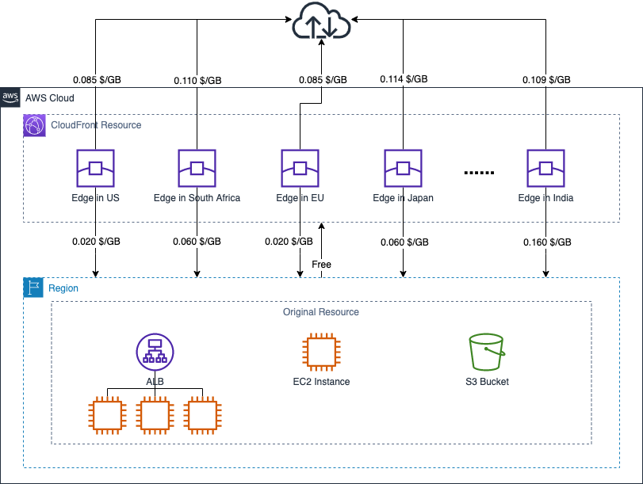
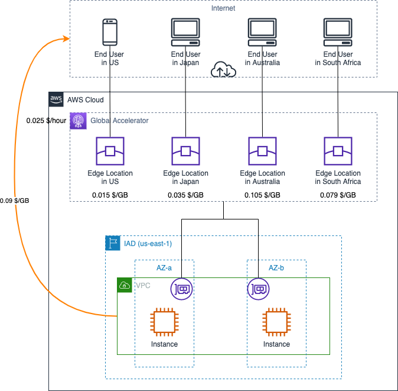

# AWS Content Delivery Service Data Transfer Cost

[中文](ContentDelivery-CN.md) | English

## Summary

This page summarizes how data transfer cost is calculated for services used for content distribution on AWS. The following services are included:

- 1. [CloudFront](#1-amazon-cloudfront)
- 2. [Global Accelerator](#2-aws-global-accelerator)
  - 2.1 [Data Transfer OUT is dominant direction](#21-data-transfer-out-is-dominant-direction)
  - 2.2 [Data Transfer IN is dominant direction](#22-data-transfer-in-is-dominant-direction)

This chapter summarizes how the cost of data transfer is calculated for services used for content distribution on AWS. The following services are included: 

- CloudFront Pricing: [Global Region](https://aws.amazon.com/cloudfront/pricing/), [Ningxia & Beijing Regions](https://www.amazonaws.cn/en/cloudfront/pricing/);
- Global Accelerator Pricing: [Global Region](https://aws.amazon.com/global-accelerator/pricing/);  
- EC2 Pricing: [Global Region](https://aws.amazon.com/ec2/pricing/on-demand/), [Ningxia & Beijing Regions](https://www.amazonaws.cn/en/ec2/pricing/)

## 1. Amazon CloudFront ##

The billing dimensions of CloudFront include data transfer OUT and HTTP or HTTPS requests, you may purchase CloudFront with on-demand pricing or make a one-year usage commitment：

>For on-demand pricing, CloudFront charges traffic served via data transfers out from edge locations, along with HTTP or HTTPS requests. Customers willing to make a one-year usage commitment can save up to 30 percent using the self-service CloudFront Savings Bundle. 

For the on-demand mode pricing model, data transfer OUT is billed with stepped rate.

In the following diargram, all calculations are based on on-demad pricing model with the first step rate. 

For detailed description of data transfer stepped pricing, and pricing for different regions, see [CloudFront Pricing](https://aws.amazon.com/cloudfront/pricing/)，and [CloudFront Pricing in Mainland China](https://www.amazonaws.cn/en/cloudfront/pricing/)。

[Back to Top](#summary)

## 2. AWS Global Accelerator ##

Global Accelerator consists of two billing dimensions: 

>Fixed fee: For every full or partial hour when an accelerator runs in your account, you are charged $0.025 until it is deleted.
>
>Data Transfer-Premium fee (DT-Premium): This is a rate per gigabyte of data transferred over the AWS network. The DT-Premium rate depends on the AWS Region (source) that serves the request and the AWS edge location (destination) where the responses are directed. You will only be charged DT-Premium in the dominant data transfer direction. The DT-Premium fee for AWS Global Accelerator applies to all traffic that flows through AWS Global Accelerator, regardless of whether the destination is to the internet, to another AWS Region, or to an Availability Zone. The DT-Premium fee is in addition to normal [EC2 Data Transfer Out fees](https://aws.amazon.com/ec2/pricing/on-demand/) charged for your application endpoints running in AWS Region(s).

In the diagram, a company has deployed their applications on AWS IAD region, accelerated through GA for end users across worldwide. The end-users are located in the United States (40%), Japan (30%), Australia (20%), and South Africa (10%). Depending on dominant direction of data traffic, the composition of the transfer cost calculation varies slightly. The following section shows an example of data transfer costs for a 1-hour period (data transfer surcharges are calculated on an hourly basis).

### 2.1 Data Transfer OUT is dominant direction

Assumptions: A total of 30GB data passes through the accelerator of GA, of which 20GB is in the data transfer OUT direction and 10GB is in the data transfer IN direction. Therefore, data transfer OUT is dominant direction.

Total transfer costs in one hour consist of:

- Accelerator Fixed fee: 0.025 x 1 (1 hour) = 0.025 $
- DT-Premium from US end user: 0.015 x 20 x 40% = 0.12 $
- DT-Premium from Japan end user: 0.035 x 20 x 30% = 0.21 $
- DT-Premium from Australia end user: 0.105 x 20 x 20% = 0.42 $
- DT-Premium from South Africa end user: 0.079 x 20 x 10% = 0.158 $
- Data Transfer OUT from IAD: 0.09 x 20 = 1.80 $

Total: 0.025 + 0.12 + 0.21 + 0.42 + 0.158 + 1.80 = 2.733 $

### 2.2 Data Transfer IN is dominant direction

Assumptions: A total of 15GB data passes through the accelerator of GA, of which 5GB is in the data transfer OUT direction and 10GB is in the data transfer IN direction. Therefore, data transfer IN is dominant direction.

Total transfer costs in one hour consist of:

- Accelerator Fixed fee: 0.025 x 1（1 小时）= 0.025 $
- DT-Premium from US end user: 0.015 x 10 x 40% = 0.06 $
- DT-Premium from Japan end user: 0.035 x 10 x 30% = 0.105 $
- DT-Premium from Australia end user: 0.105 x 10 x 20% = 0.21 $
- DT-Premium from South Africa end user: 0.079 x 10 x 10% = 0.079 $
- Data Transfer OUT from IAD: 0.09 x 5 = 0.45 $（无论数据主方向是流入还是流出，都会收取 DTO 费用）
  
Total: 0.025 + 0.06 + 0.105 + 0.21 + 0.079 + 0.45 = 0.929 $

[Back to Top](#summary)

[Back to README](../../README-EN.md)