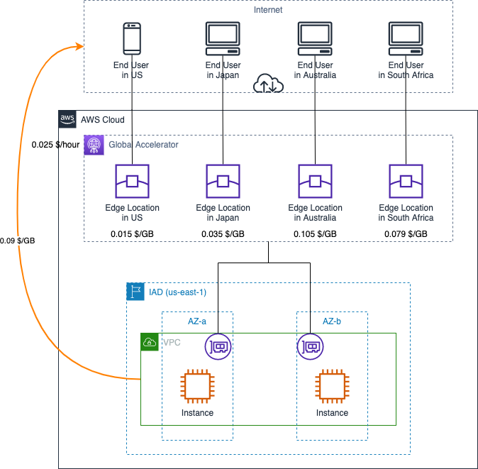

# AWS Content Delivery Service Data Transfer Cost

中文 ｜ [English](ContentDelivery-EN.md)

## Summary

本章内容总结了 AWS 上用于内容分发的服务在使用过程中数据传输所产生的费用计算方式。包含如下服务：

- 1. [CloudFront](#1-amazon-cloudfront)
- 2. [Global Accelerator](#2-aws-global-accelerator)
  - 2.1 [数据流出为主方向](#21-数据流出为主方向)
  - 2.2 [数据流入为主方向](#22-数据流入为主方向)

本章参考了官网中以下费用计算说明：

- CloudFront 计费说明：[全球区域](https://aws.amazon.com/cn/cloudfront/pricing/)，[宁夏、北京区域](https://www.amazonaws.cn/cloudfront/pricing/)；  
- Global 计费说明: [全球区域](https://aws.amazon.com/cn/global-accelerator/pricing/)；
- EC2 计费说明：[全球区域](https://aws.amazon.com/cn/ec2/pricing/on-demand/)，[宁夏、北京区域](https://www.amazonaws.cn/ec2/pricing/)

## 1. Amazon CloudFront ##

CloudFront 的计费维度包括数据流量和请求，购买方式包括按需和承诺用量：

>对于按需定价，CloudFront 对从边缘站点传出的数据流量以及 HTTP 或 HTTPS 请求收费。愿意做出一年使用承诺的客户可以使用自助式 CloudFront Savings Bundle 节省最多 30% 的费用。

在按需模定价模式下，数据传出的流量按照阶梯进行计费。

以下图示中，只针对按需模式下，以第一阶梯的费用单价对数据流量的计费进行说明。

关于流量阶梯定价、不同区域定价的详细说明，可查阅 [CloudFront 计费说明](https://aws.amazon.com/cn/cloudfront/pricing/)，宁夏和北京区域的说明需查询 [中国大陆地区官网](https://www.amazonaws.cn/cloudfront/pricing/)。

[返回顶部](#summary)

## 2. AWS Global Accelerator ##

Global Accelerator 包含两个计费维度：

>固定费用：在账户中运行加速器时，每小时（不足 1 小时按 1 小时算）收取 0.025 USD，直到加速器被删除。
>
>数据传输附加费用 (DT-Premium)：通过 AWS 网络传输的数据的每 GB 费率。DT-Premium 费率取决于处理请求的 AWS 区域（源）和响应定向到的 AWS 边缘站点（目标）。您只需为主方向传输的数据支付 DT-Premium。AWS Global Accelerator 的 DT-Premium 费用适用于流经 AWS Global Accelerator 的所有流量，无论目标是否指向 Internet、其他 AWS 区域还是可用区。除了对在 AWS 区域中运行的应用程序终端节点收取正常的 [EC2 数据传出费用](https://aws.amazon.com/cn/ec2/pricing/on-demand/) 之外，还会收取 DT-Premium 费用。

图示企业在 AWS 北弗吉尼亚区域（IAD）部署了自己的应用，通过 GA 面向全球的最终用户进行加速。最终用户分布在美国（40%）、日本（30%）、澳大利亚（20%）、南非（10%）。根据数据流主方向的不同，传输成本的计算的组成略有不同。以下部分为 1 小时内（数据传输附加费以小时为单位进行计算），数据传输成本的计算示例。

### 2.1 数据流出为主方向

假设：共有 30GB 数据通过 GA 的加速器，其中 20GB 为数据流出方向，10GB 为数据流入方向。因此数据流出为主方向。

则该小时内传输成本包括：

- 加速器固定费用：0.025 x 1（1 小时）= 0.025 $
- 美国用户产生的数据传输附加费：0.015 x 20 x 40% = 0.12 $
- 日本用户产生的数据传输附加费：0.035 x 20 x 30% = 0.21 $
- 澳大利亚用户产生的数据传输附加费：0.105 x 20 x 20% = 0.42 $
- 南非用户产生的数据传输附加费：0.079 x 20 x 10% = 0.158 $
- IAD 中产生的数据传输费：0.09 x 20 = 1.80 $

合计：0.025 + 0.12 + 0.21 + 0.42 + 0.158 + 1.80 = 2.733 $

### 2.2 数据流入为主方向

假设：共有 15GB 数据通过 GA 的加速器，其中 5GB 为数据流出方向，10GB 为数据流入方向，因此数据流入为主方向。

则该小时内传输成本包括：

- 加速器固定费用：0.025 x 1（1 小时）= 0.025 $
- 美国用户产生的数据传输附加费：0.015 x 10 x 40% = 0.06 $
- 日本用户产生的数据传输附加费：0.035 x 10 x 30% = 0.105 $
- 澳大利亚用户产生的数据传输附加费：0.105 x 10 x 20% = 0.21 $
- 南非用户产生的数据传输附加费：0.079 x 10 x 10% = 0.079 $
- IAD 中产生的数据传输费：0.09 x 5 = 0.45 $（无论数据主方向是流入还是流出，都会收取 DTO 费用）
  
合计：0.025 + 0.06 + 0.105 + 0.21 + 0.079 + 0.45 = 0.929 $

[返回顶部](#summary)

[【返回 README】](../../README.md)