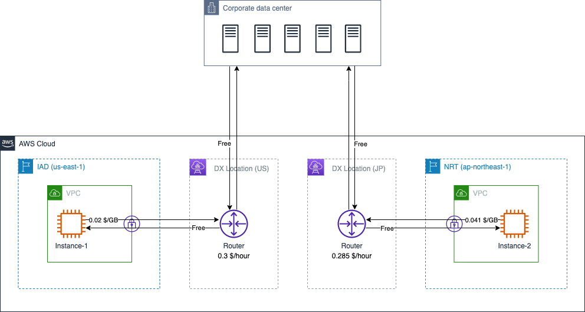
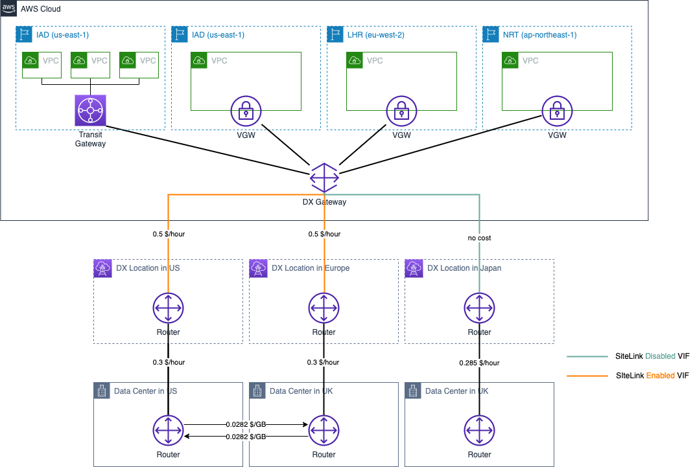

# AWS Direct Connect Data Transfer Cost

## Summary

本章内容总结了 AWS Direct Connect (DX) 几种典型应用场景下，数据传输所产生的费用计算方式。包含如下场景：

本章参考了官网中以下费用计算说明：

- DX 计费说明：[全球区域](https://aws.amazon.com/cn/directconnect/pricing/?nc=sn&loc=3)，[宁夏、北京区域](https://www.amazonaws.cn/directconnect/pricing/)；

## 1. AWS Direct Connect

DX 的价格维度包括：

>连接在任何 AWS 区域运行的资源后（如 Amazon Virtual Private Cloud 或 AWS Transit Gateway），三个因素决定定价：容量、端口小时数和数据传出 (DTO)。  
>
>AWS Direct Connect 数据传入在所有站点按每 GB 0.00 USD 收费。  
>
>数据传出定价取决于源 AWS 区域和 AWS Direct Connect 站点。  

相同 **容量** 时，使用 [专用连接](https://docs.aws.amazon.com/zh_cn/directconnect/latest/UserGuide/WorkingWithConnections.html#dedicated_connection) 和 [托管连接](https://docs.aws.amazon.com/zh_cn/directconnect/latest/UserGuide/WorkingWithConnections.html#hosted_connection) 所产生的的 **端口小时费用** 不同。

图示中，某公司分别通过美国和日本的 DX Location 各建立了 1 条 1Gbps 专用连接。假设 1 小时内，本地数据中心从位于日本的 EC2 实例下载了 2GB 数据，从位于美国的 EC2 实例下载了 4GB 数据，两个 EC2 实例各从本地数据中心内下载了 10GB 数据。所产生的 DX 成本如下：

- 端口费用：0.3 x 1（美国费率）+ 0.285 x 1（日本费率）= 0.585 $
- Instance-1 数据流出费用：0.02 x 4（美国费率）= 0.08 $
- Instance-2 数据流出费用：0.041 x 2（日本费率）= 0.082 $
- 数据流入费用：10 x 0 + 10 x 0 = 0 $（传入数据不产生费用）

合计：0.585 + 0.08 + 0.082 = 0.747 $

[返回顶部](#summary)

## 2. DX Gateway

根据 [官网说明](https://aws.amazon.com/cn/directconnect/faqs/)：

>使用 Direct Connect 网关不会产生任何费用。

但需要遵循 [Direct Connect 计费规则](https://aws.amazon.com/cn/directconnect/pricing/) 付费。由于通过 DX Gateway 允许访问所有区域的资源，注意您将需要根据作为流量来源的 AWS 区域和连接它的 AWS Direct Connect 站点支付适用的 DTO 数据费率。

图示中，某公司利用位于美国的 DX Location 建立了 1 条 1Gbps 专用连接，并通过 DX Gateway 关联到位于 IAD 和 NRT 的 VPC。假设 1 小时内，本地数据中心从位于日本的 EC2 实例下载了 2GB 数据，从位于美国的 EC2 实例下载了 4GB 数据，两个 EC2 实例各从本地数据中心内下载了 10GB 数据。所产生的 DX 成本如下：

- 端口费用：0.3 x 1 = 0.3 $
- Instance-1 数据流出费用：0.02 x 4 = 0.08 $
- Instance-2 数据流出费用：0.09 x 2 = 0.18 $
- 数据流入费用：0

合计：0.3 + 0.08 + 0.18 = 0.56 $

[返回顶部](#summary)

## 3. SiteLink

除了 DX 的计费维度外，SiteLink 还有两个因素决定额外成本：

>SiteLink 小时数和 SiteLink 数据传输。

>SiteLink 小时体现 AWS Direct Connect 虚拟接口 (VIF) 启用 SiteLink 功能的小时数。

>SiteLink 数据传输指 AWS Direct Connect 位置之间流动的数据量，按每 GB 支付。SiteLink 数据传输费率根据网络流量的源和目的地而变化。例如，从欧洲发送到加拿大的数据的计费价格与从欧洲发送到印度的数据计费价格不同。

图示中，某公司在美国、英国和日本都有本地数据中心，在 AWS 上启用了 IAD、LHR、NRT 三个区域。每个数据中心通过 1 条 1 Gbps 的专用 DX 连接到 AWS。

美国和英国的两条 DX 链路上各创建了 1 个配置 SiteLink 的 VIF，日本的 DX 链路上创建的 VIF 没有启用 SiteLink。

假设 1 小时内，美国数据中心向英国数据中心发送 10GB 数据，英国数据中心向美国数据中心发送 5GB 数据。无论传递数据实际花费了多少时间，则 1 小时内网络链路方面的总体成本计算如下：

- Dedicated DX Connetction 小时成本：0.3 x 1（美国）+ 0.3 x 1（英国）+ 0.285 x 1（日本）= 0.885 $；
- DX 流量成本：0（没有从 AWS 通过 DX 连接发送到本地数据中心的数据）；
- SiteLink 小时成本：0.5 x 2（美国、英国各有 1 个 VIF 启用了 SiteLink）= 1$
- SiteLink 流量成本：0.0282 x 10（美国->英国）+ 0.0282 x 5（英国->美国）= 0.423 $

合计：0.885 + 1 + 0.423 = 2.308 $

>如启用了 TGW，还需增加 TGW 的小时费用。图示中在 IAD 增加了一组通过 TGW 关联到 DX Gateway 上的 VPC，仅为了说明 SiteLink 支持 Transit VIF 和 Private VIF，并不能作为实际网络设计的参考。

以上计算参考 [DX 价格说明](https://aws.amazon.com/cn/directconnect/pricing/?nc1=h_ls)

[返回顶部](#summary)

[【返回 README】](../../README.md)