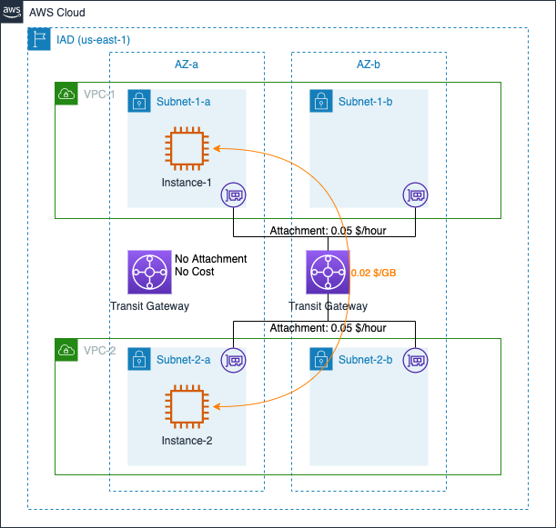
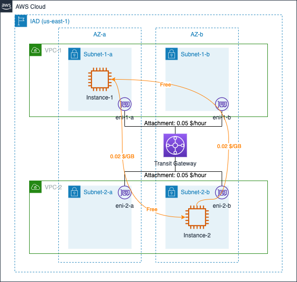

# AWS Transit Gateway Data Transfer Cost

## Summary

本章内容总结了 Transit Gateway（TGW）在几种典型应用场景下，数据传输所产生的费用计算方式。包含如下场景：

- 1. [标准场景计费](#标准收费)
- 2. [跨 AZ 场景计费](#跨-az-收费)

本章参考了官网中以下费用计算说明：
- Transit Gateway 计费说明：[全球区域](https://aws.amazon.com/cn/transit-gateway/pricing/?nc1=h_ls)，[宁夏、北京区域](https://www.amazonaws.cn/transit-gateway/pricing/)；
- EC2 计费说明：[全球区域](https://aws.amazon.com/cn/ec2/pricing/on-demand/)，[宁夏、北京区域](https://www.amazonaws.cn/ec2/pricing/)；
- VPN 计费说明：[全球区域](https://aws.amazon.com/cn/vpn/pricing/?nc1=h_ls)

## 标准收费 ##

TGW 自身的计费规则包含两个维度：

>使用 AWS Transit Gateway，您需要为每小时建立到 Transit Gateway 的连接数量和流经 AWS Transit Gateway 的流量付费。

图示采用弗吉尼亚北部区域，两个 EC2 实例位于相同 AZ 的不同 VPC 内，两个 VPC 通过 TGW 联通。另外有一个 TGW 创建后没有关联任何资源。假设 1 小时内，Instance-1 向 Instance-2 发送 10GB 数据，Instance-2 向 Instance-1 发送 5GB 数据，无论传输数据实际用时多长，1 小时内产生的流量相关费用为：

- TGW 连接的小时费：0.05 x 2（2 个 Attachment）= 0.1 $
- 流量处理费：0.02 x 10（Instanc-1 -> Instance-2）+ 0.02 x 5（Instance-2 -> Instance-1）= 0.3 $

合计：0.1 + 0.3 = 0.4 $

[返回顶部](#summary)

## 跨 AZ 收费 ##

在 [标准收费](#标准收费) 中，两个通信的 EC2 实例位于相同可用区内。如果两个 EC2 实例位于不同可用区，除了 TGW 费用外，根据 TGW 在创建关联时方式的不同，还可能会产生跨可用区流量费用。

当使用 TGW 关联多个 VPC 时，如果 TGW 在所有 AZ 内均创建了 eni，TGW 会首先将流量路由到相同可用区内对应的 eni 中。如下图：

两个 VPC 通过 TGW 关联，创建关联时均选中了 AZ-a 和 AZ-b。

- 当 Instance-1 向 Instance-2 发送数据时，流量路径为：Instance-1 -> eni-1-a -> TGW -> eni-2-a -> Instance-2；
- 当 Instance-2 向 Instance-1 发送数据时，流量路径为：Instance-2 -> eni-2-b -> TGW -> eni-1-b -> Instance-1

由此，在 TGW 流量处理费用之外，还会产生跨可用区费用。假设 1 小时内，Instance-1 向 Instance-2 发送 10GB 数据，Instance-2 向 Instance-1 发送 5GB 数据，无论传输数据实际用时多长，1 小时内产生的流量相关费用为：

- TGW 连接的小时费：0.05 x 2（2 个 Attachment）= 0.1 $
- TGW 流量处理费：0.02 x 10（Instanc-1 -> Instance-2）+ 0.02 x 5（Instance-2 -> Instance-1）= 0.3 $
- 跨可用区流量处理费：0.01 x 10（eni-2-a OUT）+ 0.01 x 10（Instance-2 IN）+ 0.01 x 5（eni-1-b OUT）+ 0.01 x 5（Instance-1 IN）= 0.3 $

合计：0.1 + 0.3 + 0.3 = 0.7 $

然而，当创建 TGW 关联时，只选择了目标实例所在的可用区时，流量可以被直接路由到目标可用区。如下图：

两个 VPC 通过 TGW 关联。创建关联时，VPC-1 选中了 AZ-a，VPC-2 选中了 AZ-a 和 AZ-b。

- 当 Instance-1 向 Instance-2 发送数据时，流量路径为：Instance-1 -> eni-1-a -> TGW -> eni-2-a -> Instance-2；
- 当 Instance-2 向 Instance-1 发送数据时，流量路径为：Instance-2 -> eni-2-b -> TGW -> Instance-1

假设 1 小时内，Instance-1 向 Instance-2 发送 10GB 数据，Instance-2 向 Instance-1 发送 5GB 数据，无论传输数据实际用时多长，1 小时内产生的流量相关费用为：

- TGW 连接的小时费：0.05 x 2（2 个 Attachment）= 0.1 $
- TGW 流量处理费：0.02 x 10（Instanc-1 -> Instance-2）+ 0.02 x 5（Instance-2 -> Instance-1）= 0.3 $
- 跨可用区流量传输费：0.01 x 10（eni-2-a OUT）+ 0.01 x 10（Instance-2 IN）+ 0.01 x 5（eni-1-b OUT）+ 0.01 x 5（Instance-1 IN）= 0.3 $

合计：0.1 + 0.3 + 0.2 = 0.6 $

**注意：**在 [Transit Gateway 文档](https://docs.aws.amazon.com/zh_cn/vpc/latest/tgw/tgw-vpc-attachments.html) 中，关于可用区与网络流量的说明仅有以下内容：

>将 VPC 挂载到中转网关时，可用区中没有中转网关挂载的任何资源无法到达中转网关。如果子网路由表中有通往中转网关的路由，则只有当中转网关在同一可用区的子网中有挂载时，才会将流量转发到中转网关。

不在相同可用区内的两个实例通过 TGW 访问时的流量路径为 **个人实验的推测结果**，仅供参考。

[返回顶部](#summary)

## 跨 region 收费 ##

TGW 是属于区域的资源，当需要跨区域通信时，需要分别在不通的区域内创建 TGW，然后将两个 TGW 建立对等连接。对等连接也会按小时收取连接费用，流量处理费说明如下：

>数据处理费用不适用于从对等连接发送至 Transit Gateway 的数据。通过对等连接传输的数据会产生标准区域间数据传输费用。

跨区域建立 TGW 的对等连接后，仍然有可能产生跨可用区访问的流量传输费用，如下图：

图中示例分别在 IAD 和 NRT 两个区域创建了资源，并建立了 TGW 间的对等连接。假设在 1 小时内，IAD 区域内的实例向 NRT 区域内的实例传输 10GB 数据，NRT 区域内的实例向 IAD 区域内的实例传输 5 GB 数据，整体网络成本组成如下：

- TGW 连接的小时费：0.05 x 2（IAD 的 TGW）+ 0.07 x 2（NRT 的 TGW）= 0.24 ¥
- TGW 流量处理费：0.02 x 10（Instance-1 传出的数据）+ 0 x 5（来自 NRT TGW 的数据）+ 0.02 x 5（Instance-2 传出的数据）+ 0 x 10（来自 IAD TGW 的数据）= 0.3 $
- 跨区域流量传输费：0.02 x 10（IAD -> NRT）+ 0.09 x 5（NRT -> IAD）= 0.65 $
- 跨可用区流量传输费：0.01 x 5（IAD-AZ-b OUT） + 0.01 x 5（IAD-AZ-a IN） + 0.01 x 10（NRT-AZ-d OUT） + 0.01 x 10（NRT-AZ-a IN）= 0.3 $

合计：0.24 + 0.3 + 0.65 + 0.3 = 1.49 $

[返回顶部](#summary)

## 跨账号收费 ##

与 DX Gateway 相同，TGW 可以和其关联的目标来自于不同账号。在跨账号情况下，遵循如下方式收取关联小时费：

>对于 AWS VPN 挂载，Transit Gateway 拥有者需要按小时付费。

>对于 AWS Direct Connect 连接，Direct Connect 网关拥有者需要按小时付费。

>对于 Transit Gateway Connect 连接（SD-WAN 设备），Transit Gateway 拥有者需要按小时付费。

>对于对等连接，每个 Transit Gateway 拥有者需要按小时为与其他 Transit Gateway 的对等连接付费。

在连接 VPN 时，Site-to-Site VPN 的小时使用费仍将正常收取。

图中将连接小时费画在了对应的 Account 方框内。

[返回顶部](#summary)

[【返回 README】](../../README.md)