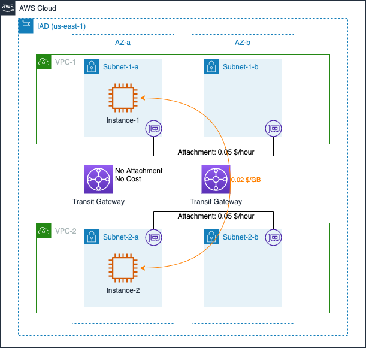
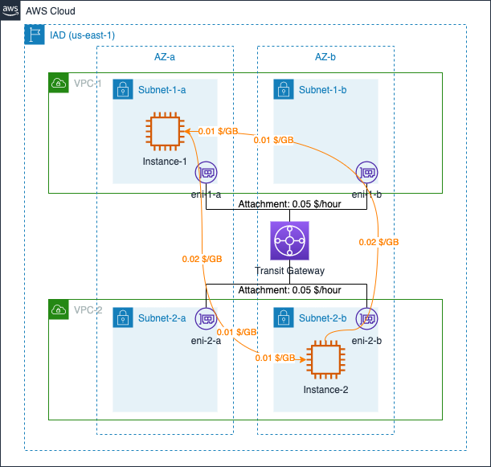
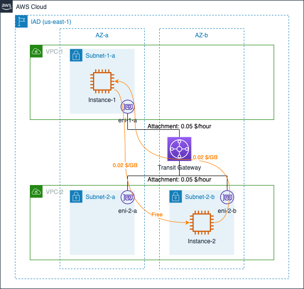
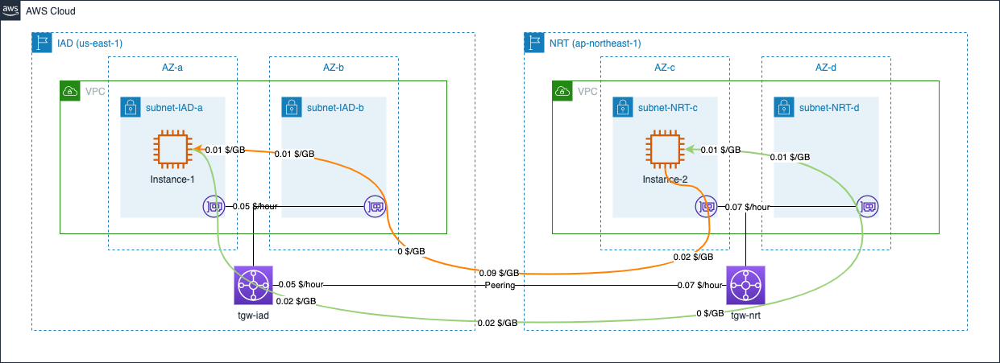
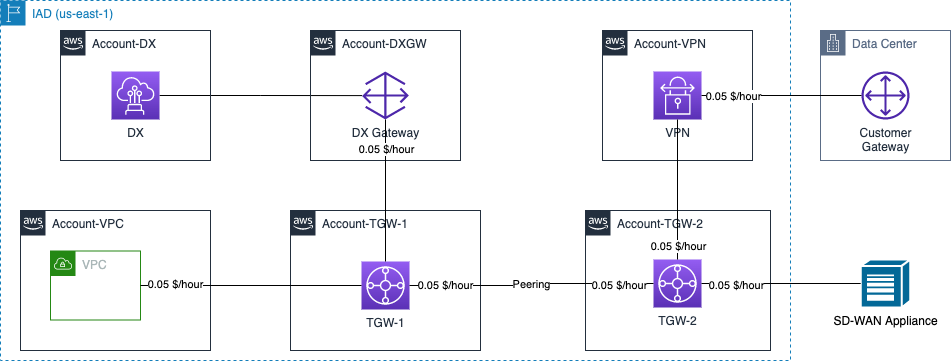

# AWS Transit Gateway Data Transfer Cost

[中文](TGW-README.md) | English

## Summary

This page summarizes the cost calculation of Transit Gateway (TGW) data transfer in several typical scenarios. The following scenarios are included:

- 1. [Standard Pricing](#1-standard-pricing)
- 2. [Cross AZ Pricing](#2-cross-az-pricing)
- 3. [Cross Region Pricing](#3-cross-region-pricing)
- 4. [Cross Account Pricing](#4-cross-account-pricing)

The following costing instructions from the official website are referenced in this page:

- Transit Gateway Pricing: [Global Region](https://aws.amazon.com/transit-gateway/pricing/), [Ningxia & Beijing Regions](https://www.amazonaws.cn/en/transit-gateway/pricing/)；
- EC2 Pricing: [Global Region](https://aws.amazon.com/ec2/pricing/on-demand/), [Ningxia & Beijing Regions](https://www.amazonaws.cn/en/ec2/pricing/)；
- VPN Pricing: [Global Region](https://aws.amazon.com/vpn/pricing/)；

## 1. Standard Pricing 

Transit Gateway itself has two billing dimensions:  

>In AWS Transit Gateway you are charged for the number of connections that you make to the Transit Gateway per hour and the amount of traffic that flows through AWS Transit Gateway. 

In the diagram, a company deployed their applicaion on AWS N.Virginia reion, two EC2 instances are located in different VPCs within the same AZ. Two VPCs are connected via TGW. Another TGW has no attachment. Assuming that Instance-1 sends 10GB data to Instance-2, and Instance-2 sends 5GB data to Instance-1 within 1 hour, the data transfer costs incurred in this 1 hour consist of: 

- TGW Attachment hours: 0.05 x 2 (two attachments) = 0.1 $
- TGW Data processed: 0.02 x 10 (Instanc-1 -> Instance-2) + 0.02 x 5 (Instance-2 -> Instance-1) = 0.3 $

Total: 0.1 + 0.3 = 0.4 $

[Back to Top](#summary)

## 2. Cross AZ Pricing

In [Standard Pricing](#1-standard-pricing), two EC2 instances are located in different AZs. In this scenario, in addition to TGW costs, there may be cross-AZ data transfer costs depending on how TGW was used. 

When attaching multiple VPCs to TGW and creating eni in each AZ, TGW will first route the data traffic to the corresponding eni in the same AZ. As shown in the figure below:   

In the diagram, two VPCs are connected via TGW, and both AZs (AZ-a and AZ-b) are checked when creating TGW attachments.  

- When Instance-1 sends data to Instance-2, the traffic path is: Instance-1 -> eni-1-a -> TGW -> eni-2-a -> Instance-2;  
- When Instance-2 sends data to Instance-1, the traffic path is: Instance-2 -> eni-2-b -> TGW -> eni-1-b -> Instance-1

As a result, cross-AZ costs are incurred in addition to TGW traffic processing costs. Assuming that Instance-1 sends 10GB data to Instance-2 and Instance-2 sends 5GB data to Instance-1 in 1 hour, the total data transfer costs incurred in 1 hour consist of:

- TGW Attachment hours: 0.05 x 2 (two attachments) = 0.1 $
- TGW Data processed: 0.02 x 10 (Instanc-1 -> Instance-2) + 0.02 x 5 (Instance-2 -> Instance-1) = 0.3 $
- Cross-AZ data transfer: 0.01 x 10 (eni-2-a OUT) + 0.01 x 10 (Instance-2 IN) + 0.01 x 5 (eni-1-b OUT) + 0.01 x 5 (Instance-1 IN) = 0.3 $

Total: 0.1 + 0.3 + 0.3 = 0.7 $

On the other hand, if you choose the only AZ where the target instance is located when creating TGW attachment, data traffic could be routed directly to the target AZ. As shown in the figure below:  

In the diagram, two VPCs are connected via TGW. and both AZs (AZ-a and AZ-b) are checked when creating TGW attachments.  
两个 VPC 通过 TGW 关联。When creating TGW attachments, different AZ were checked in each attachment, AZ-a from VPC-1, AZ-a and AZ-b from VPC-2.

- When Instance-1 sends data to Instance-2, the traffic path is: Instance-1 -> eni-1-a -> TGW -> eni-2-a -> Instance-2;  
- When Instance-2 sends data to Instance-1, the traffic path is: Instance-2 -> eni-2-b -> TGW -> Instance-1

Assuming that Instance-1 sends 10GB data to Instance-2 and Instance-2 sends 5GB data to Instance-1 in 1 hour, the traffic-related costs incurred in 1 hour consist of:  

- TGW Attachment hours: 0.05 x 2 (two attachments) = 0.1 $
- TGW Data processed: 0.02 x 10 (Instanc-1 -> Instance-2) + 0.02 x 5 (Instance-2 -> Instance-1) = 0.3 $
- Cross-AZ data transfer: 0.01 x 10 (eni-2-a OUT) + 0.01 x 10 (Instance-2 IN) + 0.01 x 5 (eni-1-b OUT) + 0.01 x 5 (Instance-1 IN) = 0.3 $

Total: 0.1 + 0.3 + 0.2 = 0.6 $

**NOTE**：In the [Transit Gateway document](https://docs.aws.amazon.com/vpc/latest/tgw/tgw-vpc-attachments.html), the only descriptions of AZ and data traffic are the followig: 

>When you attach a VPC to a transit gateway, any resources in Availability Zones where there is no transit gateway attachment cannot reach the transit gateway. If there is a route to the transit gateway in a subnet route table, traffic is forwarded to the transit gateway only when the transit gateway has an attachment in a subnet in the same Availability Zone.

The descriptions of cross-AZ traffic path in this page are **PRESUMED resulats from PERSONAL experiments**, for reference only. 

[Back to Top](#summary)

## 3. Cross Region Pricing

TGW is regional resource. If you need to communicate across regions via TGW, you need to create separate TGWs in different regions and then establish peering attachments between these two TGWs. Peering attachments are also charged an hourly attachment fee, and the data processed fee is described as follows:

>Data processing charges do not apply for data sent from a peering attachment to a Transit Gateway. Data transferred over a peering attachment incurs the standard inter-Region data transfer charges as explained in the  [EC2 on-demand pricing page](https://aws.amazon.com/ec2/pricing/on-demand/).

After creation of TGW peering attachment cross different regions, it is still possible to incur data transfer costs for cross-AZ access, as shown below:  

In the diagram, a company creates resources on AWS N.Virginia region (IAD) and Tokyo region (NRT), and establishes peering attachments between TGWs. Assuming that in a 1-hour period, instances in the IAD region send 10GB data to instances in the NRT region, and instances in the NRT region sends 5GB data to instances in the IAD region, the total network cost composition is as follows:  

- TGW Attachment hours: 0.05 x 2 (from TGW in IAD) + 0.07 x 2 (from TGW in NRT) = 0.24 $
- TGW Data processed: 0.02 x 10 (Data Transfer OUT from Instance-1) + 0 x 5 (Data from TGW in NRT) + 0.02 x 5 (Data Transfer OUT from Instance-2) + 0 x 10 (Data from TGW in IAD) = 0.3 $
- Cross-regions data transfer: 0.02 x 10 (IAD -> NRT) + 0.09 x 5 (NRT -> IAD) = 0.65 $
- Cross-AZ data transfer: 0.01 x 5 (IAD-AZ-b OUT) + 0.01 x 5 (IAD-AZ-a IN) + 0.01 x 10 (NRT-AZ-d OUT) + 0.01 x 10 (NRT-AZ-a IN) = 0.3 $

Total: 0.24 + 0.3 + 0.65 + 0.3 = 1.49 $

[Back to Top](#summary)

## 4. Cross Account Pricing

Same as DX Gateway, TGW could be attached with targets from different accounts. In the case of cross-account, the attachments hourly rate is charged as follows:

>For AWS VPN attachments, the Transit Gateway owner is billed hourly.

>For AWS Direct Connect attachments, the Direct Connect Gateway owner is billed hourly.

>For Transit Gateway Connect attachments (SD-WAN appliances), the Transit Gateway owner is billed hourly.

>For peering attachments, each Transit Gateway owner is billed hourly for the peering attachment with the other Transit Gateway.

When attaching to a VPN, Site-to-Site VPN hourly usage fees will still be charged as well.

In the diagram, the hourly rate is drawn in the corresponding Account box

[Back to Top](#summary)

[Back to README](../../README-EN.md)