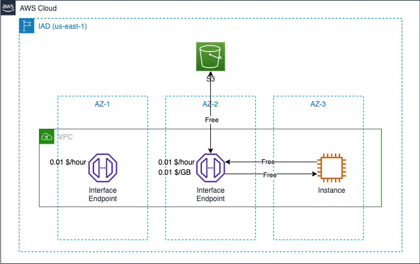

# Amazon VPC Data Transfer Cost

中文 ｜ [English](VPC-EN.md)

## Summary

本章内容总结了 VPC 几种典型应用场景下，数据传输所产生的费用计算方式。包含如下场景：

- 1. [VPC Peering](#1-vpc-peering)
- 2. [NAT Gateway](#2-nat-gateway)
- 3. [VPC Endpoint](#3-vpc-endpoint)

本章参考了官网中以下费用计算说明：

- EC2 计费说明：[全球区域](https://aws.amazon.com/cn/ec2/pricing/on-demand/)，[宁夏、北京区域](https://www.amazonaws.cn/ec2/pricing/)；
- PrivateLink 计费说明：[全球区域](https://aws.amazon.com/cn/privatelink/pricing/)，[宁夏、北京区域](https://www.amazonaws.cn/privatelink/pricing/)；
- NAT 网关定价说明：[全球区域](https://aws.amazon.com/cn/vpc/pricing/)，[宁夏、北京区域](https://www.amazonaws.cn/vpc/pricing/)

## 1. VPC Peering

如果相同区域内的两个 VPC 建立了 VPC 对等连接，[对等连接本身免费](https://docs.aws.amazon.com/vpc/latest/peering/what-is-vpc-peering.html#vpc-peering-pricing)，根据 AWS 在 2021 年 5 月的 [声明](https://aws.amazon.com/cn/about-aws/whats-new/2021/05/amazon-vpc-announces-pricing-change-for-vpc-peering/)：

>通过可用区 (AZ) 内的 VPC Peering 连接进行的所有数据传输都将免费。通过 VPC Peering 连接进行的所有跨可用区的数据传输，将继续按照标准的区域内[数据传输费率](https://aws.amazon.com/cn/ec2/pricing/on-demand/)收费。

若跨区域设置 VPC Peering，将产生 [跨区域流量](https://aws.amazon.com/cn/ec2/pricing/on-demand/) 成本。

图中所示 3 个 VPC，VPC-1 分别与 VPC-2 和 VPC-A 建立了对等连接（peering connection）。VPC-1 和 VPC-2 之间的流量费用遵循相同区域内流量费用规则，VPC-1 和 VPC-A 之间产生跨区域流量费。由于 VPC-A 和 VPC-2 之间没有建立对等连接，因此它们之间不能使用私有 IP 进行通信，只能通过公有 IP 通信，产生的流量费用仍然遵循跨区域流量费用标准。

[返回顶部](#summary)

## 2. NAT Gateway

就 NAT 网关自身而言收费参考两个维度，**NAT 网关小时费率** 和 **NAT 网关数据处理费用**：

>如果选择在 VPC 中创建 NAT 网关，您需要为网关预置和可用的每个“NAT 网关小时”付费。通过 NAT 网关处理的每个 GB 都要收取数据处理费，与流量源或目的地无关。

此外，还需要叠加计算 EC2 实例所产生的数据传输费用，包括：数据流向互联网、跨可用区、跨区域费用。

在 1 小时内，下载 2GB、上传 1GB 数据下，图中两个实例在分别访问第三方资源和相同区域内 S3 内资源时，流量成本计算如下：

- 如单独使用 Instance-1：
  - 仅访问 3rd Party Site：0.045 x 1（NAT-GW 使用时间） + 0.045 x (2+1)（NAT-GW 处理数据量） + 0.09 x 1（数据流出量） = 0.27 $
  - 仅访问同区域内的 S3：0.045 x 1（NAT-GW 使用时间）+ 0.045 x (2+1)（NAT-GW 处理数据量） = 0.18 $
- 如单独使用 Instance-2：
  - 仅访问 3rd Party Site：0.045 x 1（NAT-GW 使用时间） + 0.045 x (2+1)（NAT-GW 处理数据量） + 0.09 x 1（数据流出量） + 0.01 x 2 x 2（跨 AZ 下载） + 0.01 x 2 x 1（跨 AZ 上传） = 0.33 $
  - 仅访问同区域内的 S3：0.045 x 1（NAT-GW 使用时间）+ 0.045 x (2+1)（NAT-GW 处理数据量） + 0.01 x 2 x 2（跨 AZ 下载） + 0.01 x 2 x 1（跨 AZ 上传） = 0.24 $

关于跨 AZ 访问时流量计费的说明，也可参考本文档中 [EC2 流量说明](../../Compute/EC2/EC2-CN.md#42-ec2-instances-across-different-az) 章节。

[返回顶部](#summary)

## 3. VPC Endpoint

针对 AWS 托管服务，VPC 中可以提供两种终端节点。网关端点（Gateway Endpoint）和接口终端节点（Interface Endpoint），使用网关端点不会产生任何费用。

在使用接口终端节点时，有两个计费维度：创建时长（按 VPC + 可用区计费），数据处理费（按 GB 计费）。根据 [AWS PrivateLink 定价](https://aws.amazon.com/cn/privatelink/pricing/) 说明：

>我们将按照 VPC 终端节点在每个可用区保持已预置状态的小时数收取费用，无论其与服务的关联状态如何。

>我们将按照由 VPC 终端节点处理的每 GB 数据收取数据处理费用，无论流量的来源或目的地如何。

图示案例中，某公司在两个可用区中为 S3 创建了接口终端节点，分别位于 AZ-1 和 AZ-2。位于 AZ-3 的 EC2 实例通过位于 AZ-2 中的接口终端节点从相同区域的 S3 存储桶中下载 2GB 数据、上传 1GB 数据，1 小时内的网络传输成本包括：

- 接口终端节点时长费用：0.01 x 1 x 2（2 个 AZ 内创建了 endpoint，创建了 1 小时）= 0.02 $；
- 接口终端节点流量处理费：0.01 x 3（合计处理了 3GB 数据）= 0.03 $；
- 跨可用区间流量处理费用：0.01 x 2 x 2GB（Interface Endpoint ENI -> Instance）+ 0.01 x 2 x 1GB（Instance -> Interface Endpoint ENI）= 0.06 $

合计：0.02 + 0.03 + 0.06 = 0.11 $

*如果在多个 AZ 内创建了 Interface Endpoint，可以通过指定具体某个接口的来避免跨 AZ 流量的产生。*

[返回顶部](#summary)

[【返回 README】](../../README.md)