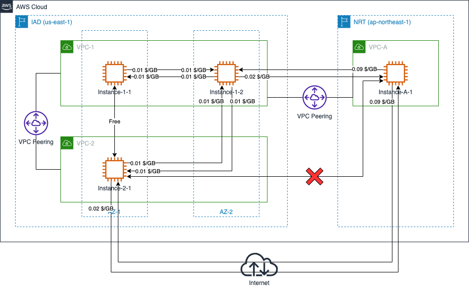
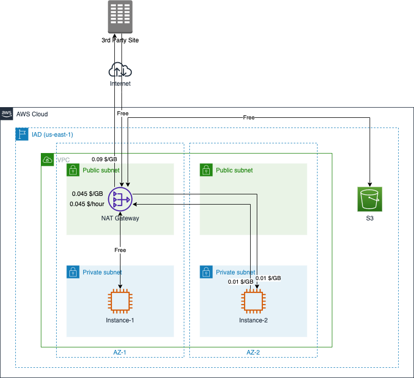
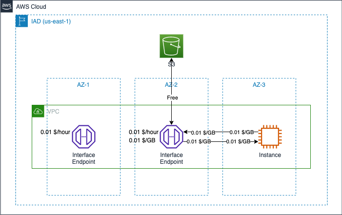

# Amazon VPC Data Transfer Cost

[中文](VPC-CN.md) | English

## Summary

This page summarizes the cost calculation of VPC in several typical scenarios. The following scenarios are included:

- 1. [VPC Peering](#1-vpc-peering)
- 2. [NAT Gateway](#2-nat-gateway)
- 3. [VPC Endpoint](#3-vpc-endpoint)

The following costing instructions from the official website are referenced in this page:

- EC2 Pricing: [Global Region](https://aws.amazon.com/ec2/pricing/on-demand/), [Ningxia & Beijing Regions](https://www.amazonaws.cn/en/ec2/pricing/);
- PrivateLink Pricing: [Global Region](https://aws.amazon.com/privatelink/pricing/), [Ningxia & Beijing Regions](https://www.amazonaws.cn/en/privatelink/pricing/);  
- NAT Pricing: [Global Region](https://aws.amazon.com/vpc/pricing/), [Ningxia & Beijing Regions](https://www.amazonaws.cn/en/vpc/pricing/)

## 1. VPC Peering

If VPC peering connection is between two VPCs in the same region, [the VPC peering itself is free](https://docs.aws.amazon.com/vpc/latest/peering/what-is-vpc-peering.html#vpc-peering-pricing)，according to a [STATEMENT](https://aws.amazon.com/about-aws/whats-new/2021/05/amazon-vpc-announces-pricing-change-for-vpc-peering/) from AWS in May 2021:

>all data transfer over a VPC Peering connection that stays within an Availability Zone (AZ) is now free. All data transfer over a VPC Peering connection that crosses Availability Zones will continue to be charged at the standard in-region [data transfer rates](https://aws.amazon.com/ec2/pricing/on-demand/).

If VPC Peering is set up across regions, [cross region data transfer costs](https://aws.amazon.com/ec2/pricing/on-demand/) will be incurred. 

There three VPCs shown in the figure, VPC-1, have peering connections with VPC-2 and VPC-A. The data transfer costs between VPC-1 and VPC-2 follow data transfer cost rules within the same region, while VPC-1 and VPC-A incur cross region data transfer costs. Since no peering connection is established between VPC-A and VPC-2, they cannot communicate with each other using private IPs, but only through public IPs, and the resulting data transfer charges still follow the cross-region traffic charge rate.

[Back to Top](#summary)

## 2. NAT Gateway

NAT gateway itself has two billing dimensions, **NAT Gateway Hourly Charge** and **NAT Gateway Data Processing Charge**: 

>If you choose to create a NAT gateway in your VPC, you are charged for each “NAT Gateway-hour" that your gateway is provisioned and available. Data processing charges apply for each gigabyte processed through the NAT gateway regardless of the traffic’s source or destination.

In addition, EC2 data transfer costs should be counted as well: data tranfser OUT, cross-AZ data transfer, cross-region data transfer.  

Within 1 hour period, downloading 2GB data and uploading 1GB data, the data transfer costs are respectively calculated as follows for the two EC2 instances in the figure when accessing third-party resources and S3 in the same region:  

- Instance-1 is used alone: 
  - Only access to 3rd Party Site: 0.045 x 1 (NAT-GW Hourly Charge) + 0.045 x (NAT-GW Data Processing Charge, 2GB+1GB) + 0.09 x 1 (Data Transfer OUT) = 0.27 $
  - Only access to S3 within the same region: 0.045 x 1 (NAT-GW Hourly Charge) + 0.045 x (NAT-GW Data Processing Charge, 2GB+1GB) = 0.18 $
- Instance-2 is used alone:  
  - Only access to 3rd Party Site: 0.045 x 1 (NAT-GW Hourly Charge) + 0.045 x (NAT-GW Data Processing Charge, 2GB+1GB) + 0.09 x 1 (Data Transfer OUT) + 0.01 x 2 x 2 (downloading path across AZ) + 0.01 x 2 x 1 (uploading path across AZ) = 0.33 $
  - Only access to S3 within the same region: 0.045 x 1 (NAT-GW Hourly Charge) + 0.045 x (NAT-GW Data Processing Charge, 2GB+1GB) + 0.01 x 2 x 2 (downloading path across AZ) + 0.01 x 2 x 1 (uploading path across AZ) = 0.24 $

For a description of data transfer billing when accessing across AZ, you may also refer to this repository in [Amazon EC2 Data Transfer Cost](../../Compute/EC2/EC2-EN.md#42-ec2-instances-across-different-az).  

[Back to Top](#summary)

## 3. VPC Endpoint

For AWS managed services, two types of endpoints are available in VPC. Gateway Endpoint and Interface Endpoint, and there is no cost for using the Gateway Endpoint.

As to interface endpoint, there are two billing dimensions: creation time (billed per VPC + availability zone), and data processing fees (billed per GB). According to the description from [AWS PrivateLink Pricing](https://aws.amazon.com/privatelink/pricing/): 

>You will be billed for each hour that your VPC endpoint remains provisioned in each Availability Zone, irrespective of the state of its association with the service.

>Data processing charges apply for each Gigabyte processed through the VPC endpoint regardless of the traffic’s source or destination.

In the figure, aa company creates interface endpoints for S3 in two AZs, AZ-1 and AZ-2. The EC2 instance in AZ-3 downloads 2GB data and uploads 1GB data from the S3 storage bucket in the same zone via the interface endpoint in AZ-2. The data transfer costs in one hour consist of:

- Interface Endpoint per VPC endpoint per AZ: 0.01 x 1 x 2 (in two AZs, run 1 hour)= 0.02 $;  
- Interfacce Endpoint Data Processed: 0.01 x 3 (both upload and download) = 0.03 $；
- Data Transfer cross AZ : 0.01 x 2 x 2GB (Interface Endpoint ENI -> Instance) + 0.01 x 2 x 1GB (Instance -> Interface Endpoint ENI) = 0.06 $

Total: 0.02 + 0.03 + 0.06 = 0.11 $

*You may save cross AZ costs by pointing the specific interface if the Interface Endpoint is created cross multiple AZs.*

[Back to Top](#summary)

[Back to README](../../README-EN.md)