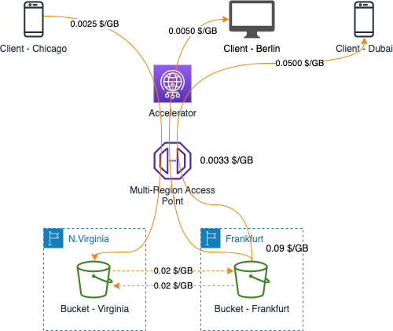

# AWS Lambda Data Transfer Cost

中文 ｜ [English](S3-EN.md)

## Summary

本章内容总结了 S3 在几种典型应用场景下，数据传输所产生的费用计算方式。

对于 S3 与 EC2 之间的数据传输场景，已经在本项目 Amazon EC2 Data Transfer Cost 章节中进行了说明。详细内容请参考 [EC2 <--> S3（不使用 S3 终端节点）](../../Compute/EC2/EC2-CN.md#2-ec2----s3不使用-s3-终端节点) 和 [EC2 <--> S3（使用 S3 终端节点）](../../Compute/EC2/EC2-CN.md#3-ec2----s3使用-s3-终端节点) 两小节。S3 与 CloudFront 之间的数据传输场景，详细内容可以参考本项目中 [Amazon CloudFront](../../Networking/ContentDelivery/ContentDelivery-CN.md#1-amazon-cloudfront) 小节的内容。

在本章节中将包含如下场景：

- [AWS Lambda Data Transfer Cost](#aws-lambda-data-transfer-cost)
  - [Summary](#summary)
  - [1. S3 Cross Region Replication](#1-s3-cross-region-replication)
  - [2. Multi-Region Access Points](#2-multi-region-access-points)
    - [2.1 Application deployed on AWS](#21-application-deployed-on-aws)
    - [2.2 Application deployed out of AWS](#22-application-deployed-out-of-aws)
  - [3. Transfer Acceleration](#3-transfer-acceleration)

本章参考了官网中以下费用计算说明：

- EC2 计费说明：[全球区域](https://aws.amazon.com/cn/ec2/pricing/on-demand/)，[宁夏、北京区域](https://www.amazonaws.cn/ec2/pricing/)；
- S3 计费说明：[全球区域](https://aws.amazon.com/cn/s3/pricing/)，[宁夏、北京区域](https://www.amazonaws.cn/s3/pricing/)

## 1. S3 Cross Region Replication

根据 [S3 计费页面](https://aws.amazon.com/cn/s3/pricing/) 中的说明，在相同 AWS 区域的 S3 存储桶之间传输的数据不必支付数据传输费用。

当需要在不同区域的 S3 存储桶之间进行数据复制时，需要根据源桶和目标桶之间所处的不同区域，收取跨区域流量传输费用。流量传输费用组成如下图：

1. Amazon S3 到 Amazon CloudFront 之间没有流量传输成本，无论 CloudFront 的 Edge Location 位于什么区域；
2. 图中以 Ohio 区域内的 S3 桶为源桶，分别列举了将数据复制到位于 London, N.Virgiona, Sydney 存储桶中不同的流量计费单位，更多计费单位参见 [S3 计费页面](https://aws.amazon.com/cn/s3/pricing/)；
3. 在使用客户端发起 aws s3 cp 命令（或通过 SDK 调用 S3 API）时，客户端与 AWS 之间仅存在控制面流量，复制的数据流不会经过客户端（无论客户端是在一台笔记本电脑还是在一台 EC2 实例上），不会产生数据传输的流量成本 *[注1]*

*[注1]：在 AWS 产品手册中未找到这部分说明。通过 debug 信息可以看到 <code>headers={'x-amz-copy-source':......'Content-Length':'0'}</code> 信息，由此判断在发起命令的客户端侧并没有实际的数据传输，不会产生数据传输的流量费用。*

[返回顶部](#summary)

## 2. Multi-Region Access Points

[Amazon S3 多区域访问点](https://aws.amazon.com/cn/s3/features/multi-region-access-points/) 提供了一个全球端点，用于在 AWS 区域之间路由 Amazon S3 请求流量。在访问跨多个 AWS 区域复制的数据集时，Amazon S3 多区域访问点可将性能提高多达 60%。*（截止到 2023 年 4 月 30 日，宁夏和北京区域暂不支持该功能）*

在计算使用多区域访问点产生的数据传输费用时，包含以下几个计算维度：

- 路由费用：每处理一个 GB 将需支付一笔数据路由费用，固定为 0.0033 $/GB，各区域价格相同；
- 路由加速费用：当应用程序位于 AWS 之外（通过互联网访问 S3 上的资源）时，S3 多区域访问点会根据访问延迟将请求自动路由到最近的数据副本，此时无论数据传入还是传出 S3， 都会产生路由加速费用，具体的费用标准与应用和 S3 存储桶所在位置有关；
- 标准的 S3 数据传输费用（包括互联网传输和跨区域传输）；
- S3 跨区域复制费用：如果开启了多个 S3 存储桶之间的数据复制，还会因此产生跨区域数据传输费。
  
根据应用程序部署的位置（在 AWS 上/不在 AWS 上），数据传输费用的组成所有不同。

### 2.1 Application deployed on AWS

当应用程序部署在 AWS 上时，需要根据应用程序和 S3 存储桶的位置计算流量费用。如下图所示：

图中 App-Virginia 会被多区域访问点路由到临近的存储桶 Bucket-Virginia 上，并上传 10GB 数据。

App-Frankfurt 会被路由到临近的 Bucket-London 上，并下载 3GB 数据。由此产生的数据传输费用计算如下：

- 流量路由费用：0.0033 x (10 + 3) = 0.0429 $
- S3 跨区域数据传输费用：0.02 x 3 = 0.06 $（App-Virginia 和 Bucket-Virginia 在相同区域，不产生流量传输费用）

合计费用：0.0429 + 0.06 = 0.1029 $

如果开启了 Bucket-Virgina 和 Bucket-London 之间的跨区域复制（Cross Region Replication，CRR）功能，还需要增加这部分的费用：  
0.02 x 3 (London -> N.Virginia) + 0.02 x 10 (N.Virginia -> London) = 0.26 $

### 2.2 Application deployed out of AWS

当应用部署在 AWS 之外时，除了 2.1 小节中介绍的费用组成外，还会增加互联网访问加速的费用，如下图所示：

图示案例中，客户端的应用程序通过多区域访问点访问部署在 Virginia 和 Frankfurt 的两个 S3 存储桶，客户端分别位于 Chicago、Berlin、Dubai。各客户端产生的流量传输成本分别阐述如下：

位于 **Chicago** 的客户端上传 10GB 数据，该请求会被路由到 Virginia 的 S3 存储桶内：

- 多区域访问点数据处理费：0.0033 x 10 = 0.033 $
- 数据传入 S3 存储桶的流量费：0 x 10 = 0 $
- 数据在北美范围内通过互联网加速功能传输 S3 存储桶的流量费：0.0025 x 10 = 0.025 $

总的流量费用：0.033 + 0 + 0.025 = 0.058 $
如果开启了存储桶间的数据复制，还将增加跨区域流量传输费用：0.02 x 10 = 0.2 $

位于 **Berlin** 的客户端下载 5GB 数据，该请求会被路由到 Frankfurt 的 S3 存储桶内：

- 多区域访问点数据处理费：0.0033 x 5 = 0.0165 $
- 数据从 S3 传出到互联网的流量费：0.09 x 5 = 0.45 $
- 数据在欧洲范围内通过互联网加速功能传输 S3 存储桶的流量费：0.0050 x 5 = 0.0250 $
  
总的流量费用：0.0165 + 0.45 + 0.0250 = 0.4915 $
如果开启了存储桶间的数据复制，还将增加跨区域流量传输费用：0.02 x 5 = 0.1 $

位于 **Dubai** 的客户端下载 20GB 数据，该请求会被路由到 Frankfurt 的 S3 存储桶内：

- 多区域访问点数据处理费：0.0033 x 20 = 0.0660 $
- 数据从 S3 传出到互联网的流量费：0.09 x 20 = 1.8 $
- 数据从欧洲通过互联网加速功能传输数据到欧洲以外地区的流量费：0.050 x 20 = 1 $

总的流量费用：0.066 + 1.8 + 1 = 2.866 $
如果开启了存储桶间的数据复制，还将增加跨区域流量传输费用：0.02 x 20 = 0.4 $

[返回顶部](#Summary)

## 3. Transfer Acceleration

Amazon S3 提供了 [Transfer Acceleration](https://aws.amazon.com/cn/s3/transfer-acceleration/) 功能来加速客户端与 **单个 S3 存储桶** 之间的 **互联网** 传输速度。该功能会产生数据传输费用（无论流出、流入 S3，还是在不同区域之间加速），并且 **叠加** 在原有的数据传输费用上。

需要注意的是，根据官方说明，如果 Transfer Acceleration 不能起到 **上传** 加速的效果，则该功能将会被旁路，也不会产生相关的费用：

>每当您使用 S3 Transfer Acceleration 上传对象时，我们都会检查此服务的传输速度是否有可能比常规 Amazon S3 的快。在将同一对象传输到同一目标 AWS 区域时，如果我们确定此服务的传输速度不会快于常规 Amazon S3，那么对于此次使用 S3 Transfer Acceleration 进行的传输，我们将不会收取任何费用，并且可能对此次上传绕过 S3 Transfer Acceleration 系统。

可以使用 [Amazon S3 Transfer Acceleration 速度比较工具](http://s3-accelerate-speedtest.s3-accelerate.amazonaws.com/en/accelerate-speed-comparsion.html) 查看性能对比情况。

下图列举了几个不同的典型场景：

客户在 Virginia 部署了 S3 存储桶，通过 Transfer Acceleration 提供传输加速服务。几种不同场景下的流量费用组成分别如下：

假设在 Virginia 的客户端向 Bucket-Virginia 上传 10GB 数据时，直接上传到 S3 存储桶中的性能更好，则此次数据传输不会产生任何流量费用。

假设在 Frankfurt 的客户端从 Bucket-Virginia 下载 10GB 数据，需要通过 Transfer Acceleration 进行加速，流量费用组成如下：

- 数据从 S3 流出到互联网：0.09 x 10 = 0.9 $
- 数据通过 Transfer Acceleration 传输到互联网：0.04 x 10 = 0.4 $

总传输费用为 0.9 + 0.4 = 1.3 $

假设在 Dubai 的客户端从 Bucket-Virginia 上传 20GB 数据，需要通过 Transfer Acceleration 进行加速，流量费用组成如下：

- 数据从互联网传入 S3：0 x 20 = 0 $
- 数据通过 Transfer Acceleration 传入到 S3：0.08 x 20 = 1.6 $

总传输费用为 0 + 1.6 = 1.6 $

假设在 Frankfurt 区域内的 EC2 实例通过 Transfer Acceleration 下载了 5GB 数据，流量费用组成如下：

- 数据从 N.Virginia 区域传输到 Frankfurt 区域：0.02 x 5 = 0.1 $
- 数据在 AWS 区域之间通过 Transfer Acceleration 加速：0.04 x 5 = 0.2 $

总传输费用为 0.1 + 0.2 = 0.3 $

[返回顶部](#Summary)

[【返回 README】](../../README.md)