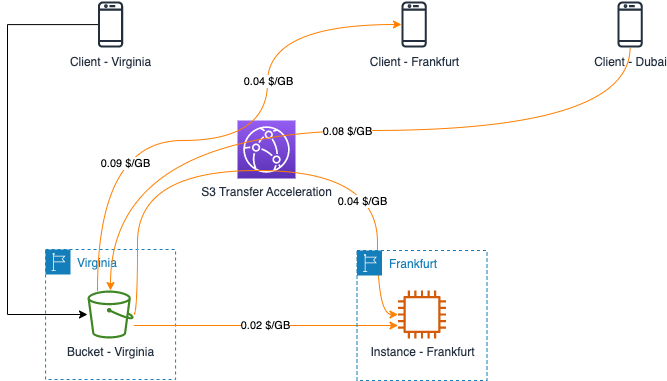

# Amazon S3 Data Transfer Cost

[中文](S3-CN.md) | English

## Summary

This page summarizes the cost of data transfers in several typical scenarios when using Amazon S3. 

The data transfer scenarios between S3 and EC2 have been discussed in the Amazon EC2 Data Transfer Cost section of this repository. You may get detail information from [EC2 <--> S3 (without S3 endpoint)](../../Compute/EC2/EC2-EN.md#2-ec2----s3-without-s3-endpoint) and [EC2 <--> S3 (with S3 endpoint)](../../Compute/EC2/EC2-EN.md#3-ec2----s3-with-s3-endpoint). For details on the data transfer scenarios between S3 and CloudFront, pls reference [Amazon CloudFront](../../Networking/ContentDelivery/ContentDelivery-EN.md#1-amazon-cloudfront) in this repository. 

The following scenarios will be included in this page: 

- [Amazon S3 Data Transfer Cost](#amazon-s3-data-transfer-cost)
  - [Summary](#summary)
  - [1. S3 Cross Region Replication](#1-s3-cross-region-replication)
  - [2. Multi-Region Access Points](#2-multi-region-access-points)
    - [2.1 Application deployed on AWS](#21-application-deployed-on-aws)
    - [2.2 Application deployed out of AWS](#22-application-deployed-out-of-aws)
  - [3. Transfer Acceleration](#3-transfer-acceleration)

The following costing instructions from the official website are referenced in this page:：

- EC2 Pricing: [Global Region](https://aws.amazon.com/ec2/pricing/on-demand/)，[Ningxia & Beijing Regions](https://www.amazonaws.cn/en/ec2/pricing/)；
- S3 Pricing: [Global Region](https://aws.amazon.com/s3/pricing/)，[Ningxia & Beijing Regions](https://www.amazonaws.cn/en/s3/pricing/)

## 1. S3 Cross Region Replication

According to the [S3 Pricing](https://aws.amazon.com/s3/pricing/), there is no data transfer costs for data transferred between S3 buckets in the same AWS region.

When data replication is required between S3 storage buckets in different regions, a cross-region data transfer cost is charged depending on the different regions in which the buckets are located. The composition of the traffic transfer cost is as follows:

1. No traffic transfer costs between Amazon S3 and Amazon CloudFront, regardless of where the Edge Location of the CloudFront is located;
2. The figure shows the different traffic billing units replicated to the London, N. Virgiona, and Sydney S3 buckets, using the S3 bucket in Ohio region as the source bucket. Access [S3 pricing](https://aws.amazon.com/s3/pricing) for more details;
3. When using a client to execute an <code>aws s3 cp</code> command (or calling S3 API via AWS SDK), there is only control plane traffic between the client and AWS, and the replicated data stream does not pass through the client (whether the client is on a laptop or an EC2 instance), therefore no data transfer costs occurd *[1]*.  

*[1]: This info is not mentioned in AWS manual. You may find a message similar to this from debug info: <code>headers={'x-amz-copy-source':......'Content-Length':'0'}</code>, which concludes that there is no actual data transfer from the client, and no traffic cost for data transfer is incurred.*

[Back to Top](#summary)

## 2. Multi-Region Access Points

[Amazon S3 Multi-Region Access Points](https://aws.amazon.com/s3/features/multi-region-access-points/) provide a global endpoint for routing Amazon S3 request traffic between AWS Regions. Amazon S3 Multi-Region Access Points accelerate performance by up to 60% when accessing data sets that are replicated across multiple AWS Regions. *（Until April 30, 2023, the Ningxia and Beijing regions do not support this feature）*

The following calculation dimensions are included when calculating the data transfer costs of multiple regional access points:

- Routing costs: When you use an S3 Multi-Region Access Point to route requests within AWS, you pay a data routing cost for each gigabyte (GB) processed and the same price for each region;
- Internet acceleration costs: If your application runs outside of AWS and accesses S3 over the internet, S3 Multi-Region Access Points increase performance by automatically routing your requests, over the global private AWS network. to the closest copy of your data based on access latency. In this case, whether the data is transferred to or from S3, there will be a route acceleration fee, depending on the application and the location of the S3 storage bucket;
- When you accelerate requests made over the internet, you pay the data routing cost outlined above and an internet acceleration cost;
- S3 cross-region replication costs: If S3 Cross-Region Replication (CRR) is enabled, cross-region data transfer costs are also incurred as a result.

The composition of data transfer costs are different depending on where the application is deployed (on/outside AWS).

### 2.1 Application deployed on AWS

When an application is deployed on AWS, data transfer costs are calculated based on the location of the application and S3 bucket. This is shown in the figure below:

App-Virginia is routed by the multi-region access point to the adjacent S3 bucket, Bucket-Virginia, and uploads 10GB data.

App-Frankfurt is routed to the adjacent Bucket-London and downloads 3GB data. The data transfer costs are calculated as follows:

- data routing costs: 0.0033 x (10 + 3) = 0.0429 $
- S3 cross region data transfer costs: 0.02 x 3 = 0.06 $ (App-Virginia and Bucket-Virginia are in the same area, no data transfer costs)

Total Costs: 0.0429 + 0.06 = 0.1029 $

If CRR between Bucket-Virgina and Bucket-London is enabled, cross region costs should be counted:  
0.02 x 3 (London -> N.Virginia) + 0.02 x 10 (N.Virginia -> London) = 0.26 $

### 2.2 Application deployed out of AWS

If applications are deployed outside of AWS, internet acceleration costs should be counted besides of the costs mentioned in 2.1 chapter, as shown in the following figure: 

In this case, application accesses two S3 buckets deployed in N.Virginia and Frankfurt through multi-region access points, with clients located in Chicago, Berlin, and Dubai, respectively. the traffic transfer costs incurred by each client are illustrated as follows:

A client located in **Chicago** uploads 10GB data and this request is routed to Virginia S3 bucket:

- Multi-region access points data processing cost: 0.0033 x 10 = 0.033 $
- Data transfer in S3 bucket: 0 x 10 = 0 $
- Data transfer from internet to S3 via internet acceleration within North America: 0.0025 x 10 = 0.025 $

Total Costs: 0.033 + 0 + 0.025 = 0.058 $  

If CRR between Bucket-Virgina and Bucket-London is enabled, cross region costs should be counted: 0.02 x 10 = 0.2 $

A client located in **Berlin** downloads 5GB data and this request is routed to Frankfurt S3 bucket:

- Multi-region access points data processing cost: 0.0033 x 5 = 0.0165 $
- Data transfer from S3 bucket to internet: 0.09 x 5 = 0.45 $
- Data transfer from S3 to internet via internet acceleration within Europe: 0.0050 x 5 = 0.0250 $
  
Total Costs: 0.0165 + 0.45 + 0.0250 = 0.4915 $
If CRR between Bucket-Virgina and Bucket-London is enabled, cross region costs should be counted: 0.02 x 5 = 0.1 $

A client located in **Dubai** downloads 20GB data and this request is routed to Frankfurt S3 bucket:

- Multi-region access points data processing cost: 0.0033 x 20 = 0.0660 $
- Data transfer from S3 bucket to internet: 0.09 x 20 = 1.8 $
- Data transfer from S3 to internet via internet acceleration out of Europe: 0.0500 x 20 = 1 $

Total Costs: 0.066 + 1.8 + 1 = 2.866 $
If CRR between Bucket-Virgina and Bucket-London is enabled, cross region costs should be counted: 0.02 x 20 = 0.4 $

[Back to Top](#Summary)

## 3. Transfer Acceleration

[S3 Transfer Acceleration](https://aws.amazon.com/cn/s3/transfer-acceleration/) accelerates **internet** transfers between the client and a **single** S3 bucket. This feature incurs data transfer costs (outbound, inbound to S3, or accelerated between regions), S3 Transfer Acceleration pricing is in **addition** to Data Transfer pricing. 

NOTE: according to the official instructions, if Transfer Acceleration does not accelerate **upload** transfer, the feature will be bypassed and no charges will be counted:

>Each time you use S3 Transfer Acceleration to upload an object, we will check whether the service is likely to be faster than a regular Amazon S3 transfer. If we determine that it is not likely to be faster than a regular Amazon S3 transfer of the same object to the same destination AWS Region, we will not charge for that use of S3 Transfer Acceleration for that transfer, and may bypass the S3 Transfer Acceleration system for that upload.

You may check upload performance with the Amazon S3 Transfer Acceleration [speed comparison tool](http://s3-accelerate-speedtest.s3-accelerate.amazonaws.com/en/accelerate-speed-comparsion.html). 

The following figure illustretes some typical scenarios:

The customer deploys S3 bucket in Virginia and enables transfer acceleration services through Transfer Acceleration. The data transfer cost components for several different scenarios are as follows:

Assuming that a client in Virginia uploading 10GB data to Bucket-Virginia has better performance when uploading directly to S3 storage bucket, this data transfer will not incur any data transfer costs.

Assuming that a client in Frankfurt downloads 10GB data from Bucket-Virginia and needs to be accelerated by Transfer Acceleration, the data transfer costs are composed as follows:

- Data transfer out from S3 to internet: 0.09 x 10 = 0.9 $
- Data transfer out from S3 to internet via Transfer Acceleration: 0.04 x 10 = 0.4 $

Total cost: 0.9 + 0.4 = 1.3 $

Assuming that a client in Dubai downloads 20GB data from Bucket-Virginia and needs to be accelerated by Transfer Acceleration, the data transfer costs are composed as follows:

- Data transfer in S3: 0 x 20 = 0 $
- Data transfer in S3 via Transfer Acceleration: 0.08 x 20 = 1.6 $

Total cost: 0 + 1.6 = 1.6 $

Assuming that an EC2 instance in Frankfurt region downloads 5GB data from Bucket-Virginia and needs to be accelerated by Transfer Acceleration, the data transfer costs are composed as follows:

- Cross region data transfer from N.Virginia region to Franfurt region: 0.02 x 5 = 0.1 $
- Cross region data transfer via Transfer Acceleration: 0.04 x 5 = 0.2 $

Total cost: 0.1 + 0.2 = 0.3 $

[Back to Top](#Summary)

[Back to README](../../README-EN.md)